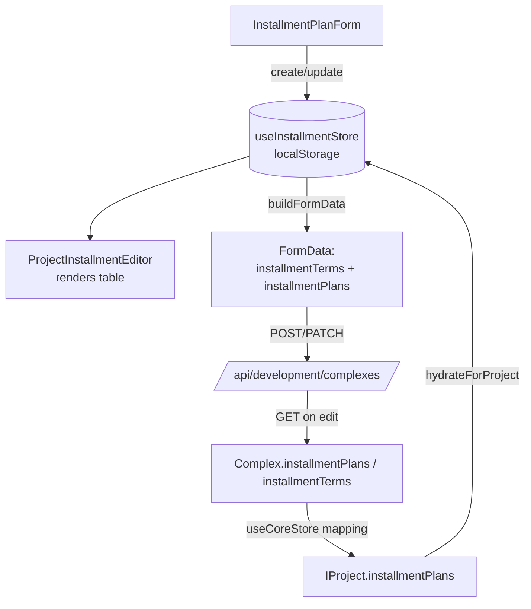

# Installment Plans (Рассрочки) — Wizard ↔ API Data Flow

How the project wizard (Step 6 «Рассрочки») reads real installment data from the
API and renders it, and how it writes edits back. This documents the client
(`bz26-client-erp`) side of the round-trip.

## TL;DR

- The wizard form does **not** call the API directly. It reads/writes a local
  store (`useInstallmentStore`, backed by `localStorage`).
- On **save**, the wizard flattens the store's plans into the multipart
  `FormData` as two fields: `installmentTerms` (legacy, 3 fields) and
  `installmentPlans` (full rich JSON).
- On **edit-load**, the API response (`installmentPlans` / `installmentTerms`)
  is mapped onto `IProject` and **hydrated** into the local store, so Step 6
  shows the real saved variants.

## Two data shapes

The complex carries installment data in two parallel fields. Both are sent and
both come back from the API.

### 1. `installmentTerms` — legacy, lossy (3 fields)

```ts
interface InstallmentTerm {
  type: string            // ← plan.title
  downPaymentPercent: number  // ← plan.downPaymentValue
  durationMonths: number      // ← plan.termMonths
}
```

Defined in `src/types/core.ts`. Used by older display code and as a fallback.

### 2. `installmentPlans` — full rich plan (source of truth for the wizard)

```ts
interface IInstallmentPlan {
  id: string
  title: string
  isActive: boolean
  applyTo: 'unit' | 'project'
  projectId: string
  unitId?: string
  downPaymentType: 'percent' | 'amount'
  downPaymentValue: number
  termType: 'months_from_current_date' | 'fixed_end_date'
  termMonths?: number
  endDate?: string
  paymentFrequency: 'monthly' | 'quarterly'
  useDiscount: boolean
  discountFromDownPayment?: boolean
  discountPercent?: number
  description?: string
  sortOrder?: number
  createdAt: string
  updatedAt: string
}
```

Defined in `src/types/installment.ts`. This is what the wizard table renders and
what carries every field the form collects (discount, frequency, term type,
active toggle, comment, `%` vs `$`).

Example API payload (one variant):

```json
{
  "installmentTerms": [
    { "type": "lana1", "downPaymentPercent": 23, "durationMonths": 37 }
  ],
  "installmentPlans": [
    {
      "title": "lana1",
      "isActive": true,
      "applyTo": "project",
      "projectId": "68ee45b5aa75612db944c009",
      "downPaymentType": "percent",
      "downPaymentValue": 23,
      "termType": "months_from_current_date",
      "termMonths": 37,
      "paymentFrequency": "monthly",
      "useDiscount": false,
      "discountFromDownPayment": false,
      "id": "3802d38f-ae52-4619-ab24-e86795d99a25",
      "createdAt": "2026-06-18T11:35:31.082Z",
      "updatedAt": "2026-06-18T11:35:31.082Z"
    }
  ]
}
```

## Components involved

| File | Role |
|---|---|
| `src/pages/projects/ProjectWizardPage.tsx` | Step 6 host; builds `FormData` on save; **hydrates** the store on edit-load |
| `src/components/projects/ProjectInstallmentEditor.tsx` | Renders the variants table; reads from `useInstallmentStore` filtered by `projectId` + `applyTo === 'project'` |
| `src/components/inventory/InstallmentPlanForm.tsx` | «Новый вариант рассрочки» form; writes to the store via `create`/`update` |
| `src/store/useInstallmentStore.ts` | `localStorage`-backed store (key `installment.plans.v1`); `create`/`update`/`remove`/`toggleActive`/`hydrateForProject` |
| `src/store/useCoreStore.ts` | Maps API `Complex` → `IProject` (incl. `installmentPlans`) in `fetchProjects` and `fetchProjectDetail` |
| `src/services/developmentApi.ts` | API client + `Complex` type; `GET/POST/PATCH /api/development/complexes` |
| `src/lib/installment.ts` | `legacyTermToPlan()` — converts a legacy `InstallmentTerm` into a full `IInstallmentPlan` for the fallback path |

## Read path (API → wizard render)

When the wizard opens in edit mode (`?edit=<id>`), `ProjectWizardPage` fetches
the complex and hydrates the local store.

```ts
// src/pages/projects/ProjectWizardPage.tsx
void fetchProjectDetail(editId).then((project) => {
  if (!project) return
  setData((prev) => applyProjectMediaToWizard(prev, project))
  if (!hasHydratedInstallments.current) {
    hasHydratedInstallments.current = true
    const plansFromApi = project.installmentPlans && project.installmentPlans.length > 0
      ? project.installmentPlans.map((p) => ({ ...p, projectId: editId }))
      : (project.installmentTerms ?? []).map((term, idx) => legacyTermToPlan(term, editId, idx))
    getInstallmentStore().hydrateForProject(editId, plansFromApi)
  }
})
```

Notes:
- **Prefer `installmentPlans`** (full data). Fall back to `installmentTerms`
  converted via `legacyTermToPlan` only for older projects that have no rich
  plans. The fallback loses fields the legacy shape never stored.
- `projectId` is normalized to the editing complex id so the editor's filter
  (`p.projectId === projectId`) matches.
- A ref guard (`hasHydratedInstallments`) ensures hydration runs **once per
  edit-load**, so it never clobbers edits the user makes afterward in the same
  session.

`hydrateForProject` replaces only the current project's plans, leaving other
projects' local drafts intact:

```ts
// src/store/useInstallmentStore.ts
hydrateForProject(projectId, plans) {
  const others = get().plans.filter((p) => p.projectId !== projectId)
  set({ plans: [...others, ...plans] })
}
```

The mapping from API `Complex` to `IProject` adds `installmentPlans` (in both
the list and detail fetchers):

```ts
// src/store/useCoreStore.ts (fetchProjects + fetchProjectDetail)
installmentTerms: c.installmentTerms,
installmentPlans: c.installmentPlans,
```

Finally, `ProjectInstallmentEditor` renders straight from the store:

```ts
// src/components/projects/ProjectInstallmentEditor.tsx
const plans = projectId
  ? allPlans
      .filter((p) => p.projectId === projectId && p.applyTo === 'project')
      .sort((a, b) => (a.sortOrder ?? 0) - (b.sortOrder ?? 0))
  : []
```

## Write path (wizard → API)

1. **Form → store.** `InstallmentPlanForm` builds a `NewInstallmentPlan` and
   calls `create`/`update` on `useInstallmentStore` (localStorage only — no API
   call yet).
2. **Wizard save → FormData.** `ProjectWizardPage.buildFormData()` reads the
   store, filtered to the current project, and appends both fields:

```ts
// src/pages/projects/ProjectWizardPage.tsx
const plansFromStore = getInstallmentStore().plans.filter(p => p.projectId === wizardProjectId)
if (plansFromStore.length > 0) {
  const terms = plansFromStore.map(p => ({
    type: p.title,
    downPaymentPercent: p.downPaymentValue,
    durationMonths: p.termMonths || 0,
  }))
  fd.append('installmentTerms', JSON.stringify(terms))   // legacy
  fd.append('installmentPlans', JSON.stringify(plansFromStore)) // full
} else if (data.installmentTerms && data.installmentTerms.length > 0) {
  fd.append('installmentTerms', JSON.stringify(data.installmentTerms))
}
```

3. **HTTP.** Multipart `POST`/`PATCH` to `/api/development/complexes[/:id]`
   (`createComplexWithFormData` / `updateComplexWithFormData`).

## End-to-end diagram



## Field mapping reference

| Form field (UI) | `IInstallmentPlan` | In `installmentTerms` | In `installmentPlans` |
|---|---|---|---|
| Название варианта | `title` | `type` | ✅ |
| Первоначальный взнос | `downPaymentValue` (+ `downPaymentType`) | `downPaymentPercent` | ✅ |
| Срок (мес.) | `termMonths` | `durationMonths` | ✅ |
| Тип срока / дата | `termType`, `endDate` | — | ✅ |
| Периодичность | `paymentFrequency` | — | ✅ |
| Скидка | `discountPercent`, `useDiscount` | — | ✅ |
| Комментарий | `description` | — | ✅ |
| Активно | `isActive` | — | ✅ |

## Caveats / known limitations

- Only variants with `applyTo === 'project'` show in the wizard editor. The API
  must return that field on each plan (the legacy fallback sets it to
  `'project'`).
- `installmentTerms` always writes the down-payment into `downPaymentPercent`,
  even when the user picked `$` (`downPaymentType === 'amount'`). The accurate
  value lives in `installmentPlans`; the legacy field is best-effort.
- Hydration depends on the backend echoing `installmentPlans` back on
  `GET /api/development/complexes/:id`. If it returns only `installmentTerms`,
  the wizard falls back to the lossy legacy conversion.
