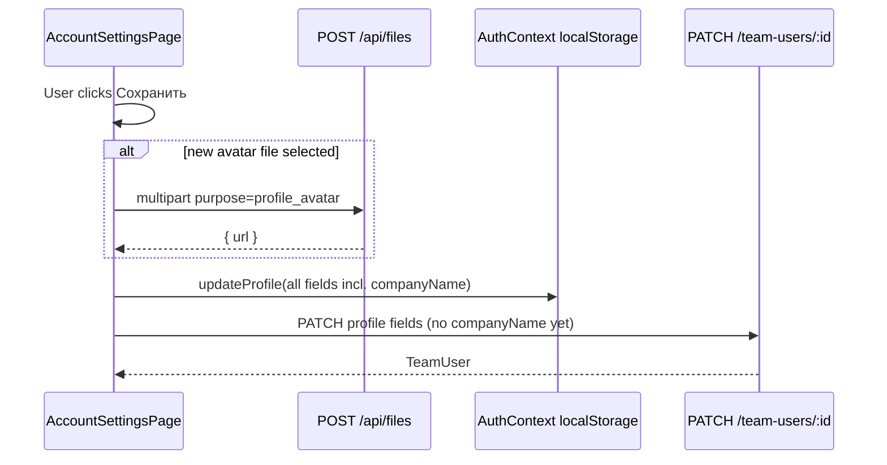

# Profile settings — data to persist & API requests

**Page:** [https://erp.baza.sale/#/dashboard/settings/profile](https://erp.baza.sale/#/dashboard/settings/profile)  
**UI:** `src/components/settings/AccountSettingsPage.tsx`  
**Client API:** `src/services/teamApi.ts`  
**Types:** `CurrentUser` (`src/types/auth.ts`), `TeamUser` / `UpdateTeamUserPayload` (`src/types/team.ts`)  
**CRM base:** `https://api-crm.baza.sale` (Bearer JWT from `jwt_token`)

This page is the user’s personal cabinet: avatar, contacts, bio, social links, and password change. Everything editable here must survive reload and be available to other ERP features (PDF consultant card, lot share sender identity, team directory).

---

## 1. Fields that must be stored in DB

Grouped as on the UI. Role badge is **read-only** (comes from auth / team role) and is not saved from this page.

### 1.1 Avatar

| UI | DB / API field | Type | Notes |
|----|----------------|------|--------|
| Photo | `avatarUrl` | `string` (HTTPS URL) | Upload file first, then store returned URL on the user record. Reject `data:` URLs for public/share use. |

### 1.2 Основное (Basic)

| UI label | DB / API field | Type | Notes |
|----------|----------------|------|--------|
| Имя | `name` | `string` | Display name |
| Должность | `position` | `string` | Job title |
| Компания | `companyName` | `string` | Shown under name; used in share/PDF. **Today not on `TeamUser`** — needs a place in DB (user profile and/or company record). See §4. |

### 1.3 Контакты (Contacts)

| UI label | DB / API field | Type | Notes |
|----------|----------------|------|--------|
| Телефон | `phone` | `string` | |
| E-mail | `email` / `loginEmail` | `string` | UI edits login email; sync both contact email and login email as product rules require |
| Telegram | `telegram` | `string` | e.g. `@username` |
| WhatsApp | `whatsapp` | `string` | Phone or link |

### 1.4 Личное (Personal)

| UI label | DB / API field | Type | Notes |
|----------|----------------|------|--------|
| Город / офис | `city` | `string` | |
| Дата рождения | `birthDate` | `string` (`YYYY-MM-DD`) | HTML date input |
| Подразделение | `department` | `string` | |

### 1.5 О себе (About)

| UI label | DB / API field | Type | Notes |
|----------|----------------|------|--------|
| Описание | `aboutMe` | `string` | Free text / bio |
| Навыки | `skills` | `string[]` | UI is comma-separated; client splits/trims before send |

### 1.6 Соцсети и ссылки (Social)

| UI label | DB / API field | Type | Notes |
|----------|----------------|------|--------|
| Facebook | `vk` | `string` | UI label is «Facebook»; payload key is still `vk` (legacy name) |
| Instagram | `instagram` | `string` | |
| Сайт | `website` | `string` | |

### 1.7 Безопасность (Security) — not part of profile PATCH

| UI | Intended storage | Notes |
|----|------------------|--------|
| Текущий пароль | verify only | Never store plaintext |
| Новый пароль | password hash on auth user | Dedicated change-password endpoint (see §3.4) |
| Подтверждение | client-only | Not sent to API |

### 1.8 Suggested DB shape (team / profile document)

Minimum fields the profile page expects on the user (or linked profile) document:

```ts
{
  id: string
  name: string
  position?: string
  companyName?: string          // gap today — see §4
  email?: string
  loginEmail?: string
  phone?: string
  telegram?: string
  whatsapp?: string
  city?: string
  birthDate?: string            // YYYY-MM-DD
  department?: string
  aboutMe?: string
  skills: string[]
  vk?: string                   // Facebook URL in UI
  instagram?: string
  website?: string
  avatarUrl?: string
  updatedAt?: string
}
```

Downstream consumers of the same data: lot share sender (`name`, `companyName`, `position`, phones, socials, `aboutMe`, `avatarUrl`), PDF consultant cards, public realtor profile (planned — see [lot-landing-backend-api-recommendations.md](./lot-landing-backend-api-recommendations.md) §2).

---

## 2. Requests the frontend will send

Auth header on all calls (except public file CDN):

```http
Authorization: Bearer <jwt_token>
```

Envelope used by CRM client:

```ts
{ success: boolean; data: T; message?: string }
```

### 2.1 Load profile (page mount)

When the user is not demo and JWT exists:

```http
GET /team-users/:id
```

**Response `data`:** `TeamUser` — used to fill the form (`name`, `position`, `phone`, `loginEmail`/`email`, `telegram`, `whatsapp`, `city`, `birthDate`, `department`, `aboutMe`, `skills`, `vk`, `instagram`, `website`, `avatarUrl`).

Also on app boot (AuthContext), not only this page:

```http
POST /team-users/ensure-self
```

Creates or returns the current user’s team record so profile fields exist after first login.

### 2.2 Upload avatar (before save, if a new file was picked)

```http
POST /api/files
Content-Type: multipart/form-data
```

| Form field | Value |
|------------|--------|
| `file` | image file (`image/*`) |
| `purpose` | `profile_avatar` |

**Response `data`:**

```json
{ "url": "https://cdn.example.com/…/avatar.jpg" }
```

Client then puts that URL into `avatarUrl` on the profile update.

### 2.3 Save profile (button «Сохранить»)

```http
PATCH /team-users/:id
Content-Type: application/json
```

**Body the client sends today:**

```json
{
  "name": "Иван Иванов",
  "email": "ivan@company.ru",
  "avatarUrl": "https://cdn.example.com/…/avatar.jpg",
  "position": "Менеджер по продажам",
  "phone": "+998 90 123 45 67",
  "telegram": "@ivan",
  "whatsapp": "+998 90 123 45 67",
  "aboutMe": "Коротко о себе",
  "skills": ["Переговоры", "CRM", "Новостройки"],
  "city": "Самарканд",
  "birthDate": "1990-05-12",
  "department": "Продажи",
  "vk": "facebook.com/ivan",
  "instagram": "@ivan",
  "website": "example.com"
}
```

**Response `data`:** updated `TeamUser`.

**Local-only today (also must land in DB eventually):** `companyName` is written to client auth state (`updateProfile` → `localStorage`) but **not** included in this PATCH. See §4.

### 2.4 Change password (needed; UI exists, API not wired)

Modal collects `oldPassword`, `newPassword`, `confirmPassword`. Client should call a dedicated auth endpoint, for example:

```http
POST /auth/change-password
Content-Type: application/json
```

```json
{
  "oldPassword": "••••••••",
  "newPassword": "••••••••"
}
```

Alternatively, if product prefers team API:

```http
PATCH /team-users/:id
```

```json
{
  "password": "••••••••",
  "oldPassword": "••••••••"
}
```

(`UpdateTeamUserPayload` already allows optional `password`; mock path currently strips it.) Prefer a dedicated change-password route that verifies the current password and never returns the hash.

---

## 3. Save flow (client sequence)



1. Optional: `POST /api/files` → `avatarUrl`
2. Always: merge into local `currentUser` (optimistic UX)
3. If JWT + not demo: `PATCH /team-users/:id` with profile payload
4. Password: separate request when modal is wired (§2.4)

---

## 4. Gaps / backend work

| Item | Status | Action |
|------|--------|--------|
| Profile fields on `TeamUser` | Client already sends | Persist all §2.3 body fields on `PATCH /team-users/:id` and return them on `GET` / `ensure-self` |
| `companyName` | Persisted for `developer` role | Saved as `title` via real `PATCH /api/developers/:id` (`src/services/developersApi.ts`); for other roles still local-only until team-users API lands |
| Avatar upload | Spec’d | `POST /api/files` with `purpose=profile_avatar` → durable CDN URL |
| Password change | UI only | Implement §2.4 and wire modal |
| Email vs login | Client sends `email` | Clarify whether changing email updates `loginEmail` / login credentials |
| Facebook field key `vk` | Naming mismatch | Keep `vk` for compatibility or migrate to `facebook` with dual-read |
| Public realtor profile | Planned | [lot-landing-backend-api-recommendations.md](./lot-landing-backend-api-recommendations.md) §2 — fill from this same profile data |

---

## 5. Related code

| Path | Role |
|------|------|
| `src/components/settings/AccountSettingsPage.tsx` | Profile UI + save |
| `src/services/teamApi.ts` | `getById`, `update`, `uploadAvatar`, `ensureSelf` |
| `src/context/AuthContext.tsx` | `updateProfile`, login hydration |
| `src/types/auth.ts` | `CurrentUser` |
| `src/types/team.ts` | `TeamUser`, `UpdateTeamUserPayload` |

**Note:** `teamApi` may still use a local mock (`USE_MOCK_TEAM`) in the client; the request shapes above are what the real CRM API must implement for production persistence.
