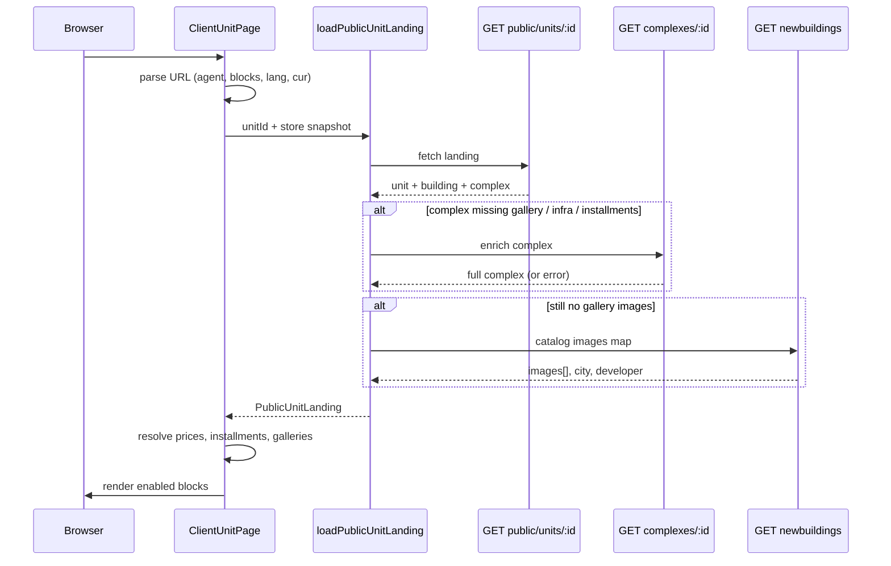

# Unit Landing Page (`#/lot/:unitId`) — Data Flow & UI

How the public client unit page is built: what we fetch from the API, what comes
from the URL, what is read from local state, and which blocks are rendered on
screen.

Example:

```
https://erp.baza.sale/#/lot/6a2803649f3a0156f4b3a3ac?n=Tempo&co=Estate+Group&r=Застройщик&em=tempo.dev@berega.city&lang=ru&cur=USD&thm=d&blk=1o4t0mpn&bm=a
```

| Part | Meaning |
|------|---------|
| `#/lot/6a2803649f3a0156f4b3a3ac` | Route + unit id |
| `n`, `co`, `r`, `em`, … | Agent / sender contacts (URL only, not from API) |
| `lang`, `cur`, `thm`, `blk`, `bm` | Page customization (language, currency, theme, visible blocks, branding mode) |

**Entry point:** `src/pages/public/ClientUnitPage.tsx`
**Route:** `src/main.tsx` → `<Route path="/lot/:unitId" element={<ClientUnitPage />} />`
**Loader:** `src/lib/unit-landing.ts` → `loadPublicUnitLanding()`

---

## TL;DR

1. **Unit id** from the path drives all server requests.
2. **Primary fetch:** `GET /api/development/public/units/:unitId` returns
   `{ unit, building, complex, installment? }` in one payload (`PublicUnitLanding`).
3. **Optional enrich:** if the complex payload is thin, we call
   `GET /api/development/complexes/:complexId` and merge gallery, infrastructure,
   documents, installment plans, etc.
4. **Catalog fallback:** if the complex still has no renders/cover, we pull
   images (and sometimes city/country/developer) from the new-buildings catalog
   (`GET /api/development/newbuildings`).
5. **URL query** supplies agent contacts and which sections to show — nothing
   extra is fetched for the agent.
6. **Local fallbacks** (only when API fails or user is inside ERP session):
   authenticated unit API, in-memory `useCoreStore`, `localStorage` finish prices
   and installment overrides, and similar units from store.

---

## URL parameters

Built by `buildUnitShareUrl()` in `src/lib/unit-share.ts`, parsed on the page
via `getUnitShareSearchQuery()` + `parseUnitShareAgent()` /
`parseUnitShareCustomization()`.

### Agent / sender (`parseUnitShareAgent`)

| Param | Alias | Field |
|-------|-------|-------|
| `n` | `agent` | Name |
| `co` | `company` | Company |
| `r` | `role` | Role |
| `ph` | `phone` | Phone |
| `wa` | `whatsapp` | WhatsApp (digits) |
| `tg` | `telegram` | Telegram username |
| `av` | `avatar` | Avatar URL |
| `em` | `email` | Email |
| `bio` | — | About me |
| `web` | `website` | Website |
| `ig` | `instagram` | Instagram |

Missing agent fields are filled with placeholder copy in
`resolveAgentWithPlaceholders()`. Agent data is **not** loaded from the backend
on this page.

### Page customization (`parseUnitShareCustomization`)

| Param | Values | Purpose |
|-------|--------|---------|
| `lang` | `ru`, `en`, `ka` | UI language |
| `cur` | `USD`, `EUR`, `GEL` | Price formatting |
| `thm` | encoded theme (`d` = dark, etc.) | Visual theme (`unit-visit-theme`) |
| `blk` | base-36 bitmask | Which content blocks are visible |
| `bm` | `a` = agent branding, `b` = BAZA branding | Header branding mode |

Block keys and defaults live in `src/config/dev-selection-customization.ts`
(`DEFAULT_SHARE_BLOCKS`). Each section in `ClientUnitPage` is gated by
`blocks.shareHero`, `blocks.shareUnitCard`, etc.

---

## Data loading pipeline

```
ClientUnitPage
    │
    ├─ unitId from route
    ├─ agent + customization from URL query
    └─ loadPublicUnitLanding(unitId, storeCtx)
            │
            ├─[1] GET /api/development/public/units/:id     ← primary
            │       finalizePublicLanding()
            │         ├─ maybe GET /api/development/complexes/:id
            │         └─ resolvePublicInstallment()
            │       enrichLandingWithCatalogImages()
            │         └─ maybe GET /api/development/newbuildings (cached map)
            │
            ├─[2] if JWT in localStorage:
            │       GET /api/development/units/:id
            │       GET /api/development/complexes/:complexId
            │       (same finalize + enrich)
            │
            └─[3] if still no data and storeCtx present:
                    buildPublicUnitLandingFromStore()
                    (useCoreStore units / buildings / projects)
```

Implementation: `loadPublicUnitLanding()` in `src/lib/unit-landing.ts`.

---

## API endpoints

### 1. Public unit landing (required)

```
GET /api/development/public/units/:unitId
```

Client: `developmentApi.getPublicUnitById()`
Type: `PublicUnitLanding` (`src/services/developmentApi.ts`)

Response shape:

```ts
{
  unit: Unit & { floorPlanUrl?, floorPlanImage?, details?: PublicUnitDetails },
  building: { id, name, number?, address? },
  complex: { id, name, city?, country?, … gallery, infrastructure, installments … },
  installment?: PublicUnitInstallmentDto | null
}
```

**Unit fields used on the page**

| Field | UI usage |
|-------|----------|
| `id`, `number`, `floor` | Title, summary, plans, footer |
| `rooms`, `roomsStr`, `area` | Summary, plans, similar-units scoring |
| `price`, `currency`, `status` | Hero price, summary, availability badge |
| `image`, `floorPlanUrl`, `floorPlanImage` | Layout plan, floor plan, unit gallery |
| `details.title`, `details.identifier` | Lot title / ID in summary |
| `details.pricePerSqm`, `details.finishPrices` | Finish selector & price |
| `details.viewType`, `details.promo` | View label, promo flag in hero |
| `details.livingArea`, `details.balconyArea` | Available in API; plans block uses area from unit |

**Building:** name shown in summary and plan section.

**Complex:** drives most project/location/investment blocks (see below).

### 2. Complex details (conditional enrich)

```
GET /api/development/complexes/:complexId
```

Called inside `finalizePublicLanding()` when the public payload is missing:

- gallery (`renders`, `images`, `cover`)
- infrastructure lists
- `installmentPlans` / `installmentTerms`

Merged in `mergeComplexFields()` — public payload wins when a field is already
populated.

For anonymous visitors this call may fail without JWT; errors are ignored and
the page uses whatever came from the public unit endpoint.

### 3. New-buildings catalog (conditional enrich)

```
GET /api/development/newbuildings
```

Used by `enrichLandingWithCatalogImages()` when the complex has no project
gallery. Provides:

- `images[]` → hero background, project gallery, unit gallery fallback
- optional `city`, `country`, `developer`

Catalog map is cached in memory after first load. Demo complexes may use a local
snapshot (`DEMO_CATALOG`); otherwise stock placeholder images are used as last
resort.

### 4. Authenticated fallbacks (only if public endpoint fails)

| Endpoint | When |
|----------|------|
| `GET /api/development/units/:id` | JWT present, public 404/error |
| `GET /api/development/complexes/:complexId` | Same path, to fill complex |

### 5. Not fetched on this page

- Agent profile (comes from URL query)
- Similar units list (computed client-side from `useCoreStore.allUnits`)
- Map tiles (MapLibre / MapTiler CDN, not our API)
- YouTube embed URL is taken from `complex.youtubeLink` if present in payload

---

## Local / client-only data

| Source | Used for |
|--------|----------|
| `useCoreStore` (`allUnits`, `buildings`, `projects`) | Fallback landing build; similar units; ceiling height custom field; finish fallback |
| `localStorage` `developer.sales.installments.{projectId}` | Installment rows override (same as sales UI) |
| `readPersistedUnitFinishPrices(unitId)` | Finish prices if missing from API |
| `agencyStore` branding | Only in `buildPublicUnitLandingFromStore()` demo path |

---

## Installment & pricing resolution

1. **List price:** `resolveUnitModalListPrice()` from selected finish or
   `unit.price` / `details.pricePerSqm` × area.
2. **Finish options:** `complex.finishTypes` + `unit.finishPrices` /
   `details.finishPrices` → `resolveFinishDisplayOptions()`.
3. **Installment rows:** `resolveProjectInstallmentRows()` from
   `complex.installmentPlans`, `complex.installmentTerms`, and optional
   `landing.installment` DTO; listens to `storage` events for live updates.
4. **Payment types:** `complex.paymentTypes` filtered by
   `blocks.shareInstallment` / `blocks.shareFullPayment`.

See also: [installment-plans-wizard-data-flow.md](./installment-plans-wizard-data-flow.md).

---

## Content helpers (derived text, not separate API)

Static / template copy is assembled in `src/lib/unit-visit-content.ts` and
`src/lib/visit-location-content.ts` when the API text fields are empty:

| Helper | Primary API fields | Fallback |
|--------|-------------------|----------|
| `resolveProjectInfoContent` | `description`, `descriptionWhy`, `descriptionWho` | Generic project copy + class/coastline |
| `resolveDistrictContent` | `districtText`, address | Auto bullets from infrastructure |
| `resolveCountryInfoContent` | `country`, yields | Country presets (e.g. Georgia) |
| `resolveLegalInfoContent` | `documents` | Standard legal bullets |
| `resolveInvestmentContent` | `investmentText`, `investmentYield` | Preset by city |
| `resolveRentalContent` | `rentalText`, `rentalYieldShort/Long` | Preset by city |
| `resolveVisitDeveloperInfo` | `developerProfile`, `developer` | Name-only fallback |
| `resolveShareUnitGallery` | unit layout + floor plan + project renders | Up to 5 images |

City / district / country **galleries** use `complex.cityGallery`,
`districtGallery`, `countryGallery` when present; otherwise hardcoded fallback
URLs for Batumi / Tbilisi / Georgia.

---

## What we show on the page

Sections render only if the corresponding `blocks.*` flag is `true` in URL
customization. Default preset enables most blocks (see
`DEFAULT_SHARE_BLOCKS`).

| Block flag | Section | Main data |
|------------|---------|-----------|
| `shareHero` | Premium hero | `complex` cover/images, name, city/country, unit price/status, agent CTA |
| `shareBranding` / `shareBazaBranding` | Sender header | Agent from URL; avatar/about if enabled |
| `shareUnitCard` | Unit summary table | Unit fields + formatted price/date |
| `shareUnitPlan` | Plans & finish | Layout URL, floor plan, finish types & prices |
| `shareUnitGallery` | Unit photos | Layout + floor plan + project fallback |
| `shareUnitFinance` | Payment & installments | `paymentTypes`, installment rows, price/m² |
| `shareProjectInfo` | About the project | Descriptions, bullets |
| `shareProjectGallery` | Project renders | `renders` / `images` |
| (same flag) | Construction progress | `constructionProgress` |
| `shareProjectInfrastructure` | Amenities | `amenities` + infrastructure lists |
| `shareProjectLocation` | Map | `locationCenter`, `areaPolygon`, address; MapLibre |
| `shareDistrict` + `shareDistrictInfo` | District text | `districtText`, infrastructure |
| `shareDistrict` + `shareDistrictGallery` | District photos | `districtGallery` or fallbacks |
| `shareDeveloperInfo` | Developer | `developerProfile` |
| `sharePurchaseFlow` | Purchase steps | Static step copy |
| `shareLegalInfo` | Legal | Bullets + links to `documents[]` |
| `shareInvestmentPotential` | Investment | Yields + `investmentText` |
| `shareRentalPotential` | Rental | Yields + `rentalText` |
| `shareSimilarUnits` | Similar apartments | Store units in same project (top 3) |
| `shareCity` + `shareCityInfo` / `shareCityGallery` | City | Infrastructure snippets + gallery |
| `shareCountry` + `shareCountryInfo` / `shareCountryGallery` | Country | Country copy + gallery |
| `shareFinalCta` | Bottom CTA | Agent contacts, reserve/docs/similar actions |
| `shareStickyContacts` | Mobile sticky bar | Phone / Telegram / WhatsApp |

Footer always shows `{complex.name} · {unit.number}`.

---

## `PublicUnitLanding.complex` field map

Fields returned by the public API (and optionally merged from
`GET /complexes/:id`):

| Field group | Fields |
|-------------|--------|
| Identity & location | `id`, `name`, `city`, `country`, `district`, `address`, `coastline`, `coordinates`, `locationCenter`, `areaPolygon` |
| Project meta | `developer`, `developerProfile`, `classType`, `completionDate`, `developmentStage`, `wallMaterial`, `ceilingHeight` |
| Marketing text | `description`, `descriptionWhy`, `descriptionWho`, `districtText`, `rentalText`, `investmentText` |
| Media | `images`, `coverUrl`, `cover`, `renders`, `constructionProgress`, `cityGallery`, `districtGallery`, `countryGallery`, `youtubeLink` |
| Infrastructure | `amenities`, `infrastructureInternal`, `infrastructureExternal`, `infrastructureLocation` |
| Commerce | `paymentTypes`, `finishTypes`, `installmentPlans`, `installmentTerms`, yields (`rentalYieldShort`, `rentalYieldLong`, `investmentYield`) |
| Legal | `documents[]` (PDF URLs) |

---

## Sequence diagram



---

## Related files

| File | Role |
|------|------|
| `src/pages/public/ClientUnitPage.tsx` | Page layout, all sections |
| `src/lib/unit-landing.ts` | Load + merge + store fallback |
| `src/services/developmentApi.ts` | API types & clients |
| `src/lib/unit-share.ts` | Share URL build/parse |
| `src/lib/unit-share-customization.ts` | `blk` / `lang` / `cur` encoding |
| `src/config/dev-selection-customization.ts` | Block keys & presets |
| `src/lib/unit-visit-content.ts` | Text/gallery/similar helpers |
| `src/lib/newbuildings-catalog-images.ts` | Catalog image enrich |
| `src/lib/installment-display.ts` | Installment rows & list price |
| `src/lib/unit-finish-pricing.ts` | Finish type prices |
| `src/components/public/visit/*` | Hero, payment, developer, amenities UI |

---

## Testing locally

E2E opens a unit landing directly:

```
/#/lot/{unitId}
```

See `tests/e2e/unit-finish-pricing.spec.ts`.

To reproduce a full share link, generate it from the ERP share dialog
(`buildUnitShareUrl`) or append query params manually using the tables above.
