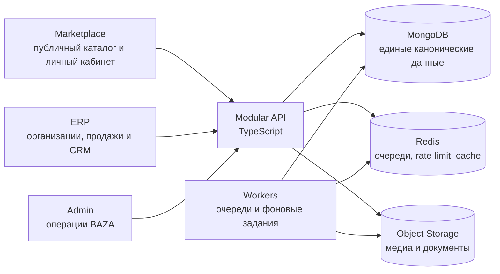
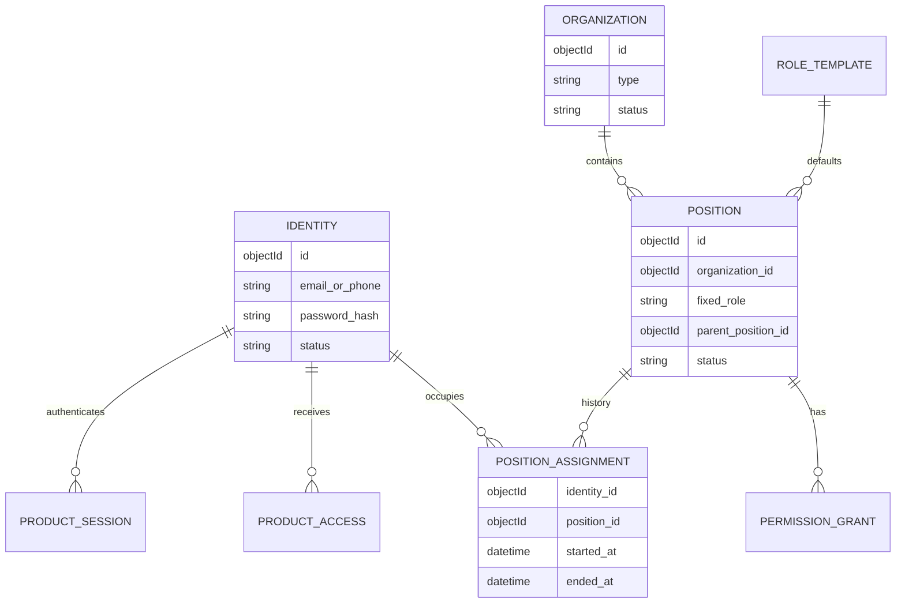
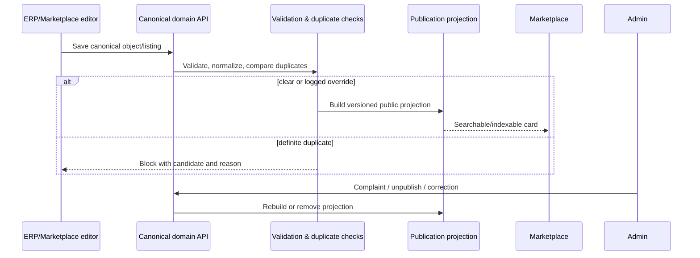

# BAZA.sale — мастер-контекст, целевая архитектура и план разработки

> Статус документа: рабочая версия локального обследования.  
> Дата фиксации: 25 августа 2026 года.  
> Дата последней сверки статуса с кодом: 27 августа 2026 года — см. раздел 16 и `docs/operations/current-state-reconciliation-2026-08-27.md`.  
> Назначение: единый источник контекста для владельца продукта, Codex, Claude, Gemini и разработчиков.  
> Ограничение текущей версии: Figma и живые `baza.sale` / `erp.baza.sale` ещё не обследованы через сеть; соответствующие пункты явно отмечены как ожидающие внешней сверки.

## 1. Как читать и обновлять этот документ

Этот файл описывает не старую систему, а новую платформу BAZA.sale, которую предстоит построить. Старые репозитории, API, таблицы и технические задания используются только как источники бизнес-функций, пользовательских сценариев и известных ошибок.

Правила приоритета источников при противоречиях:

1. Последнее прямое решение владельца продукта.
2. Заполненные ответы в `BAZA_неотвеченные_вопросы.xlsx`, если они не противоречат более позднему прямому решению.
3. Figma — для состава и визуальной логики маркетплейса после отдельной полной сверки.
4. Существующий ERP-фронтенд — для состава экранов, текущих пользовательских сценариев и терминологии.
5. Существующий фронтенд админки — для визуального направления и инвентаря административных разделов.
6. `erp_master_rail.xlsx`, локальные ТЗ, бизнес-концепции и тарифные таблицы — как черновой инвентарь функций.
7. Живой старый сайт — только как проверка существующих функций, URL и пользовательских сценариев.
8. Старый маркетплейс, старые API и старый backend никогда не являются основой новой архитектуры или контрактов.

Каждое существенное изменение решения должно сопровождаться записью в разделе «Журнал решений». AI-агент не имеет права молча заменять утверждённое решение своей догадкой.

## 2. Зафиксированные решения владельца продукта

### 2.1. Границы продукта

- Платформа состоит из трёх самостоятельных веб-приложений: маркетплейса, ERP и админки.
- У каждого приложения собственный домен/поддомен и отдельная сессия. Автоматического SSO-перехода между сайтами нет.
- Маркетплейс переписывается полностью по Figma с сохранением действительно нужной функциональности. Старый фронтенд не переиспользуется.
- ERP-фронтенд сохраняется как основа интерфейса, но подключается к новому backend и может рефакториться в рабочей копии.
- Фронтенд админки сохраняется как визуальная и навигационная основа, но все моки и локальные права заменяются реальной серверной логикой.
- Backend создаётся с нуля на TypeScript и MongoDB. Старые endpoint-ы, схемы и база не переносятся как архитектурная основа.
- Новая система независима от старой. Импорт старых данных рассматривается отдельно после создания основной платформы.
- Первая продуктовая цель — работающий маркетплейс, но он строится не изолированно: минимальные контуры ERP и админки создаются в тех же вертикальных сценариях.

### 2.2. Пользователи, организации и роли

- ERP поддерживает агентства, застройщиков и независимых риэлторов.
- Данные организаций строго изолированы.
- Один человек не состоит одновременно в нескольких организациях. Для разных организаций нужны разные учётные записи.
- Фиксированные внутренние роли агентства и застройщика: Собственник, Директор, РОП, Менеджер, Администратор.
- Роль — шаблон базовых прав, а не единственный механизм авторизации. Точные разрешения могут настраиваться владельцем/уполномоченным руководителем в пределах разрешённой матрицы.
- Концепция вкладки «Команда»: клиенты, задачи, рабочая история и права принадлежат стабильной должностной позиции. При увольнении человека позиция освобождается и назначается другому человеку без потери рабочей базы.
- Безопасная реализация этой концепции не передаёт пароль или личный логин. Личная идентичность человека отделена от должностной позиции и истории её назначения.
- Филиалы пока не входят в обязательный объём.
- Сотрудники BAZA работают через админку. В новой модели есть супер-администратор и административные аккаунты с индивидуальными разрешениями и областями действия.
- Организации никогда не получают доступ в административную панель BAZA.

### 2.3. Маркетплейс и MLS

- Marketplace-аккаунт может существовать без ERP.
- Независимый риэлтор может бесплатно зарегистрироваться в маркетплейсе.
- Обычный собственник может разместить вторичную недвижимость через упрощённый сценарий маркетплейса без ERP.
- Новостройки публикуются только из ERP застройщика.
- Вторичные объекты могут создаваться в маркетплейсе; если автор связан с ERP-организацией, объект появляется в её ERP.
- MLS имеет отдельный статус/значок и требует регистрации и верификации. Простая публикация объявления и MLS-публикация — разные действия.
- Документарная юридическая проверка объекта на первом этапе не проводится.
- Премодерации каждого объявления нет: публикация автоматическая после структурных проверок и проверки дублей.
- Явный дубль блокирует публикацию. Автор может заявить, что это не дубль; такое исключение логируется и попадает в административную проверку.
- Контакты нельзя отдавать массовому скрейпингу. Телефон, WhatsApp и Telegram раскрываются отдельным пользовательским действием с rate limit и аудитом.
- Внутренний чат маркетплейса на первом этапе не обязателен.
- Запуск: Батуми, Грузия. Языки: русский, английский, грузинский. Валюты MVP: USD, GEL и RUB.
- Нужны адаптивная мобильная версия, индексируемые карточки, человекочитаемые URL, sitemap и структурированные данные.
- Нужен поиск по области на карте. Базовый картографический стек — MapLibre и OSM-совместимые данные/тайлы; конкретный поставщик тайлов определяется перед запуском.

### 2.4. ERP, коммерция и эксплуатация

- Иерархия первички: застройщик → жилой комплекс → корпус → этаж → юнит. Секции допускаются только как опциональное расширение конкретного корпуса.
- Паркинг должен поддерживаться как отдельный тип инвентаря и отдельное представление шахматки, а не только как необычный этаж.
- Планировки являются отдельными переиспользуемыми сущностями; сохраняется сценарий ручной разметки.
- Цена и комиссия по комплексу едины для партнёров; приватных каталогов с разными партнёрскими ценами пока нет.
- Физический объект вторички имеет одного владельца/представителя. Несколько объявлений об одном объекте считаются кандидатами в дубли.
- Один объект может одновременно предлагаться к продаже и аренде.
- Новый лид назначается РОПом, Директором или Собственником. Автоматическая раздача может появиться позднее как опция, но не является стартовым поведением.
- Дубль лида ищется только внутри одной организации; существование лида в другой организации не раскрывается.
- Один клиент имеет одного ответственного менеджера. Переназначать внутри организации могут РОП, Директор и Собственник.
- Совместные сделки нескольких организаций и передача лида между организациями сейчас не нужны.
- Бронирование одного юнита должно атомарно исключать пересекающиеся активные брони.
- Финансы на первом этапе — управленческая аналитика и заявленные/ожидаемые суммы, а не подтверждение реального банковского платежа.
- Платёжного провайдера пока нет. Подключение тарифа и продвижения ведётся вручную через контакт/Telegram, но каждое действие всё равно отражается в серверном журнале начислений и изменений.
- При окончании подписки рабочее пространство замораживается. Удаление спустя месяц нельзя выполнять автоматически до утверждения политики хранения и безопасного экспорта.
- WhatsApp и Telegram нужны как внешние каналы общения. Email/SMS, телефония и запись звонков пока не входят в стартовый объём.
- AI-лид, AI-чат и AI-функции РОПа отложены до реализации основной платформы. Модель данных при этом должна сохранять историю и события так, чтобы AI можно было подключить позднее.

### 2.5. Технологические и организационные решения

- Основная база — MongoDB на собственном сервере.
- Сервер: Ubuntu, ориентировочно 8 ГБ RAM и 120 ГБ диска для тестового/первого контура. Docker разрешён.
- Ожидаемый начальный масштаб невелик: около 25 разработчиков/участников проекта и порядка 100 первых пользователей, но архитектура не должна создавать тупики роста.
- Предпочтителен монорепозиторий.
- Нужны OpenAPI, версионирование API, автоматические тесты, нагрузочная и базовая security-проверка до запуска.
- Файлы сначала хранятся на собственном сервере.
- Код продукта нельзя начинать до утверждения этого мастер-плана и оставшихся принципиальных решений.

## 3. Реестр обследованных источников

| Источник | Что извлечено | Как используется | Ограничения |
|---|---|---|---|
| `bz26-client-erp-main` | 601 TS/TSX-файл; маршруты, экраны, модели команды, CRM, первички, вторички, броней, подборок, чатов, LMS, финансов и настроек | Главный источник состава ERP-интерфейса и пользовательских сценариев | Много моков и localStorage; API и типы противоречат друг другу; не источник backend-контрактов |
| `erp_master_rail.xlsx` | 114 строк мастер-реестра и 99 строк задач по всем ERP-модулям | Проверка полноты функционального покрытия | Приоритеты и поля backend — черновик, не утверждённый roadmap |
| `bz26-dev-admin-client` | 24+ административных раздела, текущая навигация, 3 демонстрационных роли, отдельные workspace для первички/вторички/жалоб | Основа интерфейса админки и перечень операций | Почти всё работает на моках; права в localStorage; AI-раздел противоречит последнему решению |
| `berega-client` | Старые маршруты и большой инвентарь страниц маркетплейса | Только список существовавших функций и негативные примеры | 177 TS/TSX-файлов, 510 упоминаний `any`, 1955 console-вызовов, дубли карт и огромные компоненты; не переиспользовать |
| `Технический_аудит_baza.sale.pdf` и текстовые аудиты | Утечки контактов (PII), отсутствие security headers/rate limit/compression/pagination/cache, ошибки координат, дубли и грязные данные, слабое SEO | Legacy-audit evidence (аудит старой реализации от 21.07.2026); текущее состояние live-системы по PII, дублям, координатам и пагинации — unverified / требует отдельной верификации | Аудит старой реализации, не новая спецификация |
| `ТЗ_Девелопмент_бэкенд.md` | Комплексы, здания, шахматка, планировки, рассрочки, брони, продвижение, рассылки | Бизнес-объекты и сценарии первички | Предлагаемые endpoint-ы и старые статусы не принимаются автоматически |
| `ТЗ_CRM_бэкенд.md` и `воронка-продаж.md` | Лиды, клиенты, сделки, задачи, история, аналитика, фиксированные воронки | Функциональный инвентарь CRM | Старые slug-значения стадий семантически испорчены и должны быть заменены |
| `CRM Business Concept` | CRM как диспетчерский центр; единая история контакта; обязательное следующее действие; управление исключениями | Принципы целевой CRM и будущей AI-готовности | AI-автоматизация отложена |
| `Архитектура` | Доменные границы и идея единой платформы | Проверка архитектурной декомпозиции | Рекомендация PostgreSQL и часть ролей противоречат текущим решениям |
| Три RBAC/ролевые таблицы | Варианты ролей, уровни `none/view/edit`, scopes и критические действия | Источник разрешений и проверок | Содержат 21–56 ролей и multi-role; последними решениями отменены |
| `Тарифы.xlsx` | Черновые тарифы агентств/застройщиков, лимиты, продвижение и список возможностей | Каталог будущих entitlement-ов и коммерческих гипотез | Лист риэлтора скопирован ошибочно; цены и бонусы конфликтуют с кодом; не готово к реализации |
| `ТГ.txt` | Telegram-бот как безопасный интерфейс над платформой, разрешения, привязка Telegram ID, операции по кнопкам | План ручного биллинга, уведомлений и служебных действий | Бот не должен становиться отдельным источником истины |
| `источники_данных_для_визитки.txt` | Состав публичной карточки юнита и источники полей | Модель публичной проекции и шаринг | Требует проверки по Figma |
| `BAZA_неотвеченные_вопросы.xlsx` | **Канонический источник требований (183/183 заполненных ответа):** `C:\Users\Александр\Desktop\BAZA_неотвеченные_вопросы.xlsx` (зеркало в проекте: `docs/decisions/BAZA_неотвеченные_вопросы_ЗАПОЛНЕНО_canonical.xlsx`, SHA256 `f9aa085b...`). Устаревшая пустая копия в рабочей папке (`outputs/01a034ef-.../BAZA_неотвеченные_вопросы.xlsx`, SHA256 `7b698350...`) содержит пустые ответы и признана obsolete/устаревшей (НЕ использовать для решений). | Основной журнал требований — полный разбор в `docs/decisions/question-decision-register.xlsx` и `docs/decisions/open-decisions.md` | Ответ на вопрос №202 (инфраструктурный бюджет) в каноническом файле фактически отвечает на другой вопрос (доска запросов) — сдвиг ответов на одну строку подтверждён; реальный ответ на бюджет получен отдельно, в разговоре с владельцем 25.08.2026 |
| Figma | Обследовано 25.08.2026 (иерархия страниц и узлов: страница Main pages [11 секций, 436 узлов: marketplace + встроенный CRM-кабинет риэлтора], страница UI kit [86 узлов], страница Рабочий процесс). `lastModified` файла: 2026-03-13 — не редактировался ~5,5 месяцев до обследования | Источник истины для UX маркетплейса — см. `docs/discovery/figma-screen-inventory.md` | Содержимое экранов выгружено на уровне структуры (глубина 3); стили (цвета/шрифты) зафиксированы по панели стилей |
| `baza.sale` (публичный каталог) | Обследовано 25.08.2026: 30+ routes, sitemap.xml, robots.txt, security headers. Находки технического аудита по публичному API `api.baza.sale` (contact PII, дубли, coordinates, pagination) классифицированы как `[legacy-audit evidence; current state unverified]` (на выборке discovery не подтверждены в полном объёме) — см. `docs/discovery/marketplace-gap-matrix.md` | Gap-анализ live vs Figma | Публичные страницы — Astro SSR; авторизованная зона `/app/*` — CSR, не проверена (WebFetch не выполняет JS) |
| `erp.baza.sale` | **Не обследовано содержательно** — hash-роутинг SPA не отдаёт контент без выполнения JS, WebFetch не подходит | — | Требуется либо тестовые учётные данные + браузерная проверка, либо считать `bz26-client-erp-main` репозиторий достаточным источником (он и был основным) |
| `docx/ALPHABASE_sale_roles_accesses.xlsx` (найден прямо в `bz26-client-erp-main`, не в Downloads) | 5 листов: Легенда, Разделы, Панели, Отчёты, Сводка — 11-ролевая RBAC-модель (Собственник/Руководитель агентства, РОП, Маркетолог, Менеджер/риелтор, Закупщик, Юрист, Финансист, HR, Партнёрский риелтор) с уровнями П/Р/ПР/О/— | Ещё один (восьмой по счёту) источник ролевой модели, конфликтующий с целевыми 5 ролями | Черновой каталог, не Accepted — см. `docs/discovery/erp-functional-map.md` разд. «Расхождения ролевых моделей» |

## 4. Что обнаружено в существующих фронтендах

### 4.1. ERP

Существующий ERP — не «готовый фронт к подключению одним API». Это большой продуктовый прототип, где разные части находятся на разных стадиях зрелости:

- 629 файлов в `src`, из них 601 TypeScript/TSX.
- 335 упоминаний `localStorage`/`sessionStorage`, 442 упоминания `any`, 526 упоминаний mock/MOCK.
- Одни домены обращаются к старым HTTP API, другие живут в локальном хранилище, третьи имеют демонстрационные данные, четвёртые смешивают все три режима.
- `ChatsPage.tsx` превышает 5700 строк и объединяет Telegram, WhatsApp, CRM-связи, AI-настройки и задачи.
- В текущем коде обнаружено хранение CRM-реквизитов/токенов в localStorage. В новой системе сырые пароли и межсервисные секреты никогда не передаются фронтенду и не хранятся в браузере.
- Типы ролей представлены одновременно несколькими несовместимыми моделями: от 6 ролей команды до 13 ролей общей auth-матрицы.
- Воронка продаж визуально содержит нужные бизнес-этапы, но машинные slug-значения повторно использованы не по смыслу. Переносить эти значения в backend нельзя.
- Актуализация объектов сейчас различается по категориям: аренда 14/21 день, вторичка 28/60 дней, другие 10/15 дней. Это противоречит устному ориентиру «жёлтый примерно через 2 недели, красный примерно через месяц».
- Продвижение в коде имеет пакеты $100/$300/$500, а тарифная таблица — другую сетку подписок и бонусов. Коммерческие правила необходимо нормализовать до разработки биллинга.

ERP уже содержит следующие пользовательские зоны, которые необходимо либо подключить к реальным данным, либо явно отложить:

1. Главный рабочий стол и персональный отчёт.
2. Девелопмент: проекты, мастер создания ЖК, шахматка, планировки, продажи, брони, регистрации, рассылки, продвижение, подборки.
3. Каталог новостроек: объекты, партнёры, рассрочки, общая шахматка и регистрации.
4. Вторичка и аренда: каталог, карточка, создание/редактирование, актуализация, карта, отчёт, подборки и MLS.
5. CRM: рабочий стол лидов, классическая воронка, старые лиды, клиенты, сделки, задачи, календарь и аналитика.
6. Чаты: Telegram/WhatsApp, диалоги, сообщения, связь с CRM, realtime и отложенные AI-сценарии.
7. Команда: оргструктура, должностные позиции, история занятости, вакансии, приглашения, блокировка, KPI и доступы.
8. Финансы, отчёты, партнёры/MLM, LMS, сообщество/форум, новости, напоминания, тарифы, брендинг и настройки.

Вывод: визуальную работу сохраняем, но подключение выполняем по доменам через новые типизированные контракты. Механическая замена base URL не допускается.

### 4.2. Админка

- В `src` 126 файлов, из них 110 TypeScript/TSX.
- Большинство разделов питается моками; 633 упоминания mock/MOCK.
- Реальные вызовы ограничены в основном авторизацией и пользователями, причём старый клиент сводит данные разных баз на уровне frontend.
- Права разделов хранятся в localStorage и представлены уровнями `none/view/edit/manage`.
- Текущие демонстрационные роли: `super_admin`, `developers_admin`, `mls_admin`.
- Текущие разделы: пользователи, застройщики, агентства, риэлторы, новостройки, вторичка, аренда, лиды, сделки, финансы, платные услуги, реклама, контент, модерация, отзывы, CRM, партнёры, аналитика, настройки, безопасность, логи, MLS, пользователи новостроек и доменные настройки.
- Раздел AI присутствует в коде, но по последнему ответу владельца продукта не входит в целевую админку текущего этапа.

Целевая модель админки: одна платформа идентичностей и данных; серверные разрешения; безопасные scopes по городу/домену/объекту; журнал критических действий; массовые операции с предварительным просмотром; безопасное временное impersonation только для поддержки.

### 4.3. Старый маркетплейс

Старый `berega-client` не является заготовкой новой реализации:

- Несколько поколений одних и тех же карт и страниц лежат одновременно.
- Крупнейшие компоненты имеют 1600–3100 строк.
- Найдены 510 упоминаний `any` и 1955 вызовов `console.*`.
- Данные, UI, маппинг API и fallback-логика смешаны в компонентах.
- Аудит старого сайта подтверждает реальные проблемы безопасности, геоданных, дублей, производительности и SEO.

Из него допустимо брать только перечень сценариев: каталоги по типам объектов, карты, карточки ЖК/юнита/риэлтора/застройщика, добавление объявления, запросы, подборки, услуги, проекты и публичные профили.

## 5. Целевая продуктовая модель

### 5.1. Три приложения, одна платформа данных



Это не три независимых backend-а и не три копии объектов. У приложений разные разрешения, сессии и представления, но общие канонические сущности и единая история изменений.

### 5.2. Основные акторы

| Контур | Актор | Ключевые возможности |
|---|---|---|
| Marketplace | Гость | Поиск, карта, индексируемые карточки, просмотр ограниченных контактов |
| Marketplace | Покупатель/арендатор | Избранное, отзывы, обращения, публичные запросы после уточнения сценария |
| Marketplace | Собственник | Упрощённое создание и управление своим объявлением |
| Marketplace | Риэлтор | Профиль, объявления, статистика из Figma, MLS после верификации, MLM-рефералы |
| Marketplace | Агентство/застройщик | Публичный профиль и опубликованные ERP-объекты |
| ERP | Независимый риэлтор | Персональный рабочий tenant и доступные CRM/объектные функции |
| ERP | Агентство | Команда, вторичка, CRM, сделки, подборки, аналитика |
| ERP | Застройщик | Команда, проекты, шахматка, продажи, брони, партнёры, аналитика |
| Admin | Супер-администратор | Административные аккаунты и права, глобальные критические действия |
| Admin | Администратор BAZA | Разрешённые домены и scopes: первичка, вторичка, отзывы, поддержка, город и т. п. |

### 5.3. Идентичность, позиции и сессии



Ключевые правила:

- `Identity` — конкретный человек и его безопасный способ входа.
- `Position` — стабильное рабочее место внутри организации.
- Лиды, клиенты, задачи и сделки принадлежат организации и могут быть закреплены за `positionId`.
- `PositionAssignment` хранит, кто занимал позицию и когда.
- При увольнении assignment закрывается, сессии человека отзываются, позиция становится вакантной. Новый сотрудник получает новый личный login и новый assignment.
- Marketplace, ERP и Admin выдают разные cookie/session с разным audience и разными сроками жизни. Наличие одной identity не создаёт автоматический вход в остальные приложения.
- ERP-доступ выдаётся отдельным `ProductAccess`; marketplace-аккаунт не означает ERP-доступ.
- Удаление пользователя не должно разрывать историю: вместо физического удаления identity деактивируется/анонимизируется по политике хранения.

### 5.4. Авторизация и изоляция организаций

Разрешение описывается тройкой `resource.action.scope`, например:

- `lead.read.own`, `lead.read.team`, `lead.read.organization`;
- `lead.assign.organization`;
- `unit.price.update.project`;
- `booking.cancel.organization`;
- `listing.unpublish.own`;
- `admin.review.moderate.city`.

Роль задаёт базовый набор, серверные grants уточняют его. Проверка выполняется backend-ом на каждом действии; скрытая кнопка на frontend не считается защитой.

Обязательные правила MongoDB-доступа:

- Каждая tenant-сущность содержит `organizationId`.
- Репозитории tenant-доменов принимают обязательный `TenantContext`; произвольный запрос без него запрещён кодом и тестами.
- Compound-индексы и уникальности включают `organizationId`, где уникальность локальна организации.
- Cross-tenant поиск по телефону/почте никогда не возвращает факт существования записи другой организации.
- Административный доступ идёт через отдельный `AdminContext` с permission, scope, причиной и audit event, а не через отсутствие `organizationId`.
- Impersonation создаёт короткую support-сессию с заметным баннером, причиной, сроком, запретом ряда критических действий и полным аудитом.

### 5.5. Каноническая модель недвижимости

Нельзя смешивать физический объект, коммерческое предложение и публичную карточку.

| Сущность | Назначение |
|---|---|
| `PropertyAsset` | Физический объект вторички/аренды/коммерции/земли/дома/готового бизнеса |
| `Listing` | Предложение продать или сдать asset; один asset может иметь одновременно sale и rent listing |
| `Development` | Проект застройщика/ЖК |
| `Building` | Корпус комплекса |
| `Section` | Опциональная секция корпуса |
| `Floor` | Этаж/уровень |
| `Unit` | Квартира, коммерческий юнит, офис, паркоместо и другой инвентарь первички |
| `FloorPlan` | Переиспользуемая планировка с медиа и ручной геометрией |
| `MarketplacePublication` | Публичная проекция конкретного Listing/Development/Unit с SEO и статусом публикации |
| `OwnerRepresentation` | Кто заявил право представлять asset; не является юридической верификацией |
| `DuplicateCandidate` | Сигналы сходства и решение по потенциальному дублю |

Отдельная категория `investment_project` описывает готовые бизнесы и крупные инвестиционные активы (например, гостиницы и казино), а не ЖК застройщика.

### 5.6. Публикация и синхронизация



Публичная карточка не собирается на лету из десятков внутренних коллекций. Публикация создаёт денормализованную, версионированную read-модель, пригодную для быстрых страниц, поиска и SEO. Источник истины остаётся в доменной модели.

## 6. Целевая техническая архитектура

### 6.1. Выбор подхода

Рекомендуется модульный монолит с отдельным worker-процессом, а не микросервисы.

Почему:

- Домены тесно связаны транзакциями: публикация, бронь, лид, назначение и аудит.
- На старте около 100 пользователей; микросервисная сложность не окупится.
- Чёткие модульные границы позволяют позднее вынести поиск, сообщения или медиа без переписывания домена.
- Один OpenAPI-контракт проще синхронизировать с тремя frontend-приложениями.

Рекомендуемый стек:

- Backend: TypeScript, NestJS с Fastify adapter, Mongoose/MongoDB schemas.
- API: REST `/api/v1`, OpenAPI как проверяемый контракт; WebSocket/SSE только для realtime-событий.
- Очереди: Redis + BullMQ-совместимый worker для публикаций, изображений, уведомлений, импортов и истечения броней.
- Marketplace: Next.js с серверным рендерингом/статической регенерацией для SEO.
- ERP/Admin: существующие React + Vite приложения, подключённые через сгенерированный typed client и серверный cache/query layer.
- Карта: MapLibre GL, GeoJSON и MongoDB `2dsphere` индексы.
- Файлы: S3-совместимое object storage (например, MinIO) на собственном сервере; метаданные и права в MongoDB.
- Валидация: одна схема на границе API плюс отдельные доменные инварианты; frontend-типы генерируются из OpenAPI, а не копируются вручную.
- Логи: структурированный JSON с request/correlation ID, actor, organization и domain event.

Альтернативы, которые не выбираются сейчас:

- Fastify без NestJS: легче, но потребует самостоятельно стандартизировать модульность, guards, DI, OpenAPI и conventions во всей большой команде.
- Микросервисы: преждевременные сетевые контракты, распределённые транзакции и сложная эксплуатация на 8 ГБ сервере.
- Одна Vite SPA для публичного маркетплейса: хуже соответствует требованиям SEO и индексируемых карточек.

### 6.2. Предлагаемая структура монорепозитория

```text
baza-platform/
  apps/
    marketplace-web/     # новый Next.js маркетплейс
    erp-web/             # импортированный и постепенно подключаемый ERP
    admin-web/           # импортированная и подключаемая админка
    api/                 # NestJS modular monolith
    worker/              # фоновые задания и consumers
  packages/
    api-client/          # сгенерированный из OpenAPI клиент
    contracts/           # только общие transport-типы/события
    domain-events/       # версии внутренних событий
    config/              # типизированная конфигурация
    observability/       # логирование, tracing, metrics
    test-kit/            # factories, fixtures, integration helpers
    ui-business/         # осознанно общие ERP/Admin компоненты
    eslint-config/
    tsconfig/
  infrastructure/
    docker/
    compose/
    nginx-or-caddy/
    backup/
  docs/
    architecture/
    api/
    runbooks/
    decisions/
```

ERP и админка импортируются в новую рабочую копию. Исходные репозитории не переписываются и остаются контрольными источниками.

### 6.3. Backend-модули

| Модуль | Ответственность | Не должен делать |
|---|---|---|
| Identity | login, password, sessions, product access, recovery, future 2FA | Знать CRM-воронки и объекты |
| Organizations | organization, positions, assignments, role templates, invitations | Хранить личные пароли позиции |
| Authorization | permission grants, scopes, policy evaluation | Подменять tenant-фильтрацию frontend-ом |
| Admin Access | admin accounts, scopes, impersonation, critical actions | Использовать обычную ERP-сессию |
| Developments | ЖК, корпуса, секции, этажи, юниты, планировки | Управлять публичным SEO напрямую |
| Property Assets | физические объекты вторички и их представительство | Дублировать sale/rent карточки как разные квартиры |
| Listings | sale/rent offers, actuality, authoring, publication commands | Хранить CRM-клиентов |
| Publication | публичные read-модели, slugs, versions, index status | Быть источником истины редактирования |
| Search & Geo | фильтры, facets, geo/polygon search, ranking | Раскрывать закрытые поля |
| Media | upload intents, metadata, variants, access policy | Принимать бесконтрольные публичные файлы |
| Dedupe & Moderation | duplicate candidates, overrides, complaints, automated rules | Считать жалобу доказанным нарушением |
| MLS | verification state, MLS eligibility, badge/publication | Подменять обычную публикацию |
| Contacts & CRM | person/contact, tenant-local dedupe, relationship history | Cross-tenant раскрытие существования контакта |
| Leads | intake, source attribution, ownership position, stage history | Автоматически раздавать без включённого правила |
| Tasks & Calendar | next action, deadlines, reminders, assignment | Требовать Google Calendar |
| Deals | deal state, participants, expected finance, checklist | Выдавать аналитику за банковский факт |
| Bookings | unit holds, confirmations, expiry, conflict protection | Полагаться на проверку только в UI |
| Selections | подборки, public share token, item snapshots | Раскрывать внутренние комиссии |
| Promotions | placements, credits, activation, expiration | Смешивать тариф и фактический платёж |
| Subscriptions | plan catalog, entitlement, limits, manual ledger | Интегрировать провайдера до отдельного решения |
| Reviews | ratings, reviews, disputes, moderation | Разрешать незалогированный массовый spam |
| Messaging | WA/TG connections, dialogs, messages, delivery states | Хранить сторонние пароли в браузере |
| Notifications | in-app/Telegram events and preferences | Быть источником бизнес-состояния |
| Content & SEO | editorial pages, translations, metadata, sitemap | Дублировать listing data вручную |
| Audit | critical actions, before/after summary, actor/context | Записывать секреты и полные пароли |
| Analytics | event-derived metrics and read models | Считать сырые UI-события финансовой истиной |
| Imports/Exports | CSV/XLSX jobs, validation reports, quarantine | Молча принимать грязные строки |
| LMS/Community | существующие поздние ERP-модули | Блокировать запуск маркетплейса |

### 6.4. Согласованность, события и фоновые задания

- Внутри одного бизнес-действия используются MongoDB transactions. Даже одиночный сервер запускается как replica set, иначе транзакции и change streams недоступны.
- После успешной транзакции событие пишется в outbox-коллекцию в той же транзакции.
- Worker доставляет idempotent-задачи: перестройка публикации, уведомление, индексирование, истечение брони, генерация sitemap, экспорт.
- Каждая задача имеет `deduplicationKey`, число попыток, backoff и dead-letter состояние.
- Критические команды (`publish`, `book`, `cancel`, ручное начисление) принимают idempotency key.
- Realtime сообщает об изменении, но клиент после события перечитывает серверное состояние; WebSocket не является источником истины.

### 6.5. Поиск и карта

На первом масштабе не разворачивается OpenSearch: 8 ГБ RAM недостаточно для безопасного совместного размещения всех сервисов.

Стартовая реализация:

- MongoDB compound и `2dsphere` индексы для структурных фильтров, bounding box и polygon query.
- Отдельная нормализованная search-проекция без приватных полей.
- Facet-справочники формируются сервером, а не вычисляются браузером из всей выдачи.
- Cursor pagination; карта получает агрегированные clusters/points в пределах viewport.
- MapLibre на frontend. Тайлы берутся у согласованного OSM-совместимого провайдера; публичный бесплатный сервер OSM не используется как безлимитный production CDN.
- При росте каталога полнотекстовый поиск выносится в Meilisearch/OpenSearch отдельным решением, сохраняя MongoDB источником истины.

### 6.6. Медиа

- Клиент запрашивает upload intent и загружает файл напрямую в object storage по ограниченной ссылке.
- Сервер фиксирует размер, MIME, checksum, владельца, организацию и назначение файла.
- До публикации выполняются MIME/magic-byte проверка и антивирусная очередь.
- Оригинал неизменяем; публичные варианты генерируются worker-ом.
- URL публичных медиа версионируются, приватные документы выдаются только по коротким signed URL.
- EXIF удаляется из публичных фотографий, даже если watermark пока не нужен.

### 6.7. Развёртывание на исходном сервере

Для test/staging-контура допустим Docker Compose:

- reverse proxy + TLS;
- marketplace, ERP, admin static/server containers;
- API и worker;
- MongoDB single-node replica set;
- Redis;
- MinIO;
- lightweight log/metric collection;
- backup jobs.

На 8 ГБ нельзя одновременно размещать тяжёлый поисковый кластер, полноценный observability-стек и tile server. Production перед запуском должен получить отдельный sizing по фактическим нагрузочным тестам. Резервная копия на том же диске не считается backup: минимум одна зашифрованная копия должна уходить вне сервера.

## 7. API и инженерные стандарты

### 7.1. Контракт API

- Prefix: `/api/v1`.
- OpenAPI генерируется из backend и проверяется в CI на несовместимые изменения.
- Typed client генерируется автоматически и используется всеми тремя приложениями.
- Ответы списков имеют cursor pagination, `items`, `nextCursor` и явные filter metadata.
- Ошибки имеют стабильный `code`, человекочитаемое `message`, `requestId` и безопасные `details`.
- Date/time хранится в UTC ISO; пользовательская timezone задаётся в профиле/организации.
- Деньги хранятся в minor units или Decimal128 плюс явная валюта. Floating point для сумм запрещён.
- Публичные URL используют slug, внутренние связи — неизменяемый id.
- Оптимистическая блокировка (`version`) применяется к карточкам, которые редактируют параллельно.

### 7.2. Definition of Done любой функции

Функция не считается готовой только потому, что экран открывается. Для каждого пользовательского сценария обязательны:

1. Утверждённые бизнес-правила и состояния.
2. Backend-команда/query и OpenAPI-контракт.
3. Серверная авторизация и tenant-isolation test.
4. Валидация и ожидаемые ошибки.
5. Реальная persistence без моков/localStorage как источника истины.
6. Audit event для критического изменения.
7. Loading/empty/error/success/forbidden/conflict состояния frontend.
8. Unit-тест доменных инвариантов.
9. Integration-тест API с MongoDB/Redis там, где они участвуют.
10. E2E happy path и хотя бы один отказоустойчивый/permission path.
11. Логи, метрики и correlation ID.
12. Документация и обновление этого мастер-контекста/журнала решений.
13. Проверка desktop/mobile для marketplace и ключевых ERP/Admin экранов.
14. Отсутствие секретов, персональных данных и необработанных stack trace в клиентских ответах.

### 7.3. Ветки и проверки

- Каждая задача работает в отдельной ветке `codex/<task-id>-<slug>` или эквивалентной ветке разработчика.
- Один PR решает один связный сценарий; огромные «подключить весь ERP» PR запрещены.
- Обязательные CI-gates: format/lint, typecheck, unit, integration, OpenAPI diff, build, targeted E2E.
- Миграции/индексы MongoDB оформляются версионированными идемпотентными скриптами.
- Feature flags используются для недостроенных вертикальных сценариев, а не долгоживущих полусистем.

## 8. План разработки вертикальными сценариями

Порядок ниже не является календарём. Следующий этап начинается, когда выполнены его входные условия и проверен предыдущий вертикальный сценарий.

### Этап 0. Закрыть discovery и утвердить источник истины

Результат: этот документ утверждён и дополнен внешней сверкой.

- Полностью проиндексировать Figma: страницы, frames, варианты desktop/mobile, компоненты, состояния, прототипные переходы.
- Составить таблицу `Figma → новая страница → существующая функция сайта → backend-домен → статус`.
- Обойти живой marketplace без использования старого API как основы; зафиксировать функциональные разрывы и URL, которые имеют SEO-ценность.
- Обойти live ERP по всем ролям/доступным аккаунтам и сопоставить с локальными маршрутами и master rail.
- Уточнить только оставшиеся блокирующие решения из раздела 11.
- Зафиксировать финальные словари: типы недвижимости, назначения коммерции, статусы публикаций, стадии CRM, причины блокировки и актуализации.

Критерий выхода: у каждого экрана есть владелец домена, источник требований и решение `build / later / reject`.

### Этап 1. Платформенный фундамент

Результат: пустые приложения и backend развёрнуты в dev/staging, идентичность и изоляция проверены.

- Создать монорепозиторий и импортировать копии ERP/Admin, не меняя исходные репозитории.
- Создать API/worker, конфигурацию окружений и Docker Compose.
- Поднять Mongo replica set, Redis, object storage и reverse proxy.
- Реализовать identity, отдельные product sessions, logout/revoke/recovery.
- Реализовать organizations, positions, assignments, invitations и фиксированные role templates.
- Реализовать permission engine, tenant context, admin context и audit foundation.
- Настроить OpenAPI client generation, CI, тестовую базу и observability foundation.

Обязательные проверки: попытки чтения/изменения чужой организации, отозванная сессия уволенного сотрудника, замена occupant без потери lead ownership, admin action без scope.

### Этап 2. Первая сквозная цепочка: новостройка → marketplace → лид

Результат: застройщик создаёт минимальный комплекс и юниты в ERP, публикует их, покупатель видит карточку и оставляет обращение, лид появляется в нужной ERP-организации, админ видит аудит.

- Канонические Development/Building/Floor/Unit/FloorPlan.
- Черновик, валидация, активация и архив комплекса.
- Минимальный мастер проекта ERP и шахматка с настоящей persistence.
- Publication projection, slug, public page и базовый SEO.
- Каталог/фильтры/карта для первички в marketplace.
- Contact reveal и lead intake с source attribution.
- Ручное назначение лида РОПом/Директором/Собственником.
- Admin overview, поиск комплекса, unpublish с причиной и audit trail.

Это первый release candidate архитектуры. Пока эта цепочка не проходит E2E, расширение остальных ERP-модулей не начинается массово.

### Этап 3. Вторичка и самостоятельная публикация

Результат: собственник или риэлтор создаёт физический объект и sale/rent listing, проходит duplicate check и публикует его.

- PropertyAsset + Listing; sale/rent одновременно.
- Упрощённый owner wizard и расширенный realtor/agency wizard.
- Нормализация адреса и GeoJSON.
- Сигналы дубля: телефон представителя, нормализованный адрес, этаж/площадь/комнаты, perceptual image hashes.
- Duplicate candidate UI, блокировка, logged override.
- Актуализация, предупреждения, снятие с публикации и недельная история версий карточки.
- Жалобы, административная очередь, unpublish владельцем/иерархией/админом.
- Синхронное отображение организационного объявления в ERP.

### Этап 4. Полноценный marketplace

Результат: весь утверждённый Figma-scope marketplace работает на реальных данных.

- Все утверждённые категории: новостройки, вторичка, долгосрочная и краткосрочная аренда, коммерция, земля, дома и инвестиционные проекты.
- Полные фильтры, polygon search, viewport clusters, карточки районов/инфраструктуры согласно внешней сверке.
- Публичные профили риэлтора, агентства и застройщика.
- Избранное, рейтинги/отзывы, спор по отзыву.
- Публичные подборки и share links.
- Доска запросов — после уточнения точного account-сценария.
- Личный кабинет и MLM-реферальный модуль.
- RU/EN/KA, USD/GEL и согласованный источник курса.
- SEO templates, canonical, structured data, sitemap, redirects ценных старых URL.
- Responsive и базовый WCAG-контур.

### Этап 5. CRM-ядро ERP

Результат: обращение проходит от лида до клиента, задачи и сделки без локальных моков.

- Единая tenant-local карточка Contact/Client с ролями buyer/investor/owner/referral/broker.
- Lead source, неизменяемая история, фиксированные осмысленные стадии и reason codes.
- Lead ownership на Position, ручное назначение и переназначение.
- Обязательное следующее действие для активного лида/сделки.
- Клиенты, задачи, календарь без Google-интеграции.
- Сделки, участники, чеклисты и ожидаемая комиссия.
- Отчёты по воронке и менеджерам, основанные на событиях, а не моках.
- CSV/XLSX import/export как фоновые задания с отчётом ошибок.

### Этап 6. Команда и управленческие доступы

Результат: вкладка «Команда» полностью работает на модели Positions.

- Оргструктура, создание вакансии/позиции, invite и назначение occupant.
- Блокировка/увольнение, отзыв сессий, история занятости и handover.
- Роли Собственник/Директор/РОП/Менеджер/Администратор.
- Профили прав позиции и разрешённые персональные overrides.
- Переключатель дополнительного права менеджера менять цены/статусы там, где это разрешено владельцем.
- KPI и отчёты по позиции и человеку как разные измерения.
- Филиалы остаются feature flag/off до отдельного решения.

### Этап 7. Продажи первички

Результат: ERP застройщика покрывает реальную операционную работу с инвентарём.

- Полный мастер комплекса, медиа, документы, инфраструктура и инвестиционные поля.
- Расширенная шахматка: квартиры, коммерция, офисы, паркинг и прочие unit kinds.
- Планировки и ручная геометрия.
- Прайсы и массовые операции с permissions/audit.
- Рассрочки.
- Бронирования с транзакционным conflict lock и истечением.
- Регистрации покупателя/осмотра.
- Партнёры, подборки и публичная карточка юнита.
- Рассылки и продвижение после согласования коммерческого каталога.

### Этап 8. Операционная админка

Результат: все утверждённые административные разделы работают на одном API.

- Admin identities, индивидуальные grants, доменные и городские scopes.
- Пользователи/организации/профили/блокировки.
- Новостройки, вторичка, аренда, MLS, duplicate queues, actuality и complaints.
- Отзывы и ручная корректировка рейтинга с обязательной причиной.
- Контент/SEO, реклама, promotion placements.
- Поддержка и тикеты.
- Массовые действия с preview, лимитами и job report.
- Безопасный экспорт.
- Audit explorer и support impersonation.
- AI-раздел не включается.

### Этап 9. Тарифы, ручной биллинг и продвижение

Результат: коммерческие возможности контролируются серверными entitlement-ами, даже пока оплата вручную.

- Очистить каталог тарифов отдельно для застройщика, агентства и риэлтора.
- Разделить subscription plan, entitlement, usage limit, promotion credit и фактическую активацию.
- Free tier и согласованный 7-дневный trial.
- Telegram/manual payment request с административным подтверждением.
- Immutable manual ledger: кто, когда и на каком основании активировал/вернул/изменил.
- Grace/frozen states без автоматического необратимого удаления.
- Собственный hosted landing как отдельный entitlement.

### Этап 10. Messaging и уведомления

Результат: диалоги WA/TG связаны с клиентами и лидами без хранения секретов в браузере.

- Серверное подключение каналов и безопасное хранение provider credentials.
- Dialog/message/media/delivery model и полная история с политикой retention.
- Link/create lead, задачи из диалога, назначение позиции.
- In-app и Telegram notifications.
- Realtime обновления и reconnect.
- AI suggestions и автономные действия остаются выключенными.

### Этап 11. Остальные ERP-модули

После стабилизации основных продаж: Finance analytics, партнёры/MLM ERP, LMS, community/forum, news/mailings, расширенная BI-аналитика. Каждый модуль проходит тот же vertical-slice DoD; «показывать существующий мок» не считается реализацией.

### Этап 12. AI

AI добавляется последним отдельным планом. Перед этим должны существовать полные истории сообщений и действий, domain events, permission engine, approval workflow и надёжный audit. Любое действие AI, создающее финансовое/юридическое обязательство или изменяющее критическое состояние, требует human approval.

## 9. Первичный backlog с зависимостями

| ID | Результат | Зависит от | Приёмка |
|---|---|---|---|
| DISC-001 | Полный Figma screen/state inventory | сетевой доступ | Все frames сопоставлены маршрутам и доменам |
| DISC-002 | Marketplace live gap matrix | сетевой доступ | Зафиксированы функции, плохие реализации и ценные URL |
| DISC-003 | ERP live role walkthrough | тестовые доступы | Для каждой роли известны меню, ограничения и разрывы |
| ARC-001 | ADR modular monolith | утверждение master plan | Границы модулей и правила зависимостей проверяемы |
| MONO-001 | Monorepo skeleton | ARC-001 | Все apps/packages собираются одной командой |
| INF-001 | Local Compose | MONO-001 | API, Mongo replica set, Redis и storage поднимаются healthcheck-ами |
| API-001 | OpenAPI/client pipeline | MONO-001 | Изменение DTO обновляет клиент и ловит breaking change |
| IAM-001 | Identity + separate sessions | INF-001 | Три audience; revoke/logout/recovery протестированы |
| ORG-001 | Organizations/Positions/Assignments | IAM-001 | Handover сохраняет рабочие связи и отзывает старый доступ |
| AUTHZ-001 | Permission/scopes engine | ORG-001 | Deny-by-default и tenant escape tests проходят |
| AUD-001 | Audit foundation | IAM-001 | Критическое действие содержит actor, reason, target, before/after summary |
| MED-001 | Secure media upload | INF-001, AUTHZ-001 | MIME/checksum/ownership/private URL проверены |
| DEV-001 | Development hierarchy | ORG-001, MED-001 | Draft complex с корпусом/этажом/unit сохраняется |
| DEV-002 | Chessboard core | DEV-001 | Статус и цена юнита изменяются только с правом и audit |
| PUB-001 | Versioned publication | DEV-001 | Active complex создаёт стабильную public projection |
| MKT-001 | Marketplace shell/SEO | MONO-001 | SSR-страница, локализация и metadata доступны без JS |
| SEARCH-001 | Structured/geo search | PUB-001 | Filter + bbox/polygon + cursor pagination |
| LEAD-001 | Marketplace lead intake | PUB-001, ORG-001 | Лид попадает только в организацию объекта с source attribution |
| ADM-001 | Admin access + lookup | AUTHZ-001, AUD-001 | Админ видит только разрешённый scope |
| E2E-001 | Newbuild vertical E2E | DEV-002, PUB-001, MKT-001, LEAD-001, ADM-001 | Создание → публикация → просмотр → лид → unpublish |
| PROP-001 | PropertyAsset + sale/rent Listings | E2E-001 | Один asset имеет независимые sale/rent offers |
| DEDUPE-001 | Duplicate candidates | PROP-001 | Exact signals блокируют, override логируется |
| ACT-001 | Actuality workflow | PROP-001 | Напоминание/просрочка/unpublish следуют утверждённым порогам |
| CRM-001 | Contact/Client | LEAD-001 | Tenant-local dedupe и единая история ролей клиента |
| CRM-002 | Lead lifecycle | CRM-001 | Осмысленные фиксированные stages и immutable history |
| CRM-003 | Tasks/next action | CRM-002 | Active record без следующего действия подсвечивается/ограничивается по правилу |
| DEAL-001 | Deal core | CRM-002 | Переходы, участники и ожидаемая комиссия валидируются |
| BOOK-001 | Atomic unit booking | DEV-002, DEAL-001 | Параллельные пересекающиеся брони не создаются |
| TEAM-001 | Team frontend integration | ORG-001, AUTHZ-001 | Vacancy/assign/block/handover без mock/localStorage |
| ADMIN-OPS-001 | Moderation/complaints queues | DEDUPE-001, ADM-001 | Решение имеет reason, scope и audit |
| BILL-001 | Entitlements/manual ledger | AUTHZ-001 | Доступ определяется entitlement, ручная операция неизменяемо журналируется |
| MSG-001 | WA/TG server connections | IAM-001, CRM-001 | Секреты отсутствуют в frontend storage |
| QA-001 | Security/load release suite | E2E-001 | Проверены tenant escape, scraping, rate limit и целевая нагрузка |
| OPS-001 | Backup/restore/runbooks | INF-001 | Восстановление проверено на отдельном окружении |

## 10. Тестовая стратегия

### 10.1. Уровни

- Domain unit tests: state machines, permissions, money, actualization, dedupe scoring.
- Repository integration tests: реальная MongoDB replica set, индексы, transactions и tenant filters.
- API contract tests: auth, validation, pagination, idempotency и OpenAPI examples.
- Worker tests: retry, deduplication, dead-letter и replay.
- Frontend component tests: формы, permission states, error/loading/empty.
- E2E: критические вертикальные цепочки трёх приложений.
- Security tests: IDOR/tenant escape, privilege escalation, brute force, contact scraping, upload abuse, XSS/CSRF.
- Load tests: search/map viewport, public cards, lead intake, chessboard updates, concurrent bookings.

### 10.2. Обязательные регрессии из старого аудита

1. Контактные PII не присутствуют в массовой выдаче и HTML до разрешённого reveal.
2. Security headers и CSP проверяются автоматически.
3. Rate limits есть на auth, search abuse, reveal, leads, reviews, uploads и public forms.
4. Все списки имеют серверную pagination и лимиты.
5. Координаты хранятся GeoJSON-порядком `[longitude, latitude]`, валидируются и не заменяются случайными placeholder-точками.
6. Dedupe-правила не допускают массового повторения карточек.
7. Справочники валидируются и не принимают тестовые значения в production.
8. Sitemap/robots/canonical/structured data проверяются release-тестом.
9. Компрессия и cache policy измеряются, а не предполагаются.

## 11. Оставшиеся решения владельца продукта

Восемь исходных блокирующих вопросов из `CLAUDE_HANDOFF_TZ.md` разд.11 (регистрация агентства, пороги актуализации, retention, MLS-верификация верхнего уровня, infrastructure budget верхнего уровня, направления коммерческого справочника, flow доски запросов, курс USD/GEL/RUB) **закрыты** — см. `docs/decisions/open-decisions.md` и раздел 14 ниже. Они не переспрашиваются повторно.

Ниже — только детали внутри уже закрытых тем, которые сам `open-decisions.md` явно оставляет open для последующего проектирования (не блокеры Этапа A, но входные данные для Этапа B):

1. **MLS-верификация, детали процесса:** верхнеуровневое решение закрыто («сотрудник BAZA вручную, по телефону/документам агентства»), но точный список проверяемых документов/полей и причины отказа/отзыва статуса не обсуждались — открыты для B-01 ADR (`open-decisions.md` разд.4).
2. **Infrastructure budget, конкретные провайдеры:** масштаб и цель (MVP/demo, 8 ГБ/120 ГБ Ubuntu, 40–100 пользователей) закрыты, но конкретные провайдеры (tile provider, error tracking, external monitoring, backup destination) не обсуждались и не должны считаться решёнными — требуют отдельного утверждения при проектировании B-06 (`open-decisions.md` разд.5).
3. **Коммерческий справочник, точный список подтипов:** направления и MVP-объём закрыты; конкретный proposal-список подтипов (офис/склад/ритейл/готовый бизнес/свободного назначения) — делегированное владельцем предложение автора документа, ждёт финального подтверждения владельца, а не техническое решение по умолчанию (`open-decisions.md` разд.6/6а).

## 12. Протокол совместной работы Codex, Claude и Gemini

### 12.1. Единственный контекст

- Каждый агент начинает с полного чтения этого файла и локального `AGENTS.md` репозитория.
- Агент явно пишет, какие разделы мастер-документа относятся к его задаче.
- При конфликте агент останавливается и создаёт запись `PROPOSED` в журнале решений; он не меняет silently роли, статусы, tenancy или API.
- Figma/ERP/Admin являются разными источниками UI, но доменные сущности и API определяются этим документом и утверждёнными ADR.

### 12.2. Формат задачи для AI

```md
Task ID: DEV-002
Goal: конкретный пользовательский результат
In scope: файлы/модули и разрешённые изменения
Out of scope: что сознательно не делаем
Source requirements: ссылки на разделы master plan/Figma/route
Dependencies: завершённые task IDs
Domain invariants: правила, которые нельзя нарушать
API changes: endpoint/schema/event/index
Permissions: resource.action.scope
Acceptance criteria: наблюдаемые сценарии
Tests: unit/integration/e2e/security
Migration/rollback: как безопасно применить и отменить
Documentation: что обновить
```

### 12.3. Владение и параллельность

- Один агент владеет конкретным bounded module/file set на время задачи.
- Параллельно выполняются только задачи без общего write surface или после согласованного контракта.
- API/schema сначала фиксируются OpenAPI/ADR, затем backend и frontend могут идти параллельно.
- Никто не редактирует исходные контрольные репозитории; работа идёт в новом monorepo/копиях.
- Массовый рефакторинг не смешивается с изменением поведения.

### 12.4. Передача результата

Каждая передача содержит:

- что изменено и зачем;
- список файлов;
- команды и результат проверок;
- известные ограничения;
- изменения API/schema/index/permission;
- миграцию и rollback;
- следующий разблокированный task ID;
- обновление журнала решений, если было принято новое решение.

### 12.5. Запреты для AI

- Не переносить старый API «для совместимости», если это не отдельный утверждённый adapter.
- Не создавать новые роли без решения владельца продукта.
- Не хранить секреты, пароли и provider tokens в localStorage.
- Не делать запрос tenant-данных без явного TenantContext.
- Не считать UI mock доказательством бизнес-правила.
- Не считать функцию готовой без persistence, permissions и тестов.
- Не добавлять AI-функции до соответствующего этапа.
- Не объединять три сессии в SSO.

## 13. Журнал решений

| ID | Статус | Решение | Основание |
|---|---|---|---|
| ADR-001 | Accepted | Backend создаётся с нуля; старый API не наследуется | Прямое решение владельца |
| ADR-002 | Accepted | TypeScript + MongoDB | Прямое решение владельца |
| ADR-003 | Proposed | NestJS/Fastify modular monolith + worker | Рекомендуемая архитектура после локального аудита |
| ADR-004 | Accepted | Три приложения и три отдельные сессии, без SSO | Прямое решение владельца |
| ADR-005 | Accepted | ERP/Admin frontend сохраняются как UI-основа, marketplace переписывается | Прямое решение владельца |
| ADR-006 | Accepted | Строгая изоляция организаций | Прямое решение владельца |
| ADR-007 | Accepted | Стабильная Position + личная Identity + Assignment history | Бизнес-концепция «аккаунт как должность», безопасно нормализованная |
| ADR-008 | Accepted | Фиксированные org roles: owner/director/rop/manager/administrator | Последний ответ владельца |
| ADR-009 | Proposed | Admin: superadmin + configurable admin grants/scopes вместо множества hardcoded ролей | Последние ответы + конфликт старых матриц |
| ADR-010 | Accepted | Новостройки публикуются из ERP; вторичка может создаваться marketplace-автором | Ответы владельца |
| ADR-011 | Accepted | AI откладывается; event/history readiness строится сейчас | Прямое решение владельца |
| ADR-012 | Proposed | Публичная versioned projection вместо прямого чтения внутренних коллекций | SEO/performance/security требования |
| ADR-013 | Proposed | Mongo transactions + outbox + idempotent workers | Брони, публикация и надёжность |
| ADR-014 | Proposed | Next.js для нового marketplace; Vite React сохраняется для ERP/Admin | SEO и сохранение фронтендов |
| ADR-015 | Proposed | MapLibre + Mongo geo indexes; тяжёлый search engine позже | 8 ГБ сервер и текущий масштаб |
| ADR-016 | Accepted | Фиксированные org roles расширены: `developer` добавлена как отдельная FixedRole (помимо owner/director/rop/manager/administrator/marketer) | Владелец подтвердил 27.08.2026 при реализации D-07: без неё ни один реально залогиненный через backend developer-owner не мог попасть в раздел «Девелопмент» — фронтенд (`dashboard-rail.tsx`) уже гейтил этот раздел за `role==='developer'`, но backend `FixedRole` (ADR-008) такого значения не знал; единственный обходной путь был demo `enterAs('developer','developer')` в обход backend. См. `docs/operations/d07-vertical-e2e-acceptance.md` §"Блокер Б". Уточняет ADR-008, не отменяет — остальные пять agency-ролей не изменились. |

## 14. Статус Этапа A на 25.08.2026 (после первого прохода discovery + сверки с реальным xlsx)

Discovery выполнен параллельными агентами, затем сверен с реальной (заполненной) версией `BAZA_неотвеченные_вопросы.xlsx`, найденной на `C:\Users\Александр\Desktop\` (вне рабочей папки, не в ТЗ-путях). Результаты:

- **DISC-002 (live marketplace gap)** — выполнен, см. `docs/discovery/marketplace-gap-matrix.md`. Обнаружена архитектура `/app/*` (CSR-зона личного кабинета), не отражённая в старом репозитории `berega-client`. Дефекты техаудита от 21.07.2026 (contact PII, дубли 22.2%, rate limiting, координаты, пагинация) реклассифицированы как `[legacy-audit evidence; current state unverified]`; подтверждены исправления по gzip и HTTP security headers на фронтенд-хосте. Live-site находки помечены соответствующими тегами taxonomy с URL/датой/методом.
- **DISC-003 (ERP functional map)** — **явно ЧАСТИЧНЫЙ (PARTIAL), не полный.** См. `docs/discovery/erp-functional-map.md`. Покрыто ~40 routes/разделов из ~100 оценочных. **Покрыто**: Selections (Development+Secondary), Chessboard, FloorPlans, Sales management (bookings/registrations/broadcasts/promotion), Projects/Wizard, CRM (leads/clients/deals/tasks/calendar), Chats (WA/TG/AI/CRM-linking), Finance/Partners-MLM/LMS/Community/News, Dashboard/Settings/Auth/misc, Team/Position/permissions/KPI, Secondary/rent/commercial/objects. **НЕ покрыто построчно** (перечень из `erp-functional-map.md` разд. «Не проверено»): полный список действий `AccountManagementTab` (edge-cases блокировки не-owner ролей), реальный (не demo) формат ответа `/estate-apartments/author/:userId` на production-данных, live ERP (`erp.baza.sale`) не обследован содержательно (SPA hash-роутинг, WebFetch не выполняет JS), `erp_master_rail.xlsx` не сверен построчно с картой. Найдено: ERP использует 5 независимых backend-баз одновременно; минимум 8 несовместимых ролевых моделей в коде и справочных Excel-файлах; actuality-пороги (14/21/28/60/10/15) подтверждены `[code verified]` в коде и `[owner decision — xlsx]` (хотя владелец сам не помнил точные числа); Position/Identity/Assignment концепция частично специфицирована в комментариях `teamApi.ts`, не реализована на backend.
- **DISC-001 (Figma inventory)** — выполнен 25.08.2026 через официальный REST API (`GET /v1/files/:key?depth=3`), см. `docs/discovery/figma-screen-inventory.md`. Глубина обследования — до уровня фрейма/компонента верхнего уровня (не построчное содержимое каждого экрана). Токен использован один раз, не сохранён нигде в репозитории; **владельцу рекомендуется отозвать токен вручную через figma.com/settings**, поскольку сессия не может сделать это за него. Находки: Figma содержит CRM-кабинет для риэлтора внутри marketplace (95 узлов, секция «CRM») — что напрямую подтверждено `[owner decision — xlsx]` вопросом #38 («У нас есть СРМ. Уже... Тебе с фигмы надо брать только маркетплейс»), то есть это не новое открытие, а совпадение с уже данным владельцем ответом; профиль застройщика/агентства как публичная marketplace-страница в Figma не найден; блог/журнал в Figma отсутствует.
- Admin functional map выполнен, см. `docs/discovery/admin-functional-map.md`. Только 3 из 25 разделов реально живые (Users, MLS, частично Newbuilds-users).
- Traceability matrix собран, см. `docs/discovery/requirements-traceability.xlsx` (93 строки).
- **Полный question/decision register всех 183 вопросов** `BAZA_неотвеченные_вопросы.xlsx` собран в `docs/decisions/question-decision-register.xlsx` — 153 decided, 17 delegated, 11 unclear, 2 deferred, blocker severity: `not assessed` (183/183).
- **8 исходных блокирующих вопросов из `CLAUDE_HANDOFF_TZ.md` разд.11 — ЗАКРЫТЫ.** См. `docs/decisions/open-decisions.md` — все 8 закрыты, включая валюты: USD, GEL и RUB.

## 15. Следующее действие

Discovery (Этап A) завершён, все обязательные файлы созданы, 8 исходных блокирующих вопросов закрыты. Разделы 1–14 ниже сохранены как исторический снимок дискавери-этапа (25.08.2026); фактическое состояние кода на 27.08.2026 см. в разделе 16 и в `docs/operations/current-state-reconciliation-2026-08-27.md`. Пункты этого раздела, относящиеся к discovery-документам, остаются актуальными; они дополнены следующим действием по продуктовому коду:

1. Прочитать и утвердить/скорректировать `docs/decisions/open-decisions.md` и `docs/decisions/question-decision-register.xlsx` — убедиться, что классификация ответов (`decided` / `delegated` / `deferred` / `unclear`) корректна, особенно 11 `unclear` ответов.
3. Подтвердить или скорректировать proposal-список подтипов коммерческой недвижимости (владелец делегировал его составление автору документа, вопрос #47 xlsx — см. `open-decisions.md` разд. «6а»).
4. Дать ответ по частным Figma-находкам: актуальная версия Home page (из 4), актуальный вариант Footer (из 5), нужен ли профиль застройщика/агентства как публичная marketplace-страница.
5. Утвердить или отклонить Proposed ADR-003, 009, 012–015 (раздел 13 ниже).
6. Дозаполнить ERP-обследование по перечисленным в п.14 непокрытым пунктам, если это критично для Этапа B, либо явно принять discovery как «достаточно для старта Этапа B» несмотря на неполноту.
7. После утверждения создать отдельный implementation plan для Этапа 1 с конкретными файлами, командами, тестами и rollout — и только затем начинать код.

## 16. Снимок фактического состояния на 27.08.2026

Раздел добавлен по итогам сверки документации с кодом (task DOC-001). Не заменяет разделы 1–15 (исторический дискавери-контекст), а фиксирует, что из плана реально реализовано к 27.08.2026. Полная версия с evidence-ссылками и оценкой охвата платформы — `docs/operations/current-state-reconciliation-2026-08-27.md`.

### 16.1. Completed

- **Foundation C-01…C-10** (core complete / operationally partial): backend foundation, identity, tenancy, permissions, audit, outbox, media, worker — доменная логика и тесты закрыты; production-grade запуск `apps/api`/`apps/worker` как отдельных процессов, `PositionOccupantAssignedHandler` (остаётся stub) и проверка backup/restore на отдельном окружении — открытые операционные пункты, см. `docs/operations/c10-foundation-release-gate.md`.
- **D-01**: Development/Building/Section/Floor/FloorPlan/Unit backend — см. `docs/operations/d01-development-aggregate.md`.
- **D-02**: V2 API client (`developmentsApiV2.ts`) и ERP Development V2 management screen — см. `docs/operations/d02-developments-v2-client.md`.
- **D-03**: publication projection для Development — см. `docs/operations/d03-publication-projection.md`.
- **D-04A**: public Development list/detail data-layer — см. `docs/operations/d04-marketplace-public-slice.md`.
- **D-05/D-05B**: reveal-contact, lead intake, lead list/detail, assign, stage change, own-scope, transition matrix — см. `docs/operations/d05-contact-reveal-lead-intake.md` и `docs/operations/d05-lead-management-completion.md`.
- **D-06**: admin account/grants/publication list/unpublish API — см. `docs/operations/d06-admin-operation.md`.
- **D-07**: vertical acceptance suite исторически проходил 10/10 (прогон до перевода developer E2E helper на HTTP onboarding) — см. `docs/operations/d07-vertical-e2e-acceptance.md` и `docs/operations/d07-post-fix-production-gaps.md`.
- **MKT-002**: Listing publication pipeline (publish/unpublish/publication-status, worker mapper, public `GET /public/listings`+`GET /public/listings/:slug`, идемпотентность, slug-collision retry на реальном write, whitelist на обеих границах) — см. `docs/operations/mkt-002-listing-publication.md`. Отдельный worker runtime E2E (реальный отдельный процесс `apps/worker` против Docker-инфры, как у D-07) не подтверждён — Docker недоступен в среде выполнения; зафиксировано как честный infrastructure gap, не имитировано.
- **DEDUPE-001 + ACT-001**: duplicate candidates (cross-organization detection, explicit-signal publish-gate, owner override с audit и проверкой владения по `OwnerScope` для обоих контуров — ERP и marketplace, с 404 non-disclosure и cross-scope доступом) и actuality workflow (пороги 14/21 rent, 28/60 secondary, 10/15 other, confirm/expire/republish lifecycle) — см. `docs/operations/dedupe-actuality-workflow.md`. Batch expire — вызываемый сервис-метод, НЕ подключён ни к какому cron/scheduler (в кодовой базе нет scheduler-пакета).
- **Owner/realtor marketplace publishing wizard**: третий независимый auth-контур (`MarketplaceAccountContext`/Guard/Middleware, без Organization/Position/PermissionGrant), `MarketplacePropertyAssetsService`/`Controller` (`/marketplace/property-assets/...`) — marketplace-аккаунт без ERP-организации создаёт/активирует/публикует PropertyAsset+Listing, переиспользуя publication pipeline (MKT-002) и dedupe/actuality gates (DEDUPE-001+ACT-001) без единой правки в них. Авторизация override duplicate candidates поддержана симметрично для `publisherScope.marketplace_account`. Независимый (Gemini) security/architecture review пройден по всем 5 категориям чек-листа (security/data/publish/privacy/E2E, 21 integration-тест) — см. `docs/operations/marketplace-publishing-wizard.md`.

### 16.2. Partial

- **PropertyAsset / Listing**: backend CRUD (PROP-001), publication pipeline (MKT-002), duplicate/actuality workflow (DEDUPE-001+ACT-001) и owner/realtor marketplace-account authoring (publishing wizard) реализованы для обеих веток publisherScope (organization + marketplace_account). Admin review queue UI для дублей, marketplace UI-форма для wizard'а (Figma) и public secondary/rent Figma UI ещё не сделаны — см. `docs/operations/prop-001-property-assets-listings.md`, `docs/operations/mkt-002-listing-publication.md`, `docs/operations/dedupe-actuality-workflow.md`, `docs/operations/marketplace-publishing-wizard.md`.
- **Marketplace UI**: текущий scaffold (`apps/marketplace-web`) не является Figma-переносом — см. `docs/discovery/figma-ui-delivery-gate.md` (запись `BLOCKED — rewrite from exact Figma frames`).
- **Figma UI**: 0 экранов `ready`; 24 `question`, 3 `blocked` — см. `docs/discovery/marketplace-screen-build-spec.md`.
- **ERP**: новый Development V2 screen подключён, остальные многочисленные модули всё ещё используют mock/localStorage или legacy API — см. раздел 4.1 выше и `docs/discovery/erp-functional-map.md`.
- **Admin**: backend foundation есть (D-06), admin-web UI отсутствует (`apps/admin-web` — пустая директория).
- **CRM**: lead-flow есть (D-05/D-05B), Contacts/Tasks/Deals/Reports полноценно не реализованы.
- **API client**: `packages/api-client` существует и генерируется из OpenAPI, но приложения его фактически не используют (erp-web/marketplace-web используют собственные тонкие axios-клиенты).

### 16.3. Not started

- Public secondary/rent marketplace UI (data-layer готов с MKT-002+wizard, Figma UI не начат).
- Figma-accurate Marketplace UI.
- Admin UI.
- Bookings, installments, selections backend.
- Billing, messaging, notifications.
- Legacy import.

### 16.4. Оценка охвата платформы

Ориентировочно **25–30% общей платформы** по объёму разработки. Это грубая оценка по количеству реализованных vertical slice против полного backlog раздела 9, не формальная метрика покрытия кода или требований.

## 17. Дополнение к снимку: 31.08.2026

Этот раздел не переписывает исторический снимок 27.08.2026. Он фиксирует результат следующих backend-срезов CRM, находящихся в локальной цепочке `codex/crm-contacts-read-path` → `codex/crm-tasks-next-action` → `codex/crm-pipeline-activity-timeline` → `codex/deal-core` (DEAL-001 и последующая CAS-доработка). До merge этой цепочки в `codex/integration` статус относится к проверенной feature-ветке, а не к уже объединённой integration-ветке.

### 17.1. CRM: что добавлено после снимка 27.08

- **Contacts read path**: `GET /contacts` и `GET /contacts/:contactId`, tenant/own-scope, поиск с экранированием regex, cursor pagination и non-disclosure.
- **Tasks / next action**: список, карточка, создание, редактирование, completion и отдельный `task.reassign`; транзакционный audit; CAS через `expectedVersion` для update/reassign/первого complete; `hasOpenNextAction` как мягкий batched-индикатор в read-модели Lead (не write-блокировка) и `stalled` на основе отсутствия открытой задачи.
- **Pipeline timeline**: `GET /leads/:leadId/timeline` и `GET /contacts/:contactId/timeline`, whitelist событий из реальных LeadEvent/Task/AuditEvent, стабильный cursor и фильтры по времени/типу.
- **Deal core (DEAL-001)**: tenant-scoped Deal и append-only DealEvent, фиксированная матрица стадий, участники, checklist, expected commission в minor units, RBAC/own-scope, audit и OpenAPI-контракт. Все мутации существующей сделки требуют `expectedVersion` и защищены условным Mongo-update; конкурентные чек-листы возвращают один `200` и один `409`, а новый/переназначенный owner валидируется как tenant-local assignable Position.

CRM теперь **backend partial, но не «lead-flow only»**. Работают контакты (read), лиды, задачи с отдельным reassignment/CAS, timeline/stalled + next-action projection и базовые сделки. Не готовы: CRM UI/kanban/calendar, отчёты и аналитика, заметки/звонки, team-scope reassignment, атомарные брони, selections и Task outbox/уведомления.

### 17.2. Свежая проверка feature-цепочки

На `codex/deal-core` после CRM-003 task hardening 31.08.2026 подтверждены: typecheck 24/24, unit 619/619, полный integration gate (включая 22/22 CRM Tasks HTTP-сценария), build 14/14, OpenAPI layout и stale checks, `git diff --check`. Integration suite выводит шум `Redis NOAUTH` от локального защищённого Redis и предупреждение Jest о неосвобождённом worker timer, но завершилась с кодом 0; это не скрывается и не является доказательством готовности runtime-инфраструктуры.

### 17.3. Скорректированная оценка охвата

Для **сведённой целевой кодовой базы после merge текущей CRM-цепочки** реалистичная ориентировочная оценка — **35–40%** общей платформы. Это рост относительно 25–30% за счёт пяти CRM backend vertical slices, а не утверждение о готовом продукте.

Оценка не повышается выше 40%, поскольку всё ещё отсутствуют Figma-accurate marketplace UI, большая часть ERP UI без mock/localStorage, Admin UI, bookings/selections/billing/messaging, production deployment и подтверждённый browser runtime E2E. Отдельная `codex/integration` не должна считаться содержащей CRM-результат до фактического merge.

### 15.1. Следующее действие по продуктовому коду (актуально на 28.08.2026)

Этапы C и D фактически начаты и частично пройдены (см. раздел 16), несмотря на формулировку выше «до начала продуктового кода» — это исторический текст этапа A, не отменяющий фактически проделанную работу. PROP-001 (PropertyAsset/Listing CRUD), MKT-002 (Listing publication pipeline), DEDUPE-001+ACT-001 (duplicate/actuality workflow с авторизацией по `OwnerScope`) и owner/realtor marketplace publishing wizard (backend) закрыты и подтверждены автоматическими тестами:
- **API unit**: 393/393 passed;
- **API integration**: 140/140 passed (включая 21 тест `marketplace-property-assets.integration-spec.ts`);
- **Worker unit**: 61/61 passed;
- **Property-assets package**: 44/44 passed.

**Важное разделение уровней тестирования**:
1. **API Integration Tests** (140/140 passed) — проверяют HTTP API, роуты, DTO, CAS, аутентификацию и авторизацию всех трёх контекстов, outbox-события и проекции публикаций в рамках Fastify и `MongoMemoryReplSet`.
2. **D-07 Playwright / Browser Runtime E2E** — проверка сквозного пользовательского сценария в браузере (Playwright) против реально запущенных отдельных процессов (`apps/api`, `apps/worker`, `apps/erp-web`, `apps/marketplace-web`) и внешней инфраструктуры (MongoDB replica set, Redis, MinIO). `playwright test --list` подтверждает наличие 22 E2E-тестов (включая 10 тестов `d07-vertical-acceptance.spec.ts`), но **список не является доказательством прохождения**. D-07 может считаться закрытым только после реального успешного прогона Playwright-тестов после перевода onboarding helper на HTTP. В текущем локальном окружении Docker daemon и внешние сервисы не запущены, поэтому повторный runtime E2E прогон остаётся честным инфраструктурным разрывом (infrastructure gap).

Актуальный порядок следующих действий (после DOC-002):

1. **D-07 Playwright runtime E2E verification** — выполнить полный запуск Playwright-тестов при наличии развёрнутой локальной/CI среды с поднятым Docker стеком (`docker compose ... up -d`) и запущенными сервисами API, Worker и Web.
2. **Продуктовая разработка (UI / Следующие срезы)**:
   - DuplicateCandidate / Actuality UI поверх ERP (экраны модерации кандидатов в дубли и управления актуальностью);
   - либо Complaints / Reviews (domain-model.md Модуль 6) по решению владельца продукта;
   - либо разметка и перенос подтверждённых экранов Marketplace UI после получения точных дочерних Figma Node ID (MKT-SCR-020/021 и др.).
3. **Scheduler для batch expire** (`ActualityService.expireOverdueListings`) — подключить к cron/worker-планировщику при утверждении инфраструктурного механизма расписаний.

Owner decisions и статусы ADR из раздела 13 не меняются этим обновлением; ни один Proposed ADR не переведён в Accepted без прямого решения владельца.
