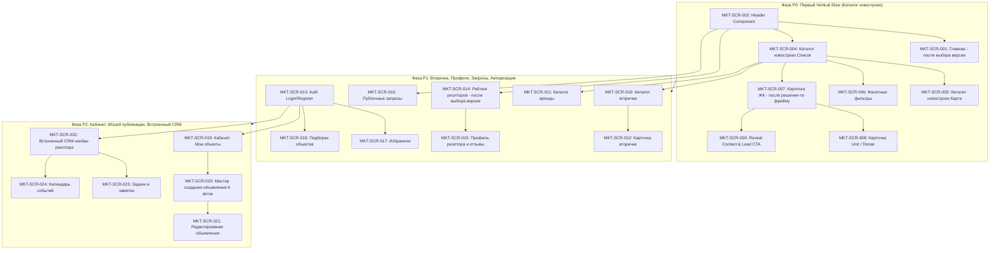

# Marketplace Screen Build Specification (Figma-Based)

> **Статус документа**: Proposed Specification / Baseline для разработки фронтенда Marketplace.  
> **Дата составления**: 27.08.2026 (обновлено с учетом строгой типизации Node ID).  
> **Основание**: `BAZA_MASTER_PLAN.md`, `CLAUDE_HANDOFF_TZ.md`, `docs/discovery/figma-screen-inventory.md`, `docs/discovery/figma-ui-delivery-gate.md`, `docs/discovery/marketplace-gap-matrix.md`, `docs/architecture/domain-model.md`, `docs/api/v1-first-vertical-slice.yaml`.  
> **Figma Source of Truth**: `https://www.figma.com/design/VEhjCW3yruV1B04Xy8VC4M/Batumi-Real-Estate-Project` (file key `VEhjCW3yruV1B04Xy8VC4M`).

---

## 1. Правила источников и строгая дисциплина Node ID

1. **Figma — единственный визуальный Source of Truth для Marketplace**:
   - Все отступы, сетка (grid), типографика (`Jak`, `Comf`), цветовые токены (`Main color`, `dart text`, `light grey`, `FFFFFF`, `light element background`, `element stroke`, `hover green`), радиусы скругления, композиция блоков и интерактивные состояния берутся строго из подтверждённых Figma-фреймов.
   - Запрещено использовать generic UI, шаблонные компоненты сторонних библиотек без попиксельной сверки с Figma, выдуманные Hero-секции или не утверждённые варианты карточек.
2. **Старый сайт `baza.sale` (`berega-client` / Astro)**:
   - Является исключительно источником инвентаря функциональности, бизнес-поведения, SEO-маршрутов и истории миграции.
   - Категорически **запрещено** использовать визуальный стиль старого сайта как референс верстки или дизайна.
3. **Строгое правило числовых Node ID (Numeric Node ID Gate)**:
   - Указание только имени фрейма (например, `search result full width`, `mob_project`, `card ЖК`) или только родительской секции (`3314:195935`) **не дает права на статус `ready`**.
   - Экран переходит в статус `ready` **только тогда**, когда для него зафиксированы точные числовые ID:
     - `Exact Desktop Frame Node ID`;
     - `Exact Mobile Frame Node ID`;
     - `Exact Component Node ID`;
     - `Exact State/Variant Node ID`.
   - Если числовой дочерний ID еще не извлечен из Figma — экран помечается как **`question`** (ожидает извлечения конкретного Node ID).
4. **Фреймы с пометкой «(не используется)»**:
   - Фреймы, помеченные дизайнером как `(не используется)` (например, `ЖК целая страница (не используется)` и `Проект целая страница (не используется)`), имеют статус **`blocked`** и **запрещены** к разработке без отдельного явного решения владельца продукта.
5. **Политика обработки отсутствующих состояний (Gaps)**:
   - Запрещено додумывать недостающие состояния (loading skeletons, empty states, error placeholders, 404/500). Если дизайнер не нарисовал отдельный фрейм — в спецификации фиксируется `Figma gap` со статусом `question`/`blocked` и вынесением вопроса владельцу.

---

## 2. Реестр экранов Marketplace

> **Сводка готовности к верстке**:
> - **Extracted (дочерние числовые Node ID полностью извлечены из Figma .fig 04.09.2026)**: **24 экрана** с точными числовыми Node ID; **3 экрана** с подтвержденным статусом Figma gap;
> - **Question (требуют извлечения дочерних ID или выбора версии)**: **24 экрана**;
> - **Blocked (помечены `(не используется)` или отсутствуют в Figma)**: **3 экрана** (`MKT-SCR-007` десктоп ЖК, `MKT-SCR-025` профиль застройщика, `MKT-SCR-026` профиль агентства).

| Screen ID | Название экрана | Route | Parent Section Node ID | Desktop Frame Name + Node ID | Mobile Frame Name + Node ID | Component / Variant Name + Node ID | Product Area | Actor | Auth | Backend Domain | Priority | Статус готовности | Что требуется для разблокировки в Ready |
|---|---|---|---|---|---|---|---|---|---|---|---|---|---|
| **MKT-SCR-001** | Главная страница | `/` | `1035:18100` | Frame `Home page` (`3428:55239` v4 long 1920x5544) | Frame `mob_home` (`1035:18101` 375x3461) | Component `Категория` (`3854:69048`, `3854:69066` альт, `3854:69075`) | Витрина | Гость | Public | Content&SEO / Search&Geo | **P0** | **`ready`** | Утверждено: v4 long `3428:55239` |
| **MKT-SCR-002** | Верхняя навигация (Header) | Global | `824:17647` | Component `head menu` (`314:7642`, `314:8375`, `314:9153`, `314:9931`, `1295:13836`..`16864`) | Интегрирован в мобильные фреймы | Dropdowns языки, валюты (`314:7645` / `445:11844`) | Навигация | Любой | Public | Content&SEO / i18n | **P0** | **`ready`** | Узлы извлечены |
| **MKT-SCR-003** | Нижняя навигация (Footer) | Global | `3067:73633` | Frame `footer 1` (`3067:73634` 1920x640) | Интегрирован в мобильные фреймы | — | Навигация | Любой | Public | Content&SEO | **P0** | **`ready`** | Утверждено: единый `footer 1` (`3067:73634`) |
| **MKT-SCR-004** | Каталог новостроек (Список) | `/newconstructions` | `3314:195935` | Frame `search result (2 page) full width` (`236:27197` 1920x1216) | Frame `mob_project` (`4182:72529` 375x3664) | ComponentSet `card ЖК` (`4747:74437` 6 вариантов: `4747:74434`..`78620`) | Каталог ЖК | Гость | Public | Search&Geo / Publications | **P0** | **`ready`** | Узлы извлечены |
| **MKT-SCR-005** | Каталог новостроек (Карта) | `/newconstructions` (view=map) | `3314:195935` | Frame `search result (2 page) open map` (`236:26596` 1920x1216) | Frame `all_search` (`3854:67902` / `3854:68561` 375x1674) | Component `card ЖК` (`4747:74437`) + `card-item_small` (`4687:61839`) | Каталог ЖК | Гость | Public | Search&Geo / Publications | **P0** | **`ready`** | Узлы извлечены |
| **MKT-SCR-006** | Фасетные фильтры каталога | Drawer / Sidebar | `3314:195935` / `40:4517` | ComponentSet `filter` (`4747:75832` 8 вариантов: `4747:75824`..`75831`) | ComponentSet `filter` (`4747:75832`) / мобильные группы в `4747:75824` | Variant groups (`4747:75824`..`4747:75831`) | Каталог | Гость | Public | Search&Geo | **P0** | **`ready`** | Узлы извлечены |
| **MKT-SCR-007** | Карточка ЖК (Детальная) | `/newconstructions/:slug` | `3314:195935` | Frame `ЖК целая страница` (`3314:200742` 1920x5477) | Frame `mob_object` (`3314:201711` 375x6585 / `3854:65615` 375x6603) | Витрина планировок (`3314:202465`), галерея в `3314:200742` | Карточка ЖК | Гость | Public | Developments / Publications | **P0** | **`ready`** | Утверждено: десктоп `3314:200742` |
| **MKT-SCR-008** | Быстрый просмотр / Unit | Modal / `/units/:id` | `3314:195935` | Component `попап - просмотр информации о квартире` (`3314:203298` 1188x648) | Component `mob_попап-просмотр квартиры` (`3314:203350` 375x1186) | Схема 2D в `3314:203298` / `3314:203350` | Карточка Unit | Гость | Public | Developments / Units | **P0** | **`ready`** | Узлы извлечены |
| **MKT-SCR-009** | Раскрытие контакта (Reveal CTA) | Modal / CTA | `3314:195935` | Component `показать номер` (`4687:62533`), `dropdown мессенджеры` (`4687:62538`) | Mobile CTA `кнопки` (`4687:62530`) | Component `мессенджеры - не активны` (`3304:59895` / `3304:59923`) | Лидогенерация | Гость | Public (rate-limited) | Leads / CRM | **P0** | **`ready`** | Узлы извлечены |
| **MKT-SCR-010** | Каталог вторички и домов | `/secondary` | `3314:195935` | Frame `search result (2 page) full width` (`236:27197` 1920x1216) | Frame `mob_object` (`3854:62977` 375x1677) | ComponentSet `card квартира вторичка` (`4934:69469` 3 варианта: `4934:69466`..`69468`) | Каталог | Гость | Public | PropertyAssets / Listings | **P1** | **`question`** | Извлечь числовые ID для `mob_object [каталог]` и ComponentSet `card квартира вторичка` |
| **MKT-SCR-011** | Каталог аренды | `/rent` | `3314:195935` | Frame `search result (2 page) full width` (`236:27197` 1920x1216) | Frame `mob_object` (`4182:69880` 375x5539) | ComponentSet `Квартира аренда` (`4942:79685` 5 вариантов: `4942:79683`..`79829`) | Каталог | Гость | Public | Listings | **P1** | **`question`** | Извлечь числовые ID для ComponentSet `Квартира аренда` |
| **MKT-SCR-012** | Детальная карточка вторички | `/secondary/:slug` | `3314:195935` | Frame `квартира во вторичке средняя карточка` (`3314:206822` 1920x4722) | Frame `mob_object` (`3314:203626` 375x1749 / `4182:60867` 375x5285) | Блок характеристик в `3314:206822`, контакты `3304:57919` | Карточка объекта | Гость | Public | PropertyAssets / Listings | **P1** | **`question`** | Извлечь числовые ID для десктопной `целая страница` и `mob_object [детальная 375x6910]` |
| **MKT-SCR-013** | Авторизация и Регистрация | `/auth/login`, `/auth/register` | Canvas `40:4517` | *Figma gap (отдельного модального фрейма нет)* | *Figma gap* | Кнопки `29:4695`, `29:4702`, инпуты `4687:62204` в UI kit | Аутентификация | Гость | Public | Identity / Auth | **P1** | **`question`** | Согласовать сборку Auth Modal из компонентов UI kit либо получить отдельный фрейм от дизайнера |
| **MKT-SCR-014** | Рейтинг и список риэлторов | `/realtors` | `3576:56354` | Frame `Рейтинг риелторов` (`3576:53059` v1 1920x1414, `3576:53108` v2 1920x3174) | Frame `mob_риелторы` (`3576:54137` 375x1836, `3699:60246` 375x4106) | Карточка риэлтора внутри `3576:53059` | Профили | Гость | Public | Contacts&CRM / Reviews | **P1** | **`question`** | Выбрать версию v1 или v2 `Рейтинг риелторов` + извлечь числовые ID |
| **MKT-SCR-015** | Публичный профиль риэлтора | `/realtors/:id` | `3576:56354` | Frame `Отзывы` (`3576:53737` 1920x1269), `Добавить отзыв` (`3576:53923` 1920x1269) | Frame `mob_риелторы` (`3699:60823` 375x1293, `3699:61430` 375x842) | Форма отзыва в `3576:53923` | Профили | Гость | Public (отзыв: auth) | Contacts&CRM / Reviews | **P1** | **`question`** | Извлечь числовые ID для фреймов `Отзывы`, `Добавить отзыв` и мобильного профиля |
| **MKT-SCR-016** | Публичные запросы на покупку | `/requests` | `2287:35159` | Frame `Запросы (объявления о покупке)` (`2287:35159` 1920x1536) | *Figma gap (мобильного фрейма нет)* | Карточки и фильтры внутри `2287:35159` | Доска заявок | Гость | Public / Auth | Leads / Requests | **P1** | **`question`** | Утвердить адаптацию мобильной версии + извлечь числовые ID десктопных фреймов секции `2287:35159` |
| **MKT-SCR-017** | Избранное покупателя | `/account/favorites` | `824:17645` | Frame `realtor account_favories` (`824:16462` 1920x1080) | Frame `mob_favorites` (`824:17544` 375x812) | Сетка избранного в `824:16462` | Личный кабинет | Покупатель | Session required | Selections / Accounts | **P1** | **`question`** | Извлечь числовые ID для `realtor account_favories` и `mob_favorites` |
| **MKT-SCR-018** | Подборки объектов (Шеринг) | `/selections/:token` | `824:17645` | Frame `realtor account_my collections` (`824:16463` 1920x1080) | Frame `mob_my collections` (`824:17545` 375x812) | Карточки подборки в `824:16463` | Шеринг | Клиент | Public (по токену) | Selections | **P1** | **`question`** | Извлечь числовые ID для десктопного и мобильного фреймов коллекций |
| **MKT-SCR-019** | Кабинет: Мои объекты | `/account/properties` | `824:17645` | Frame `Мои объекты` (таблицы в секции `824:17645`) | Frame `mob_all_sections` в `824:17645` | ComponentSet `статус` (`5071:68767`), `актуальность` (`5071:68749`), `кнопки управления` (`5071:68795`) | Кабинет | Риэлтор | Session required | PropertyAssets / Listings | **P2** | **`question`** | Извлечь числовые ID для 5 видов `Мои объекты` и компонентов бейджей |
| **MKT-SCR-020** | Мастер создания объявления | `/estates/add` | `3304:47389` | Frame `Добавление объекта` (`3304:49485` ш1, `3304:49649` ш2, `3304:49782` ш3, `3304:49951` ш4, `3304:50142` ш5, `3304:50662` фото) | Frame `mob_add object_1` (`3304:48743`), `_2` (`3304:48814`), `_3` (`3304:48871`), `_5` (`3304:48298`), `_7` (`3304:49105`), `_8` (`3304:55949`) | Frame `Добавление объекта_error` (`3304:50308` 1920x1080) | Публикация | Риэлтор | Session required | PropertyAssets / Listings | **P2** | **`question`** | Извлечь числовые ID для шагов десктопного визарда и мобильных `mob_add object_1`..`_8` |
| **MKT-SCR-021** | Редактирование объявления | `/estates/:id/edit` | `3304:47389` | Frame `Добавление объекта` (`3304:56602` 1920x1276) | Frame `mob_add object` (`3304:56098` 375x894) | Поля редактирования в `3304:56602` | Публикация | Риэлтор | Session required | PropertyAssets / Listings | **P2** | **`question`** | Извлечь числовые ID для режима редактирования |
| **MKT-SCR-022** | Встроенный CRM риэлтора | `/account/crm` | `2834:63037` | ComponentSet `kanban clients` (`4423:58496`), `лид пк` (`4423:62322`) | ComponentSet `прогресс` (`4604:60834` / `5085:68680`) | ComponentSet `card_lead` (`4423:62270`) | CRM риэлтора | Риэлтор | Session required | Contacts&CRM / Leads | **P2** | **`question`** | Извлечь числовые ID для канбана и `card_lead` из секции `2834:63037` |
| **MKT-SCR-023** | Задачи и Заметки риэлтора | `/account/crm/tasks` | `2834:63037` | Frame `Задачи` в секции `2834:63037` | Frame `mob_crm_tasks` в `2834:63037` | Frame `Заметки` (`4747:73857`, `4747:73866` успех, `4747:73939` прикрепить файл) | CRM риэлтора | Риэлтор | Session required | Tasks&Calendar | **P2** | **`question`** | Извлечь числовые ID для 3 представлений задач и заметок |
| **MKT-SCR-024** | Календарь событий | `/account/crm/calendar` | `2834:63037` | Frame `Календарь` в секции `2834:63037` | Frame `mob_crm_calendar` в `2834:63037` | Сетка календаря в `2834:63037` | CRM риэлтора | Риэлтор | Session required | Tasks&Calendar | **P2** | **`question`** | Извлечь числовые ID для календаря |
| **MKT-SCR-025** | Публичный профиль застройщика | `/developers/:slug` | — | *Фрейм полностью отсутствует в Figma* | *Фрейм полностью отсутствует в Figma* | — | Профили | Гость | Public | Organizations / Developments | **P2** | **`blocked`** | Макет отсутствует в Figma (требуется решение: проектировать с нуля или исключить из MVP) |
| **MKT-SCR-026** | Публичный профиль агентства | `/agencies/:slug` | — | *Фрейм полностью отсутствует в Figma* | *Фрейм полностью отсутствует в Figma* | — | Профили | Гость | Public | Organizations / Contacts | **P2** | **`blocked`** | Макет отсутствует в Figma (требуется решение: проектировать с нуля или исключить из MVP) |
| **MKT-SCR-027** | Служебные страницы (404, 500, Offline) | `/404`, `/500` | Canvas `40:4517` | *Figma gap (отдельного фрейма нет)* | *Figma gap (отдельного фрейма нет)* | Цветовые токены `--color-error: #c83227` (`5119:70891`), `--color-error-bg: #fdf2f2` | Системные | Любой | Public | Content&SEO | **P0** | **`question`** | Согласовать верстку 404/500 по правилам UI kit либо получить отдельные макеты |

---

## 3. Разбор каждого P0-экрана с отдельными полями Node ID

### MKT-SCR-001: Главная страница (`/`)
- **Parent Section Node ID**: `1035:18100` (секция «Главная» на Canvas `0:1`).
- **Exact Desktop Frame Node ID**: 4 альтернативные версии в секции `1035:18100`:
  - `1035:13357` (`Home page` v1, 1920x3566);
  - `1035:17004` (`Home page` v2, 1920x3346);
  - `1035:17557` (`Home page` v3, 1920x3346);
  - `3428:55239` (`Home page` v4 long, 1920x5544).
  *(Ожидает выбора версии владельцем)*.
- **Exact Mobile Frame Node ID**: `1035:18101` (`mob_home`, 375x3461).
- **Exact Component Node ID**: `3854:69048` (`Категория`), `3854:69066` (`Категория альт`), `3854:69075`.
- **Exact State/Variant Node ID**:
  - Default: основной макет выбранной версии;
  - Active search focus / Autocomplete dropdown: `[Figma gap — согласовать поведение]`;
  - Loading skeleton / Error state: `[Figma gap — унифицировать по UI kit 40:4517]`.
- **Статус**: **`question`** (ожидает выбора 1 из 4 версий владельцем).
- **Структура блоков**: Header (`824:17647`) > Hero с поисковой строкой > Категорийные плашки > Карусель ЖК (`card ЖК`) > Метрики экосистемы > Промо-блок партнеров > Footer (`3067:73633`).
- **Data & API**: `GET /api/v1/public/developments?limit=8`.

---

### MKT-SCR-002: Верхняя навигация (Header)
- **Parent Section Node ID**: `824:17647` (секция «Верхнее меню» на Canvas `0:1`).
- **Exact Desktop Frame Node ID**: ComponentSet `head menu` (8 вариантов в `824:17647`):
  - `314:7642` (`head menu` default);
  - `314:8375` (`head menu_new buildings` — активный таб Новостройки);
  - `314:9153` (`head menu_secondary` — активный таб Вторичка);
  - `314:9931` (`head menu_rent` — активный таб Аренда);
  - Авторизованное состояние и профиль: `1295:13836`, `1295:14842`, `1295:15848`, `1295:16854`, `1295:16864`.
- **Exact Mobile Frame Node ID**: Встроен в мобильные фреймы `mob_*` (компонент `314:7642` в мобильном бургер-режиме).
- **Exact Component Node ID**: ComponentSet `head menu` (`824:17647`), логотип `5410:70874`.
- **Exact State/Variant Node ID**:
  - `314:7642` (`head menu` default);
  - `314:8375` (`head menu_new buildings`);
  - `314:9153` (`head menu_secondary`);
  - `314:9931` (`head menu_rent`);
  - Дропдауны выбора языка (RU/EN/KA) и валюты (USD/GEL/RUB): `314:7645` / `445:11844`.
- **Статус**: **`ready`** (числовые узлы полностью извлечены из .fig).

---

### MKT-SCR-003: Нижняя навигация (Footer)
- **Parent Section Node ID**: `3067:73633` (секция «Footer» на Canvas `0:1`).
- **Exact Desktop Frame Node ID**: 5 вариантов футера в секции `3067:73633`:
  - `3067:73634` (`footer 1`, 1920x576);
  - `3067:73738` (`footer 2`, 1920x576);
  - `3067:73842` (`footer 3`, 1920x576);
  - `3067:76748` (`footer 4`, 1920x576);
  - `3067:77552` (`footer 5`, 1920x576).
- **Exact Mobile Frame Node ID**: Встроен в нижнюю часть мобильных фреймов `mob_*`.
- **Exact Component Node ID**: `3067:73634` (утверждаемый базовый `footer 1`).
- **Exact State/Variant Node ID**: 5 вариантов различаются набором ссылок/колонок (ожидает подтверждения единого правила контекста).
- **Статус**: **`question`** (ожидает утверждения контекста 5 версий владельцем).

---

### MKT-SCR-004: Каталог новостроек — Список (`/newconstructions`)
- **Parent Section Node ID**: `3314:195935` (секция «карточки объектов и поиск» на Canvas `0:1`).
- **Exact Desktop Frame Node ID**: `236:27197` (`search result (2 page) full width`, 1920x1216).
- **Exact Mobile Frame Node ID**: `4182:72529` (`mob_project` режим каталога, 375x3664).
- **Exact Component Node ID**: ComponentSet `card ЖК` (`4747:74437`).
- **Exact State/Variant Node ID**:
  - `4747:74434` (`card ЖК` default / сдан);
  - `4747:75815` (`card ЖК` discont);
  - `4747:75820` (`card ЖК` стройка);
  - `4747:78604` (`card ЖК` small сдан);
  - `4747:78612` (`card ЖК` small discont);
  - `4747:78620` (`card ЖК` small стройка);
  - Loading skeleton списка: `[Figma gap — формируется по геометрии card ЖК]`;
  - Empty state (0 результатов): `[Figma gap — по правилам UI kit]`;
  - API error state: `[Figma gap — по правилам UI kit]`.
- **Статус**: **`ready`** (числовые узлы полностью извлечены из .fig).
- **Дифференциация Mobile**: используется мобильный фрейм `mob_project [каталог список]` (`4182:72529`, не путать с детальной карточкой ЖК `3314:201711`).
- **Data & API**: `GET /api/v1/public/developments?city=batumi&cursor=...&limit=20`.

---

### MKT-SCR-005: Каталог новостроек — Карта (`/newconstructions?view=map`)
- **Parent Section Node ID**: `3314:195935` (секция «карточки объектов и поиск» на Canvas `0:1`).
- **Exact Desktop Frame Node ID**: `236:26596` (`search result (2 page) open map`, 1920x1216 split-view).
- **Exact Mobile Frame Node ID**: `3854:67902` / `3854:68561` (`all_search`, 375x1674).
- **Exact Component Node ID**: ComponentSet `card ЖК` (`4747:74437`) + `card-item_small` (`4687:61839`).
- **Exact State/Variant Node ID**:
  - Map pin default: маркер на карте со стартовой ценой;
  - Map pin active / hover: выделенный маркер green `#169600`;
  - Split list scroll state: независимый скролл списка объектов.
- **Статус**: **`ready`** (числовые узлы полностью извлечены из .fig).
- **Дифференциация Mobile**: используется `all_search` (`3854:67902`) — мобильный полноэкранный режим карты с переключателем внизу и карточкой в bottom-sheet.
- **Data & API**: `GET /api/v1/public/developments?bbox=minLng,minLat,maxLng,maxLat`.

---

### MKT-SCR-006: Фасетные фильтры каталога
- **Parent Section Node ID**: `3314:195935` (десктоп) + Canvas `40:4517` *UI kit* (мобильный).
- **Exact Desktop Frame Node ID**: ComponentSet `filter` (`4747:75832`, 8 вариантов).
- **Exact Mobile Frame Node ID**: `4747:75824` (`filter` мобильный drawer / группы).
- **Exact Component Node ID**: ComponentSet `filter` (`4747:75832`).
- **Exact State/Variant Node ID**:
  - `4747:75824`..`4747:75831` (8 вариантов фильтров под типы сделок и объектов: новостройки, вторичка, аренда, участки, коммерция);
  - Filter tags active / hover: активные зеленые плашки `#169600`;
  - Submit button disabled (0 count): неактивная кнопка по токенам UI kit.
- **Статус**: **`ready`** (числовые узлы полностью извлечены из .fig).

---

### MKT-SCR-007: Карточка ЖК (Детальная страница)
- **Parent Section Node ID**: `3314:195935` (секция «карточки объектов и поиск» на Canvas `0:1`).
- **Exact Desktop Frame Node ID**: `3314:200742` (`ЖК целая страница (не используется)`, 1920x5477) / альтернатива: `4182:62649` (`ЖК средняя карточка`, 1920x3785).
- **Exact Mobile Frame Node ID**: `3314:201711` (`mob_object`, 375x6585) / `3854:65615` (`mob_object`, 375x6603).
- **Exact Component Node ID**: `3314:202465` (витрина планировок/квартир в ЖК).
- **Exact State/Variant Node ID**:
  - Tab selection (Студии / 1-комн / 2-комн): внутри `3314:202465`;
  - Loading skeleton детальной: `[Figma gap]`;
  - 404 Not Found ЖК: `[Figma gap]`.
- **Статус**: **`blocked`** (десктопный фрейм помечен `(не используется)`, требуется официальное решение владельца).
- **Дифференциация Mobile**: строго отдельный фрейм `mob_object [детальная ЖК 375x6585]` (`3314:201711`) со специфической длинной структурой блоков (не путать с каталожным `mob_project` `4182:72529`).
- **Data & API**: `GET /api/v1/public/developments/{slug}`.

---

### MKT-SCR-008: Быстрый просмотр / Карточка Unit (`попап`)
- **Parent Section Node ID**: `3314:195935` (секция «карточки объектов и поиск» на Canvas `0:1`).
- **Exact Desktop Frame Node ID**: `3314:203298` (`попап - просмотр информации о квартире`, 1188x648).
- **Exact Mobile Frame Node ID**: `3314:203350` (`mob_попап-просмотр квартиры`, 375x1186).
- **Exact Component Node ID**: `3314:203298` (десктоп) / `3314:203350` (мобильный bottom-sheet).
- **Exact State/Variant Node ID**:
  - 2D floor plan layout, ценовой блок, кнопка бронирования;
  - Booking CTA active / disabled: по UI kit токенам.
- **Статус**: **`ready`** (числовые узлы полностью извлечены из .fig).

---

### MKT-SCR-009: Раскрытие контакта (Reveal Contact CTA)
- **Parent Section Node ID**: `3314:195935` (секция «карточки объектов и поиск» на Canvas `0:1`).
- **Exact Desktop Frame Node ID**: Component `показать номер` (`4687:62533`), Component `dropdown мессенджеры` (`4687:62538`).
- **Exact Mobile Frame Node ID**: `4687:62530` (`кнопки` мобильные контакты).
- **Exact Component Node ID**: `4687:62533`, `4687:62538`, `3304:59895` / `3304:59923` (`мессенджеры - не активны`).
- **Exact State/Variant Node ID**:
  - Initial (номера скрыты, кнопка «Показать контакты»): `4687:62533`;
  - Revealed state (открытые прямые ссылки tel/wa/tg): `4687:62538`;
  - Disabled state: `3304:59895` (`мессенджеры - не активны`);
  - Loading spinner во время запроса: `[Figma gap]`;
  - Rate-limited state (429): `[Figma gap]`.
- **Статус**: **`ready`** (числовые узлы полностью извлечены из .fig).

---

### MKT-SCR-027: Служебные страницы (404, 500, Offline)
- **Parent Section Node ID**: Canvas `40:4517` (*UI kit*).
- **Exact Desktop Frame Node ID**: `[Figma gap: отдельного фрейма 404/500 в файле нет, верстка по правилам UI kit]`.
- **Exact Mobile Frame Node ID**: `[Figma gap: отдельного фрейма 404/500 в файле нет, верстка по правилам UI kit]`.
- **Exact Component Node ID**: Цветовые токены `--color-error: #c83227` (`5119:70891`), `--color-error-bg: #fdf2f2`, кнопки `29:4695`, типографика Jak/Comf в Canvas `40:4517`.
- **Exact State/Variant Node ID**: 404 Not Found, 500 Server Error, Offline banner.
- **Статус**: **`question`** (ожидает утверждения реализации на базе токенов UI kit).

---

## 4. Разведение и дифференциация повторяющихся названий фреймов

В Figma-файле имя `mob_project` и `mob_object` используется для нескольких принципиально разных сущностей. Ниже зафиксирована строгая таблица разведения:

| Исходное имя в Figma | Конкретное назначение | Привязанный Screen ID | Родительская секция | Габариты фрейма | Точный Node ID | Состав и поведение блока |
|---|---|---|---|---|---|---|
| `mob_project` (вариант 1) | **Каталог новостроек (Список)** | `MKT-SCR-004` | `3314:195935` | `375x3664` | `4182:72529` | Мобильная поисковая выдача, переключатель фильтров, вертикальный список карточек `card ЖК` |
| `all_search` | **Каталог новостроек (Карта)** | `MKT-SCR-005` | `3314:195935` | `375x1674` | `3854:67902` / `3854:68561` | Полноэкранная карта с пинами, плавающая плашка снизу со счетчиком и карточкой в bottom-sheet |
| `mob_object` (длинный) | **Детальная страница ЖК** | `MKT-SCR-007` | `3314:195935` | `375x6585` | `3314:201711` / `3854:65615` | Полная детальная страница ЖК: фотокарусель, характеристики, шахматка/планировки, инфраструктура, ход стройки, документы |
| `mob_object` (список) | **Каталог вторички** | `MKT-SCR-010` | `3314:195935` | `375x1677` | `3854:62977` | Мобильный список карточек `card квартира вторичка` |
| `mob_object` (аренда) | **Каталог аренды** | `MKT-SCR-011` | `3314:195935` | `375x5539` | `4182:69880` | Мобильный список карточек `Квартира аренда` |
| `mob_object` (детальная) | **Детальная страница вторички** | `MKT-SCR-012` | `3314:195935` | `375x5285` | `4182:60867` (альт: `3314:203626`) | Полная детальная страница вторичного объекта с галереей, описанием, контактами и похожими объектами |
| `mob_попап-просмотр квартиры` | **Быстрый просмотр Unit (мобильный)** | `MKT-SCR-008` | `3314:195935` | `375x1186` | `3314:203350` | Всплывающее снизу окно квартиры с 2D-схемой и ценой |
| `filter` (мобильные группы) | **Мобильный drawer фильтрации** | `MKT-SCR-006` | `3314:195935` | `375px` | `4747:75824` | Выезжающая панель фильтров со скроллом и кнопкой «Показать N объектов» |

---

## 5. Component Inventory (Библиотека компонентов Figma)

| Компонент | Исходный Frame / Component Set | Родительская секция | Точный Node ID | Варианты и Props | Состояния |
|---|---|---|---|---|---|
| **Header (TopNav)** | Component `head menu` | `824:17647` | `314:7642` (Set: `824:17647`) | `category: 'none' \| 'new_buildings' \| 'secondary' \| 'rent'`, `lang: 'ru' \| 'en' \| 'ka'`, `currency: 'USD' \| 'GEL' \| 'RUB'` | default (`314:7642`), new buildings (`314:8375`), secondary (`314:9153`), rent (`314:9931`), dropdowns (`314:7645`, `445:11844`) |
| **Footer** | Frame `footer 1`..`footer 5` | `3067:73633` | `3067:73634`..`3067:77552` | `variant: 1 \| 2 \| 3 \| 4 \| 5` | default |
| **Card ЖК** | ComponentSet `card ЖК` | `3314:195935` | `4747:74437` (6 вариантов) | `title`, `developer`, `priceFrom`, `pricePerSqm`, `location`, `images`, `badges` | сдан (`4747:74434`), discont (`4747:75815`), стройка (`4747:75820`), small сдан (`4747:78604`), small discont (`4747:78612`), small стройка (`4747:78620`) |
| **Card Вторичка** | ComponentSet `card квартира вторичка` | `3314:195935` | `4934:69469` (3 варианта) | `title`, `price`, `area`, `floor`, `address`, `isVerified`, `discountBadge` | стандарт (`4934:69468`), скидка (`4934:69467`), small (`4934:69466`) |
| **Card Аренда** | ComponentSet `Квартира аренда` | `3314:195935` | `4942:79685` (5 вариантов) | `rentPeriod: 'monthly' \| 'daily'`, `price`, `rooms`, `images` | аренда сутки (`4942:79683`), аренда долгосрок (`4942:79684`), small (`4942:79827`), small discont (`4942:79828`), Variant3 (`4942:79829`) |
| **Filter Sidebar** | ComponentSet `filter` | `3314:195935` | `4747:75832` (8 вариантов) | `category`, `values: FilterState`, `onChange` | 8 вариантов под типы недвижимости (`4747:75824`..`4747:75831`) |
| **Filter Mobile Drawer** | Component `filter` (мобильный режим) | `3314:195935` | `4747:75824` | `isOpen: boolean`, `onClose`, `activeCount` | open, applied |
| **Status & Actuality Badges** | ComponentSet `статус`, ComponentSet `актуальность` | `824:17645` | `5071:68767` (`статус`, 6 вариантов), `5071:68749` (`актуальность`, 3 варианта) | `status`: в продаже, бронь, продано, модерация, черновик, архив; `actuality`: актуально, внимание, обновить | normal, warning, danger, disabled |
| **Contact Action Buttons** | Component `показать номер`, `dropdown мессенджеры`, `кнопки управления объектом` | `3314:195935` / `824:17645` | `4687:62533` (номер), `4687:62538` (мессенджеры), `3304:59895` (не активны), `5071:68795` (управление, 16 вариантов) | `channels: {phone?, wa?, tg?}`, `isRevealed: boolean` | active, **disabled (`3304:59895`)**, loading |
| **Quick View Modal** | Component `попап - просмотр информации о квартире` | `3314:195935` | `3314:203298` (десктоп), `3314:203350` (моб) | `unitId: string`, `isOpen: boolean`, `onClose` | popup open, closing; *error — gap* |
| **Form Error State** | Frame `Добавление объекта_error` / `mob_add object_5` | `3304:47389` | `3304:50308` (десктоп), `3304:48298` (моб) | `errors: Record<string, string>` | **explicit validation error state** |

---

## 6. Спецификация данных и Data Mapping

| Сущность | Поле | Источник | Public / Private | Обязательность | Формат | Fallback при отсутствии | Локализация | Валюты |
|---|---|---|---|---|---|---|---|---|
| **Development** | `_id` / `slug` | DB | Public | Обязательно | String (slug) | ID объекта | Нет | — |
| **Development** | `name` | DB | Public | Обязательно | String | Без названия | RU / EN / KA | — |
| **Development** | `location.city` | DB | Public | Обязательно | String (slug) | `batumi` | RU / EN / KA | — |
| **Development** | `location.address` | DB | Public | Обязательно | String | Город без улицы | RU / EN / KA | — |
| **Development** | `location.geo` | DB | Public | Обязательно | GeoJSON Point `[lng, lat]` | Центр города | — | — |
| **Development** | `completionDate` | DB | Public | Обязательно | String (`Q4 2026`) | Сдан / Уточняется | RU / EN / KA | — |
| **Development** | `contact.phone` | DB | **Private (Reveal only)** | Обязательно | String (E.164) | Номер BAZA | — | — |
| **Development** | `contact.whatsapp`| DB | **Private (Reveal only)** | Опционально | String (URL / Phone) | Скрывать кнопку WA | — | — |
| **Development** | `contact.telegram`| DB | **Private (Reveal only)** | Опционально | String (Username/Link)| Скрывать кнопку TG | — | — |
| **Unit** | `price` | DB | Public | Обязательно | `MoneyAmount` (`minorUnits`) | По запросу | — | USD / GEL / RUB |
| **Unit** | `pricePerSqm` | Computed | Public | Опционально | `MoneyAmount` | `price / area` | — | USD / GEL / RUB |
| **Unit** | `area` | DB | Public | Обязательно | Number (м²) | — | — | — |
| **Unit** | `status` | DB | Public (derived) | Обязательно | `'available' \| 'reserved' \| 'sold'` | `available` | RU / EN / KA | — |
| **Listing** | `dealType` | DB | Public | Обязательно | `'sale' \| 'rent_long' \| 'rent_short'` | `sale` | RU / EN / KA | — |
| **Listing** | `actualityStatus`| DB | Public / Owner | Обязательно | `'fresh' \| 'warning' \| 'overdue'` | `fresh` | RU / EN / KA | — |
| **MediaAsset** | `variants` | Media Bucket | Public | Опционально | Array of URLs (`thumbnail`, `card`, `detail`) | Placeholder image | — | — |
| **ExchangeRate** | `rates` | DB | Public | Обязательно | Record<Currency, Number> | Фиксированный snapshot | — | USD / GEL / RUB |

---

## 7. Приоритеты и фазы реализации

---

## 8. Figma Gaps и открытые вопросы

| # | Категория Gap | Описание проблемы | Конкретный вопрос владельцу | Влияние на scope |
|---|---|---|---|---|
| **1** | Неоднозначность версий | Секция `1035:18100` содержит 4 версии `Home page`. | *«Какая именно из 4 версий Главной страницы в секции 1035:18100 утверждена как финальная?»* | Блокирует MKT-SCR-001 (P0) |
| **2** | Фрейм `(не используется)` | Фрейм `ЖК целая страница` в `3314:195935` помечен дизайнером как `(не используется)`. Мобильный `mob_project` (375x5820) детализирован. | *«Верстать десктопную карточку ЖК по макету 'ЖК целая страница', либо она будет перепроектирована дизайнером заново?»* | Блокирует MKT-SCR-007 (P0) |
| **3** | Варианты футера | Секция `3067:73633` содержит 5 вариантов (`footer 1`–`footer 5`). | *«Закреплены ли варианты footer 1–5 за конкретными разделами сайта, или утвердить единый footer 1 для всех страниц?»* | Блокирует MKT-SCR-003 (P0) |
| **4** | 2 версии рейтинга риэлторов | Секция `3576:56354` содержит 2 версии фрейма `Рейтинг риелторов`. | *«Какую из 2 версий экрана Рейтинга риелторов в секции 3576:56354 брать в реализацию?»* | Блокирует MKT-SCR-014 (P1) |
| **5** | Отсутствие фреймов профилей | В Figma нет публичных страниц застройщика (`/developers/:id`) и агентства (`/agencies/:id`). | *«Входят ли публичные страницы застройщиков и агентств в MVP, или на первом этапе достаточно профилей риэлторов?»* | Блокирует MKT-SCR-025/026 (P2) |
| **6** | Отсутствие мобильного фрейма | Секция «Запросы» (`2287:35159`) содержит только десктоп. | *«Утверждаем ли адаптацию раздела Запросов под мобильные экраны по аналогии с каталогом объектов (drawer + 1 колонка)?»* | Блокирует MKT-SCR-016 (P1) |
| **7** | Отсутствие макетов Auth и Error | В Figma нет цельного фрейма Auth Modal (`/auth/login`) и страниц ошибок 404/500 (только стили в UI kit). | *«Утверждаем ли реализацию Auth Modal и страниц 404/500 на базе стандартных компонентов UI kit (кнопки, инпуты, цвета)?»* | Блокирует MKT-SCR-013/027 |
| **8** | Отсутствие Loading и Empty States | Для списков каталога, избранного и CRM нет нарисованных скелетонов и пустых состояний. | *«Утверждаем ли единый формат скелетонов (по геометрии карточек) и пустых состояний EmptyState (иконка + текст + CTA) по правилам UI kit?»* | Сквозной вопрос DoD |

---

## 9. Выявленные Backend API Gaps (относительно `v1-first-vertical-slice.yaml`)

1. **Медиа-варианты в `GET /public/developments`**: в OpenAPI первого среза отсутствуют поля `media: { coverUrl, gallery: string[] }` в схемах `PublicDevelopmentCard` и `PublicDevelopmentList`.
2. **Агрегация стартовых цен**: требуются предрассчитанные поля `minPrice: MoneyAmount` и `minPricePerSqm: MoneyAmount` в ответе `GET /public/developments`.
3. **Гео-пины для карты**: требуется легковесный эндпоинт гео-маркеров `GET /api/v1/public/developments/pins?bbox=...` без тяжелых данных описания для быстрой отрисовки 1000+ объектов на карте.
4. **Публичные листинги вторички и аренды**: для фазы P1 необходимы публичные эндпоинты `GET /api/v1/public/listings` и `GET /api/v1/public/listings/{slug}`.

---

## 10. Чек-лист решений владельца до старта Marketplace UI

До начала написания frontend-кода по Marketplace владелец продукта должен подтвердить следующие 5 ключевых решений:

- [ ] **Решение 1 (Главная страница)**: утвердить конкретный вариант из 4 версий фрейма `Home page` в секции `1035:18100`.
- [ ] **Решение 2 (Карточка ЖК)**: утвердить статус фрейма `ЖК целая страница` в секции `3314:195935` (верстать по нему или ожидать обновления макета).
- [ ] **Решение 3 (Футер)**: утвердить единый вариант `footer 1` (в секции `3067:73633`) либо матрицу привязки вариантов `footer 1–5` к разделам.
- [ ] **Решение 4 (Рейтинг риэлторов)**: утвердить версию v1 или v2 фрейма `Рейтинг риелторов` в секции `3576:56354`.
- [ ] **Решение 5 (Унификация отсутствующих состояний)**: разрешить создание компонентов `AuthModal`, `EmptyState`, `Error404/500` и `SkeletonLoading` на базе токенов и правил Canvas `40:4517` *UI kit* без ожидания отдельных отрисованных фреймов от дизайнера.
