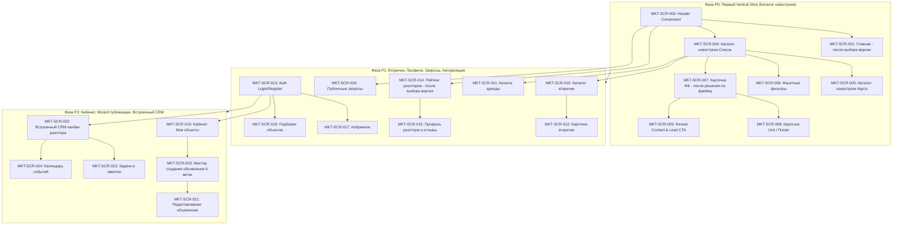

# Marketplace Screen Build Specification (Figma-Based)

> **Статус документа**: Proposed Specification / Baseline для разработки фронтенда Marketplace.  
> **Дата составления**: 27.08.2026 (обновлено с учетом строгой типизации Node ID).  
> **Основание**: `BAZA_MASTER_PLAN.md`, `CLAUDE_HANDOFF_TZ.md`, `docs/discovery/figma-screen-inventory.md`, `docs/discovery/figma-ui-delivery-gate.md`, `docs/discovery/marketplace-gap-matrix.md`, `docs/architecture/domain-model.md`, `docs/api/v1-first-vertical-slice.yaml`.  
> **Figma Source of Truth**: `https://www.figma.com/design/VEhjCW3yruV1B04Xy8VC4M/Batumi-Real-Estate-Project` (file key `VEhjCW3yruV1B04Xy8VC4M`).

---

## 1. Правила источников и строгая дисциплина Node ID

1. **Figma — единственный визуальный Source of Truth для Marketplace**:
   - Все отступы, сетка (grid), типографика (`Jak`, `Comf`), цветовые токены (`Main color`, `dart text`, `light grey`, `FFFFFF`, `light element background`, `element stroke`, `hover green`), радиусы скругления, композиция блоков и интерактивные состояния берутся строго из подтверждённых Figma-фреймов.
   - Запрещено использовать generic UI, шаблонные компоненты сторонних библиотек без попиксельной сверки с Figma, выдуманные Hero-секции или не утверждённые варианты карточек.
2. **Старый сайт `baza.sale` (`berega-client` / Astro)**:
   - Является исключительно источником инвентаря функциональности, бизнес-поведения, SEO-маршрутов и истории миграции.
   - Категорически **запрещено** использовать визуальный стиль старого сайта как референс верстки или дизайна.
3. **Строгое правило числовых Node ID (Numeric Node ID Gate)**:
   - Указание только имени фрейма (например, `search result full width`, `mob_project`, `card ЖК`) или только родительской секции (`3314:195935`) **не дает права на статус `ready`**.
   - Экран переходит в статус `ready` **только тогда**, когда для него зафиксированы точные числовые ID:
     - `Exact Desktop Frame Node ID`;
     - `Exact Mobile Frame Node ID`;
     - `Exact Component Node ID`;
     - `Exact State/Variant Node ID`.
   - Если числовой дочерний ID еще не извлечен из Figma — экран помечается как **`question`** (ожидает извлечения конкретного Node ID).
4. **Фреймы с пометкой «(не используется)»**:
   - Фреймы, помеченные дизайнером как `(не используется)` (например, `ЖК целая страница (не используется)` и `Проект целая страница (не используется)`), имеют статус **`blocked`** и **запрещены** к разработке без отдельного явного решения владельца продукта.
5. **Политика обработки отсутствующих состояний (Gaps)**:
   - Запрещено додумывать недостающие состояния (loading skeletons, empty states, error placeholders, 404/500). Если дизайнер не нарисовал отдельный фрейм — в спецификации фиксируется `Figma gap` со статусом `question`/`blocked` и вынесением вопроса владельцу.

---

## 2. Реестр экранов Marketplace

> **Сводка готовности к верстке**:
> - **Ready (готовы к верстке с полным набором числовых ID)**: **0 экранов** (требуется извлечение дочерних числовых Node ID из Figma);
> - **Question (требуют извлечения дочерних ID или выбора версии)**: **24 экрана**;
> - **Blocked (помечены `(не используется)` или отсутствуют в Figma)**: **3 экрана** (`MKT-SCR-007` десктоп ЖК, `MKT-SCR-025` профиль застройщика, `MKT-SCR-026` профиль агентства).

| Screen ID | Название экрана | Route | Parent Section Node ID | Desktop Frame Name + Node ID | Mobile Frame Name + Node ID | Component / Variant Name + Node ID | Product Area | Actor | Auth | Backend Domain | Priority | Статус готовности | Что требуется для разблокировки в Ready |
|---|---|---|---|---|---|---|---|---|---|---|---|---|---|
| **MKT-SCR-001** | Главная страница | `/` | `1035:18100` | Frame `Home page` (4 версии: v1..v4) — *ID: требуется извлечение* | Frame `mob_home` (`375x3461`) — *ID: требуется извлечение* | Component `Категория` — *ID: требуется извлечение* | Витрина | Гость | Public | Content&SEO / Search&Geo | **P0** | **`question`** | Выбрать 1 из 4 версий `Home page` + извлечь числовые ID десктопа и `mob_home` |
| **MKT-SCR-002** | Верхняя навигация (Header) | Global | `824:17647` | Component `head menu` (8 вариантов) — *ID: требуется извлечение* | Интегрирован в мобильные фреймы | Dropdowns: языки, валюты — *ID: требуется извлечение* | Навигация | Любой | Public | Content&SEO / i18n | **P0** | **`question`** | Извлечь числовой Node ID для `head menu` и его 8 вариантов из секции `824:17647` |
| **MKT-SCR-003** | Нижняя навигация (Footer) | Global | `3067:73633` | Frame `footer 1`..`footer 5` — *ID: требуется извлечение* | Интегрирован в мобильные фреймы | — | Навигация | Любой | Public | Content&SEO | **P0** | **`question`** | Утвердить правило контекста 5 версий + извлечь числовой Node ID утвержденного футера |
| **MKT-SCR-004** | Каталог новостроек (Список) | `/newconstructions` | `3314:195935` | Frame `search result full width` — *ID: требуется извлечение* | Frame `mob_project [каталог список]` — *ID: требуется извлечение* | Component `card ЖК` (`COMPONENT_SET`) — *ID: требуется извлечение* | Каталог ЖК | Гость | Public | Search&Geo / Publications | **P0** | **`question`** | Извлечь числовые ID для `search result full width`, `mob_project [каталог]` и `card ЖК` |
| **MKT-SCR-005** | Каталог новостроек (Карта) | `/newconstructions` (view=map) | `3314:195935` | Frame `search result (2 page) open map` — *ID: требуется извлечение* | Frame `mob_project [каталог карта]` — *ID: требуется извлечение* | Component `card ЖК` + пины — *ID: требуется извлечение* | Каталог ЖК | Гость | Public | Search&Geo / Publications | **P0** | **`question`** | Извлечь числовые ID для `search result (2 page) open map` и мобильного режима карты |
| **MKT-SCR-006** | Фасетные фильтры каталога | Drawer / Sidebar | `3314:195935` / `40:4517` | Component `filter` (`COMPONENT_SET` 3200x4534) — *ID: требуется извлечение* | Component `filters_mob` (в `40:4517`) — *ID: требуется извлечение* | Variant groups цен, комнат, опций — *ID: требуется извлечение* | Каталог | Гость | Public | Search&Geo | **P0** | **`question`** | Извлечь числовой Node ID для ComponentSet `filter` и Component `filters_mob` |
| **MKT-SCR-007** | Карточка ЖК (Детальная) | `/newconstructions/:slug` | `3314:195935` | Frame `ЖК целая страница (не используется)` — *ID: требуется извлечение* | Frame `mob_project [детальная ЖК 375x5820]` — *ID: требуется извлечение* | Витрина планировок, галерея — *ID: требуется извлечение* | Карточка ЖК | Гость | Public | Developments / Publications | **P0** | **`blocked`** | Решение владельца по статусу десктопного фрейма `ЖК целая страница (не используется)` + извлечение ID |
| **MKT-SCR-008** | Быстрый просмотр / Unit | Modal / `/units/:id` | `3314:195935` | Component `попап - просмотр информации о квартире` (десктоп `1200px`) — *ID: требуется извлечение* | Component `попап [mobile variant]` — *ID: требуется извлечение* | Схема 2D, характеристики — *ID: требуется извлечение* | Карточка Unit | Гость | Public | Developments / Units | **P0** | **`question`** | Извлечь числовой Node ID для десктопного и мобильного вариантов `попап` |
| **MKT-SCR-009** | Раскрытие контакта (Reveal CTA) | Modal / CTA | `3314:195935` | Component `контакты` / Component `мессенджеры` — *ID: требуется извлечение* | Mobile sticky CTA bar — *ID: требуется извлечение* | Component `мессенджеры - не активны` — *ID: требуется извлечение* | Лидогенерация | Гость | Public (rate-limited) | Leads / CRM | **P0** | **`question`** | Извлечь числовые Node ID для компонентов `контакты`, `мессенджеры`, `мессенджеры - не активны` |
| **MKT-SCR-010** | Каталог вторички и домов | `/secondary` | `3314:195935` | Frame `search result full width` — *ID: требуется извлечение* | Frame `mob_object [каталог вторички]` — *ID: требуется извлечение* | Component `card квартира вторичка` — *ID: требуется извлечение* | Каталог | Гость | Public | PropertyAssets / Listings | **P1** | **`question`** | Извлечь числовые ID для `mob_object [каталог]` и ComponentSet `card квартира вторичка` |
| **MKT-SCR-011** | Каталог аренды | `/rent` | `3314:195935` | Frame `search result full width` — *ID: требуется извлечение* | Frame `mob_object [каталог аренды]` — *ID: требуется извлечение* | Component `Квартира аренда` (`COMPONENT_SET`) — *ID: требуется извлечение* | Каталог | Гость | Public | Listings | **P1** | **`question`** | Извлечь числовые ID для ComponentSet `Квартира аренда` |
| **MKT-SCR-012** | Детальная карточка вторички | `/secondary/:slug` | `3314:195935` | Frame `целая страница` (для вторички) — *ID: требуется извлечение* | Frame `mob_object [детальная вторички 375x6910]` — *ID: требуется извлечение* | Блок характеристик, контакты — *ID: требуется извлечение* | Карточка объекта | Гость | Public | PropertyAssets / Listings | **P1** | **`question`** | Извлечь числовые ID для десктопной `целая страница` и `mob_object [детальная 375x6910]` |
| **MKT-SCR-013** | Авторизация и Регистрация | `/auth/login`, `/auth/register` | Canvas `40:4517` | *Figma gap (отдельного модального фрейма нет)* | *Figma gap* | Инпуты, кнопки в UI kit — *ID: требуется извлечение* | Аутентификация | Гость | Public | Identity / Auth | **P1** | **`question`** | Согласовать сборку Auth Modal из компонентов UI kit либо получить отдельный фрейм от дизайнера |
| **MKT-SCR-014** | Рейтинг и список риэлторов | `/realtors` | `3576:56354` | Frame `Рейтинг риелторов` (2 версии: v1, v2) — *ID: требуется извлечение* | Frame `mob_риелторы [список]` — *ID: требуется извлечение* | Карточка риэлтора — *ID: требуется извлечение* | Профили | Гость | Public | Contacts&CRM / Reviews | **P1** | **`question`** | Выбрать версию v1 или v2 `Рейтинг риелторов` + извлечь числовые ID |
| **MKT-SCR-015** | Публичный профиль риэлтора | `/realtors/:id` | `3576:56354` | Frame `Отзывы` / `Добавить отзыв` — *ID: требуется извлечение* | Frame `mob_риелторы [профиль/отзывы]` — *ID: требуется извлечение* | Форма добавления отзыва — *ID: требуется извлечение* | Профили | Гость | Public (отзыв: auth) | Contacts&CRM / Reviews | **P1** | **`question`** | Извлечь числовые ID для фреймов `Отзывы`, `Добавить отзыв` и мобильного профиля |
| **MKT-SCR-016** | Публичные запросы на покупку | `/requests` | `2287:35159` | Frame `Запросы (объявления о покупке)` — *ID: требуется извлечение* | *Figma gap (мобильного фрейма нет)* | Component `card Запрос`, `Фильтры Покупка/Аренда` — *ID: требуется извлечение* | Доска заявок | Гость | Public / Auth | Leads / Requests | **P1** | **`question`** | Утвердить адаптацию мобильной версии + извлечь числовые ID десктопных фреймов секции `2287:35159` |
| **MKT-SCR-017** | Избранное покупателя | `/account/favorites` | `824:17645` | Frame `realtor account_favories` — *ID: требуется извлечение* | Frame `mob_favorites` — *ID: требуется извлечение* | Сетка избранного — *ID: требуется извлечение* | Личный кабинет | Покупатель | Session required | Selections / Accounts | **P1** | **`question`** | Извлечь числовые ID для `realtor account_favories` и `mob_favorites` |
| **MKT-SCR-018** | Подборки объектов (Шеринг) | `/selections/:token` | `824:17645` | Frame `realtor account_my collections` — *ID: требуется извлечение* | Frame `mob_my collections` — *ID: требуется извлечение* | Карточки подборки — *ID: требуется извлечение* | Шеринг | Клиент | Public (по токену) | Selections | **P1** | **`question`** | Извлечь числовые ID для десктопного и мобильного фреймов коллекций |
| **MKT-SCR-019** | Кабинет: Мои объекты | `/account/properties` | `824:17645` | Frame `Мои объекты` (5 табличных видов) — *ID: требуется извлечение* | Frame `mob_all_sections` — *ID: требуется извлечение* | Component `статус`, Component `актуальность` — *ID: требуется извлечение* | Кабинет | Риэлтор | Session required | PropertyAssets / Listings | **P2** | **`question`** | Извлечь числовые ID для 5 видов `Мои объекты` и компонентов бейджей |
| **MKT-SCR-020** | Мастер создания объявления | `/estates/add` | `3304:47389` | Frame `Добавление объекта` (6 веток) — *ID: требуется извлечение* | Frame `mob_add object_1`..`_8` — *ID: требуется извлечение* | Frame `mob_add object_4_errors` (error state) — *ID: требуется извлечение* | Публикация | Риэлтор | Session required | PropertyAssets / Listings | **P2** | **`question`** | Извлечь числовые ID для шагов десктопного визарда и мобильных `mob_add object_1`..`_8` |
| **MKT-SCR-021** | Редактирование объявления | `/estates/:id/edit` | `3304:47389` | Frame `Добавление объекта` (edit mode) — *ID: требуется извлечение* | Frame `mob_add object` — *ID: требуется извлечение* | Поля редактирования — *ID: требуется извлечение* | Публикация | Риэлтор | Session required | PropertyAssets / Listings | **P2** | **`question`** | Извлечь числовые ID для режима редактирования |
| **MKT-SCR-022** | Встроенный CRM риэлтора | `/account/crm` | `2834:63037` | Frame `kanban clients` (3 размера) — *ID: требуется извлечение* | Frame `mob_crm *` (3 аккордеона) — *ID: требуется извлечение* | Component `card_lead` (3 размера) — *ID: требуется извлечение* | CRM риэлтора | Риэлтор | Session required | Contacts&CRM / Leads | **P2** | **`question`** | Извлечь числовые ID для канбана и `card_lead` из секции `2834:63037` |
| **MKT-SCR-023** | Задачи и Заметки риэлтора | `/account/crm/tasks` | `2834:63037` | Frame `Задачи` (список/канбан/матрица) — *ID: требуется извлечение* | Frame `mob_crm_tasks` — *ID: требуется извлечение* | Frame `Заметки` — *ID: требуется извлечение* | CRM риэлтора | Риэлтор | Session required | Tasks&Calendar | **P2** | **`question`** | Извлечь числовые ID для 3 представлений задач и заметок |
| **MKT-SCR-024** | Календарь событий | `/account/crm/calendar` | `2834:63037` | Frame `Календарь` (неделя / день) — *ID: требуется извлечение* | Frame `mob_crm_calendar` — *ID: требуется извлечение* | Сетка календаря — *ID: требуется извлечение* | CRM риэлтора | Риэлтор | Session required | Tasks&Calendar | **P2** | **`question`** | Извлечь числовые ID для календаря |
| **MKT-SCR-025** | Публичный профиль застройщика | `/developers/:slug` | — | *Фрейм полностью отсутствует в Figma* | *Фрейм полностью отсутствует в Figma* | — | Профили | Гость | Public | Organizations / Developments | **P2** | **`blocked`** | Макет отсутствует в Figma (требуется решение: проектировать с нуля или исключить из MVP) |
| **MKT-SCR-026** | Публичный профиль агентства | `/agencies/:slug` | — | *Фрейм полностью отсутствует в Figma* | *Фрейм полностью отсутствует в Figma* | — | Профили | Гость | Public | Organizations / Contacts | **P2** | **`blocked`** | Макет отсутствует в Figma (требуется решение: проектировать с нуля или исключить из MVP) |
| **MKT-SCR-027** | Служебные страницы (404, 500, Offline) | `/404`, `/500` | Canvas `40:4517` | *Figma gap (отдельного фрейма нет)* | *Figma gap (отдельного фрейма нет)* | Цветовые стили `Error bg`, `Error` — *ID: требуется извлечение* | Системные | Любой | Public | Content&SEO | **P0** | **`question`** | Согласовать верстку 404/500 по правилам UI kit либо получить отдельные макеты |

---

## 3. Разбор каждого P0-экрана с отдельными полями Node ID

### MKT-SCR-001: Главная страница (`/`)
- **Parent Section Node ID**: `1035:18100` (секция «Главная» на Canvas `0:1`).
- **Exact Desktop Frame Node ID**: `[Требуется ручное извлечение из Figma: выбрать 1 из 4 версий фрейма "Home page" внутри секции 1035:18100]`.
- **Exact Mobile Frame Node ID**: `[Требуется ручное извлечение из Figma: фрейм "mob_home" (375x3461) внутри секции 1035:18100]`.
- **Exact Component Node ID**: `[Требуется ручное извлечение из Figma: компоненты "Категория" и "Категория (альтернатива)"]`.
- **Exact State/Variant Node ID**:
  - Default: основной макет выбранной версии;
  - Active search focus / Autocomplete dropdown: `[Figma gap — требуется извлечение/согласование]`;
  - Loading skeleton / Error state: `[Figma gap — отсутствует в секции 1035:18100]`.
- **Статус**: **`question`** (заблокирован до выбора версии и фиксации числовых ID).
- **Структура блоков**: Header (`824:17647`) > Hero с поисковой строкой > Категорийные плашки > Карусель ЖК (`card ЖК`) > Метрики экосистемы > Промо-блок партнеров > Footer (`3067:73633`).
- **Data & API**: `GET /api/v1/public/developments?limit=8`.

---

### MKT-SCR-002: Верхняя навигация (Header)
- **Parent Section Node ID**: `824:17647` (секция «Верхнее меню» на Canvas `0:1`).
- **Exact Desktop Frame Node ID**: `[Требуется ручное извлечение: 8 вариантов "head menu" (1920x1216) внутри 824:17647]`.
- **Exact Mobile Frame Node ID**: `[Встроен в мобильные фреймы mob_* — отдельный бургер-хедер]`.
- **Exact Component Node ID**: `[Требуется ручное извлечение: ComponentSet "head menu" и логотип 5410:70874]`.
- **Exact State/Variant Node ID**:
  - `head menu` (default);
  - `head menu_new buildings` (активный таб Новостройки);
  - `head menu_secondary` (активный таб Вторичка);
  - `head menu_rent` (активный таб Аренда);
  - Выпадающие списки языка (RU/EN/KA) и валюты (USD/GEL/RUB): `[Требуется извлечение из UI kit 40:4517]`.
- **Статус**: **`question`** (ожидает фиксации числовых ID вариантов).

---

### MKT-SCR-003: Нижняя навигация (Footer)
- **Parent Section Node ID**: `3067:73633` (секция «Footer» на Canvas `0:1`).
- **Exact Desktop Frame Node ID**: `[Требуется ручное извлечение: фреймы "footer 1"–"footer 5" внутри 3067:73633]`.
- **Exact Mobile Frame Node ID**: `[Встроен в нижнюю часть мобильных фреймов mob_*]`.
- **Exact Component Node ID**: `[Требуется ручное извлечение утвержденного футера]`.
- **Exact State/Variant Node ID**: `[Figma gap: контекст 5 вариантов футера не зафиксирован числовыми тегами]`.
- **Статус**: **`question`** (ожидает утверждения контекста вариантов и фиксации числового ID).

---

### MKT-SCR-004: Каталог новостроек — Список (`/newconstructions`)
- **Parent Section Node ID**: `3314:195935` (секция «карточки объектов и поиск» на Canvas `0:1`).
- **Exact Desktop Frame Node ID**: `[Требуется ручное извлечение: фрейм "search result full width" (1920px) внутри 3314:195935]`.
- **Exact Mobile Frame Node ID**: `[Требуется ручное извлечение: фрейм "mob_project" в режиме списка (375px) внутри 3314:195935]`.
- **Exact Component Node ID**: `[Требуется ручное извлечение: ComponentSet "card ЖК" внутри 3314:195935]`.
- **Exact State/Variant Node ID**:
  - `card ЖК` (default / hover): `[Требуется извлечение из ComponentSet]`;
  - Loading skeleton списка: `[Figma gap — отсутствует в 3314:195935]`;
  - Empty state (0 результатов): `[Figma gap — отсутствует в 3314:195935]`;
  - API error state: `[Figma gap — отсутствует в 3314:195935]`.
- **Статус**: **`question`** (ожидает фиксации числовых ID).
- **Дифференциация Mobile**: используется мобильный фрейм `mob_project [каталог список]` (не путать с детальной карточкой ЖК `mob_project [детальная 375x5820]`).
- **Data & API**: `GET /api/v1/public/developments?city=batumi&cursor=...&limit=20`.

---

### MKT-SCR-005: Каталог новостроек — Карта (`/newconstructions?view=map`)
- **Parent Section Node ID**: `3314:195935` (секция «карточки объектов и поиск» на Canvas `0:1`).
- **Exact Desktop Frame Node ID**: `[Требуется ручное извлечение: фрейм "search result (2 page) open map" (1920px split-view) внутри 3314:195935]`.
- **Exact Mobile Frame Node ID**: `[Требуется ручное извлечение: фрейм "mob_project" в режиме карты с bottom-sheet превью внутри 3314:195935]`.
- **Exact Component Node ID**: `[Требуется ручное извлечение: ComponentSet "card ЖК" + маркеры карты]`.
- **Exact State/Variant Node ID**:
  - Map pin default: `[Требуется извлечение из UI kit 40:4517 / 3314:195935]`;
  - Map pin active / hover: `[Требуется извлечение]`;
  - Split list scroll state: `[Требуется извлечение]`.
- **Статус**: **`question`** (ожидает фиксации числовых ID).
- **Дифференциация Mobile**: используется `mob_project [каталог карта]` — мобильный полноэкранный режим карты с переключателем внизу и карточкой в bottom-sheet.
- **Data & API**: `GET /api/v1/public/developments?bbox=minLng,minLat,maxLng,maxLat`.

---

### MKT-SCR-006: Фасетные фильтры каталога
- **Parent Section Node ID**: `3314:195935` (десктоп) + Canvas `40:4517` *UI kit* (мобильный).
- **Exact Desktop Frame Node ID**: `[Требуется ручное извлечение: ComponentSet "filter" (3200x4534) внутри 3314:195935]`.
- **Exact Mobile Frame Node ID**: `[Требуется ручное извлечение: компонент "filters_mob" внутри Canvas 40:4517]`.
- **Exact Component Node ID**: `[Требуется ручное извлечение: Component "filter" и "filters_mob"]`.
- **Exact State/Variant Node ID**:
  - Filter groups expanded / collapsed: `[Требуется извлечение вариантов]`;
  - Filter tags active / hover: `[Требуется извлечение]`;
  - Submit button disabled (0 count): `[Требуется извлечение]`.
- **Статус**: **`question`** (ожидает фиксации числовых ID компонентов).

---

### MKT-SCR-007: Карточка ЖК (Детальная страница)
- **Parent Section Node ID**: `3314:195935` (секция «карточки объектов и поиск» на Canvas `0:1`).
- **Exact Desktop Frame Node ID**: `[Frame "ЖК целая страница (не используется)" внутри 3314:195935 — заблокирован пометкой дизайнера]`.
- **Exact Mobile Frame Node ID**: `[Требуется ручное извлечение: отдельный фрейм "mob_project" габаритами 375x5820 внутри 3314:195935]`.
- **Exact Component Node ID**: `[Требуется ручное извлечение: компоненты шахматки, карусели рендеров, инфраструктуры]`.
- **Exact State/Variant Node ID**:
  - Tab selection (Студии / 1-комн / 2-комн): `[Требуется извлечение]`;
  - Loading skeleton детальной: `[Figma gap]`;
  - 404 Not Found ЖК: `[Figma gap]`.
- **Статус**: **`blocked`** (десктопный фрейм помечен `(не используется)`, требуется официальное решение владельца).
- **Дифференциация Mobile**: строго отдельный фрейм `mob_project [детальная ЖК 375x5820]` со специфической длинной структурой блоков (не путать с каталожным `mob_project [каталог]`).
- **Data & API**: `GET /api/v1/public/developments/{slug}`.

---

### MKT-SCR-008: Быстрый просмотр / Карточка Unit (`попап`)
- **Parent Section Node ID**: `3314:195935` (секция «карточки объектов и поиск» на Canvas `0:1`).
- **Exact Desktop Frame Node ID**: `[Требуется ручное извлечение: Component "попап - просмотр информации о квартире" (десктопная модалка 1200px) внутри 3314:195935]`.
- **Exact Mobile Frame Node ID**: `[Требуется ручное извлечение: Component "попап" (мобильный bottom-sheet) внутри 3314:195935]`.
- **Exact Component Node ID**: `[Требуется ручное извлечение: Component "попап"]`.
- **Exact State/Variant Node ID**:
  - Modal open / backdrop: `[Требуется извлечение]`;
  - 2D floor plan zoom / pan: `[Figma gap]`;
  - Booking CTA active / disabled: `[Требуется извлечение]`.
- **Статус**: **`question`** (ожидает фиксации числовых ID десктопного и мобильного попапа).

---

### MKT-SCR-009: Раскрытие контакта (Reveal Contact CTA)
- **Parent Section Node ID**: `3314:195935` (секция «карточки объектов и поиск» на Canvas `0:1`).
- **Exact Desktop Frame Node ID**: `[Требуется ручное извлечение: Component "контакты" и "мессенджеры" внутри 3314:195935]`.
- **Exact Mobile Frame Node ID**: `[Требуется ручное извлечение: плавающий мобильный CTA-бар]`.
- **Exact Component Node ID**: `[Требуется ручное извлечение: ComponentSet "мессенджеры" и "контакты"]`.
- **Exact State/Variant Node ID**:
  - Initial (номера скрыты, кнопка «Показать контакты»): `[Требуется извлечение]`;
  - Disabled state: `Component "мессенджеры - не активны" [Требуется ручное извлечение ID]`;
  - Loading spinner во время запроса: `[Figma gap]`;
  - Revealed state (открытые прямые ссылки tel/wa/tg): `[Требуется извлечение]`;
  - Rate-limited state (429): `[Figma gap]`.
- **Статус**: **`question`** (ожидает фиксации числовых ID компонентов контактов).

---

### MKT-SCR-027: Служебные страницы (404, 500, Offline)
- **Parent Section Node ID**: Canvas `40:4517` (*UI kit*).
- **Exact Desktop Frame Node ID**: `[Figma gap: отдельного фрейма 404/500 в файле нет]`.
- **Exact Mobile Frame Node ID**: `[Figma gap: отдельного фрейма 404/500 в файле нет]`.
- **Exact Component Node ID**: `[Требуется извлечение: цветовые токены "Error bg", "Error", типографика Jak/Comf в Canvas 40:4517]`.
- **Exact State/Variant Node ID**: `[Figma gap: требуется утверждение макета ошибки]`.
- **Статус**: **`question`** (ожидает утверждения реализации на базе токенов UI kit).

---

## 4. Разведение и дифференциация повторяющихся названий фреймов

В Figma-файле имя `mob_project` и `mob_object` используется для нескольких принципиально разных сущностей. Ниже зафиксирована строгая таблица разведения:

| Исходное имя в Figma | Конкретное назначение | Привязанный Screen ID | Родительская секция | Габариты фрейма | Состав и поведение блока |
|---|---|---|---|---|---|
| `mob_project` (вариант 1) | **Каталог новостроек (Список)** | `MKT-SCR-004` | `3314:195935` | `375px` (динамическая высота) | Мобильная поисковая выдача, переключатель фильтров, вертикальный список карточек `card ЖК` |
| `mob_project` (вариант 2) | **Каталог новостроек (Карта)** | `MKT-SCR-005` | `3314:195935` | `375px` (fullscreen map) | Полноэкранная карта с пинами, плавающая плашка снизу со счетчиком и карточкой в bottom-sheet |
| `mob_project` (вариант 3) | **Детальная страница ЖК** | `MKT-SCR-007` | `3314:195935` | **`375x5820`** (сверхдлинный фрейм) | Полная детальная страница ЖК: фотокарусель, характеристики, шахматка/планировки, инфраструктура, ход стройки, документы |
| `mob_object` (вариант 1) | **Каталог вторички и аренды** | `MKT-SCR-010`, `MKT-SCR-011` | `3314:195935` | `375px` (динамическая высота) | Мобильный список карточек `card квартира вторичка` и `Квартира аренда` |
| `mob_object` (вариант 2) | **Детальная страница вторички** | `MKT-SCR-012` | `3314:195935` | **`375x6910`** (сверхдлинный фрейм) | Полная детальная страница вторичного объекта с галереей, описанием, контактами и похожими объектами |
| `попап - просмотр информации о квартире` | **Быстрый просмотр Unit (мобильный)** | `MKT-SCR-008` | `3314:195935` | `375px` bottom-sheet modal | Всплывающее снизу окно квартиры с 2D-схемой и ценой |
| `filters_mob` | **Мобильный drawer фильтрации** | `MKT-SCR-006` | Canvas `40:4517` | `375px` slide-over | Выезжающая панель фильтров со скроллом и кнопкой «Показать N объектов» |

---

## 5. Component Inventory (Библиотека компонентов Figma)

| Компонент | Исходный Frame / Component Set | Родительская секция | Требуемый для верстки точный Node ID | Варианты и Props | Состояния |
|---|---|---|---|---|---|
| **Header (TopNav)** | Component `head menu` | `824:17647` | `[Требуется извлечь ID]` | `category: 'none' \| 'new_buildings' \| 'secondary' \| 'rent'`, `lang: 'ru' \| 'en' \| 'ka'`, `currency: 'USD' \| 'GEL' \| 'RUB'` | default, dropdown-open |
| **Footer** | Frame `footer 1`..`footer 5` | `3067:73633` | `[Требуется извлечь ID]` | `variant: 1 \| 2 \| 3 \| 4 \| 5` | default |
| **Card ЖК** | Component `card ЖК` (`COMPONENT_SET`) | `3314:195935` | `[Требуется извлечь ID]` | `title`, `developer`, `priceFrom`, `pricePerSqm`, `location`, `images`, `badges` | default, hover; *skeleton — gap* |
| **Card Вторичка** | Component `card квартира вторичка` | `3314:195935` | `[Требуется извлечь ID]` | `title`, `price`, `area`, `floor`, `address`, `isVerified`, `discountBadge` | default, hover; *skeleton — gap* |
| **Card Аренда** | Component `Квартира аренда` (`COMPONENT_SET`) | `3314:195935` | `[Требуется извлечь ID]` | `rentPeriod: 'monthly' \| 'daily'`, `price`, `rooms`, `images` | default, hover; *skeleton — gap* |
| **Filter Sidebar** | Component `filter` (`COMPONENT_SET` 3200x4534) | `3314:195935` | `[Требуется извлечь ID]` | `category`, `values: FilterState`, `onChange` | default, expanded-group |
| **Filter Mobile Drawer** | Component `filters_mob` | Canvas `40:4517` | `[Требуется извлечь ID]` | `isOpen: boolean`, `onClose`, `activeCount` | open, applied |
| **Status & Actuality Badges** | Component `статус`, Component `актуальность` | `824:17645` | `[Требуется извлечь ID]` | `status: 'active' \| 'moderation' \| 'expired'`, `actuality: 'fresh' \| 'warning' \| 'overdue'` | normal, warning, danger, disabled |
| **Contact Action Buttons** | Component `контакты`, `мессенджеры` | `3314:195935` | `[Требуется извлечь ID]` | `channels: {phone?, wa?, tg?}`, `isRevealed: boolean` | active, **disabled (`мессенджеры - не активны`)**, loading |
| **Quick View Modal** | Component `попап - просмотр информации о квартире` | `3314:195935` | `[Требуется извлечь ID]` | `unitId: string`, `isOpen: boolean`, `onClose` | popup open, closing; *error — gap* |
| **Form Error State** | Frame `mob_add object_4_errors` | `3304:47389` | `[Требуется извлечь ID]` | `errors: Record<string, string>` | **explicit validation error state** |

---

## 6. Спецификация данных и Data Mapping

| Сущность | Поле | Источник | Public / Private | Обязательность | Формат | Fallback при отсутствии | Локализация | Валюты |
|---|---|---|---|---|---|---|---|---|
| **Development** | `_id` / `slug` | DB | Public | Обязательно | String (slug) | ID объекта | Нет | — |
| **Development** | `name` | DB | Public | Обязательно | String | Без названия | RU / EN / KA | — |
| **Development** | `location.city` | DB | Public | Обязательно | String (slug) | `batumi` | RU / EN / KA | — |
| **Development** | `location.address` | DB | Public | Обязательно | String | Город без улицы | RU / EN / KA | — |
| **Development** | `location.geo` | DB | Public | Обязательно | GeoJSON Point `[lng, lat]` | Центр города | — | — |
| **Development** | `completionDate` | DB | Public | Обязательно | String (`Q4 2026`) | Сдан / Уточняется | RU / EN / KA | — |
| **Development** | `contact.phone` | DB | **Private (Reveal only)** | Обязательно | String (E.164) | Номер BAZA | — | — |
| **Development** | `contact.whatsapp`| DB | **Private (Reveal only)** | Опционально | String (URL / Phone) | Скрывать кнопку WA | — | — |
| **Development** | `contact.telegram`| DB | **Private (Reveal only)** | Опционально | String (Username/Link)| Скрывать кнопку TG | — | — |
| **Unit** | `price` | DB | Public | Обязательно | `MoneyAmount` (`minorUnits`) | По запросу | — | USD / GEL / RUB |
| **Unit** | `pricePerSqm` | Computed | Public | Опционально | `MoneyAmount` | `price / area` | — | USD / GEL / RUB |
| **Unit** | `area` | DB | Public | Обязательно | Number (м²) | — | — | — |
| **Unit** | `status` | DB | Public (derived) | Обязательно | `'available' \| 'reserved' \| 'sold'` | `available` | RU / EN / KA | — |
| **Listing** | `dealType` | DB | Public | Обязательно | `'sale' \| 'rent_long' \| 'rent_short'` | `sale` | RU / EN / KA | — |
| **Listing** | `actualityStatus`| DB | Public / Owner | Обязательно | `'fresh' \| 'warning' \| 'overdue'` | `fresh` | RU / EN / KA | — |
| **MediaAsset** | `variants` | Media Bucket | Public | Опционально | Array of URLs (`thumbnail`, `card`, `detail`) | Placeholder image | — | — |
| **ExchangeRate** | `rates` | DB | Public | Обязательно | Record<Currency, Number> | Фиксированный snapshot | — | USD / GEL / RUB |

---

## 7. Приоритеты и фазы реализации

---

## 8. Figma Gaps и открытые вопросы

| # | Категория Gap | Описание проблемы | Конкретный вопрос владельцу | Влияние на scope |
|---|---|---|---|---|
| **1** | Неоднозначность версий | Секция `1035:18100` содержит 4 версии `Home page`. | *«Какая именно из 4 версий Главной страницы в секции 1035:18100 утверждена как финальная?»* | Блокирует MKT-SCR-001 (P0) |
| **2** | Фрейм `(не используется)` | Фрейм `ЖК целая страница` в `3314:195935` помечен дизайнером как `(не используется)`. Мобильный `mob_project` (375x5820) детализирован. | *«Верстать десктопную карточку ЖК по макету 'ЖК целая страница', либо она будет перепроектирована дизайнером заново?»* | Блокирует MKT-SCR-007 (P0) |
| **3** | Варианты футера | Секция `3067:73633` содержит 5 вариантов (`footer 1`–`footer 5`). | *«Закреплены ли варианты footer 1–5 за конкретными разделами сайта, или утвердить единый footer 1 для всех страниц?»* | Блокирует MKT-SCR-003 (P0) |
| **4** | 2 версии рейтинга риэлторов | Секция `3576:56354` содержит 2 версии фрейма `Рейтинг риелторов`. | *«Какую из 2 версий экрана Рейтинга риелторов в секции 3576:56354 брать в реализацию?»* | Блокирует MKT-SCR-014 (P1) |
| **5** | Отсутствие фреймов профилей | В Figma нет публичных страниц застройщика (`/developers/:id`) и агентства (`/agencies/:id`). | *«Входят ли публичные страницы застройщиков и агентств в MVP, или на первом этапе достаточно профилей риэлторов?»* | Блокирует MKT-SCR-025/026 (P2) |
| **6** | Отсутствие мобильного фрейма | Секция «Запросы» (`2287:35159`) содержит только десктоп. | *«Утверждаем ли адаптацию раздела Запросов под мобильные экраны по аналогии с каталогом объектов (drawer + 1 колонка)?»* | Блокирует MKT-SCR-016 (P1) |
| **7** | Отсутствие макетов Auth и Error | В Figma нет цельного фрейма Auth Modal (`/auth/login`) и страниц ошибок 404/500 (только стили в UI kit). | *«Утверждаем ли реализацию Auth Modal и страниц 404/500 на базе стандартных компонентов UI kit (кнопки, инпуты, цвета)?»* | Блокирует MKT-SCR-013/027 |
| **8** | Отсутствие Loading и Empty States | Для списков каталога, избранного и CRM нет нарисованных скелетонов и пустых состояний. | *«Утверждаем ли единый формат скелетонов (по геометрии карточек) и пустых состояний EmptyState (иконка + текст + CTA) по правилам UI kit?»* | Сквозной вопрос DoD |

---

## 9. Выявленные Backend API Gaps (относительно `v1-first-vertical-slice.yaml`)

1. **Медиа-варианты в `GET /public/developments`**: в OpenAPI первого среза отсутствуют поля `media: { coverUrl, gallery: string[] }` в схемах `PublicDevelopmentCard` и `PublicDevelopmentList`.
2. **Агрегация стартовых цен**: требуются предрассчитанные поля `minPrice: MoneyAmount` и `minPricePerSqm: MoneyAmount` в ответе `GET /public/developments`.
3. **Гео-пины для карты**: требуется легковесный эндпоинт гео-маркеров `GET /api/v1/public/developments/pins?bbox=...` без тяжелых данных описания для быстрой отрисовки 1000+ объектов на карте.
4. **Публичные листинги вторички и аренды**: для фазы P1 необходимы публичные эндпоинты `GET /api/v1/public/listings` и `GET /api/v1/public/listings/{slug}`.

---

## 10. Чек-лист решений владельца до старта Marketplace UI

До начала написания frontend-кода по Marketplace владелец продукта должен подтвердить следующие 5 ключевых решений:

- [ ] **Решение 1 (Главная страница)**: утвердить конкретный вариант из 4 версий фрейма `Home page` в секции `1035:18100`.
- [ ] **Решение 2 (Карточка ЖК)**: утвердить статус фрейма `ЖК целая страница` в секции `3314:195935` (верстать по нему или ожидать обновления макета).
- [ ] **Решение 3 (Футер)**: утвердить единый вариант `footer 1` (в секции `3067:73633`) либо матрицу привязки вариантов `footer 1–5` к разделам.
- [ ] **Решение 4 (Рейтинг риэлторов)**: утвердить версию v1 или v2 фрейма `Рейтинг риелторов` в секции `3576:56354`.
- [ ] **Решение 5 (Унификация отсутствующих состояний)**: разрешить создание компонентов `AuthModal`, `EmptyState`, `Error404/500` и `SkeletonLoading` на базе токенов и правил Canvas `40:4517` *UI kit* без ожидания отдельных отрисованных фреймов от дизайнера.
