# CI Integration Test Gate

**Workflow File**: `.github/workflows/integration-gate.yml`
**Execution Environment**: `ubuntu-latest` (Node 22, pnpm 11.23.0)
**Target Duration**: ~2 minutes (Timeout: 20 minutes)

---

## 1. Overview & Architecture

The **Integration Test Gate** (`integration-gate.yml`) runs the full suite of HTTP, database, and cross-module integration tests (`pnpm test:integration`).

### The Three CI Gates of BAZA

BAZA implements a tiered three-gate CI pipeline to balance rapid developer feedback with comprehensive release validation:

```mermaid
flowchart TD
    subgraph Gate1["1. Fast Quality Gate (quality-gate.yml)"]
        A1[Typecheck] --> A2[Unit Tests]
        A2 --> A3[Production Build]
        A3 --> A4[OpenAPI Contract Verification]
    end

    subgraph Gate2["2. Integration Gate (integration-gate.yml)"]
        B1[Fastify HTTP Endpoints] --> B2[NestJS AppModule Ingestion]
        B2 --> B3[In-Memory Mongo Memory ReplicaSet]
        B3 --> B4[Cross-Module Transactions]
    end

    subgraph Gate3["3. Runtime Release Gate (runtime-release-gate.yml)"]
        C1[Docker Compose Stack] --> C2[Standalone API + Worker]
        C2 --> C3[Redis + MinIO + Mongo RS]
        C3 --> C4[Real Playwright Browser E2E]
    end
```



| Gate | Workflow File | Scope | Dependencies & Infrastructure | Target Duration |
|------|---------------|-------|--------------------------------|-----------------|
| **1. Fast Quality Gate** | `.github/workflows/quality-gate.yml` | Static typing (`typecheck`), Jest unit tests, workspace build (`turbo build`), OpenAPI contract drift checks (`check-stale.mjs`, `verify-contract-layout.mjs`). | Zero infrastructure dependencies (pure Node.js environment). | ~2 min |
| **2. Integration Gate** | `.github/workflows/integration-gate.yml` | HTTP endpoints via Fastify inject (`admin-http`, `auth-session`), module interactions, MongoDB transactions (`runInTransaction`), concurrency and race condition tests. | In-memory `mongodb-memory-server` ReplicaSet (no Docker or external services required). | ~2 min |
| **3. Runtime Release Gate** | `.github/workflows/runtime-release-gate.yml` | Full containerized system topology (`compose.runtime.yml`), independent worker daemon, Nginx SPAs (`marketplace-web`, `admin-web`), real Redis, MinIO S3 storage, and Playwright Chromium browser execution. | Docker Compose runtime stack + Playwright browser binaries. | ~45 min |

---

## 2. Trigger Rules & Concurrency

### Triggers
- **`pull_request`**: Automatically triggered on all pull requests against any branch.
- **`push`**: Triggered on direct merges / pushes to `main` and `codex/integration`.
- **`workflow_dispatch`**: Manual on-demand execution from GitHub Actions console.

### Concurrency Policy
```yaml
concurrency:
  group: integration-gate-${{ github.workflow }}-${{ github.ref }}
  cancel-in-progress: true
```
Cancels obsolete runs when newer commits are pushed to active PRs or branch heads.

---

## 3. Runner Setup Order

The setup order strictly mirrors BAZA's standard cache requirements:

```yaml
- name: Set up pnpm
  uses: pnpm/action-setup@v4
  with:
    version: 11.23.0

- name: Set up Node.js
  uses: actions/setup-node@v4
  with:
    node-version: 22
    cache: pnpm
    cache-dependency-path: pnpm-lock.yaml

- name: Install dependencies
  run: pnpm install --frozen-lockfile
```

1. **`pnpm/action-setup@v4`** ensures `pnpm 11.23.0` is available in `PATH`.
2. **`actions/setup-node@v4`** configures `Node 22` and initializes dependency caching using the global pnpm store.
3. **`pnpm install --frozen-lockfile`** installs dependencies deterministically from `pnpm-lock.yaml`.

---

## 4. Execution Pipeline

```yaml
- name: Run HTTP and module integration tests
  run: pnpm test:integration

- name: Check git formatting and whitespace
  run: git diff --check
```

### Why Integration Tests Do Not Require External Infrastructure
- Integration tests in `@baza/api` (`test/integration/**/*.integration-spec.ts`) dynamically start isolated in-memory MongoDB replica sets via `mongodb-memory-server` (`MongoMemoryReplSet`).
- HTTP endpoints are tested via Fastify's native `app.inject()` testing adapter, traversing the entire middleware stack (guards, exception filters, interceptors, Pipes) without opening TCP listening sockets.
- Redis caching operations gracefully degrade or mock during integration runs, eliminating the need for Docker daemons or Redis containers on the CI runner.

---

## 5. Local Reproduction

To execute the integration gate suite locally prior to pushing code:

```bash
# 1. Ensure lockfile consistency
pnpm install --frozen-lockfile

# 2. Run all integration test suites
pnpm test:integration

# 3. Verify clean Git formatting
git diff --check
```
