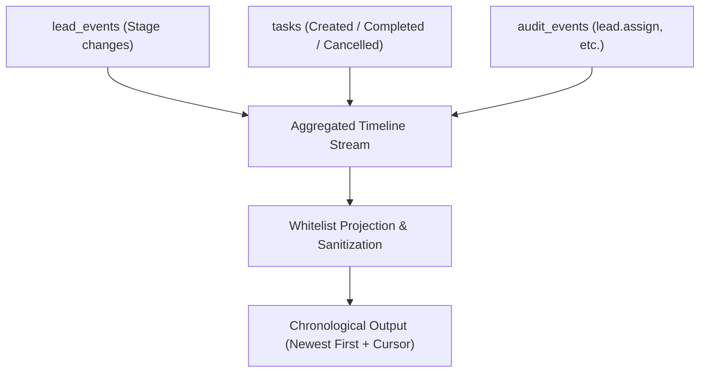

# CRM-004: Pipeline & Activity Timeline + Stalled Leads

**Document Type**: Operational Runbook & Technical Architecture Specification
**Component**: `@baza/api` (CRM Module)
**Specification Reference**: `docs/api/v1-first-vertical-slice.yaml`

---

## 1. Overview & Business Objectives

CRM-004 delivers the **Activity Timeline** and **Stalled Lead detection** backend slice for BAZA ERP CRM:
1. **Activity Timeline**: Unified, chronological audit and event stream for Leads (`GET /leads/:leadId/timeline`) and Contacts (`GET /contacts/:contactId/timeline`).
2. **Stalled Leads Management**: Automated calculation and indexed query filtering for active leads lacking an open task ("Next Action").

---

## 2. Stalled Lead Business Logic ("No Next Action")

### Definition & State Matrix

| Lead Stage | Open Tasks Count | `stalled` Flag | Description / Operational Action |
|---|---|---|---|
| `new`, `contacted`, `qualified` (Active) | `0` | `true` | **Stalled Deal**: No upcoming action scheduled. Requires manager or ROP attention. |
| `new`, `contacted`, `qualified` (Active) | `>= 1` | `false` | **Healthy Pipeline**: Open task is in progress. |
| `converted`, `lost` (Terminal) | `0` | `false` | **Closed Deal**: Terminal stage; no next action expected. |
| `converted`, `lost` (Terminal) | `>= 1` | `false` | **Closed Deal**: Terminal stage; not flagged as stalled. |

### Querying Stalled Leads
- `GET /leads?stalled=true`: Returns only active leads with zero open tasks.
- `GET /leads?stalled=false`: Returns leads that either have open tasks or have reached a terminal stage.
- Executed atomically inside MongoDB aggregation pipeline via `$lookup` on `tasks` matching `status: 'open'`, preserving cursor pagination (`_id: -1`).

---

## 3. Unified Activity Timeline

### Event Aggregation Model

The timeline aggregates events from existing immutable collections without inventing fictitious entities:

### Supported Event Types

| `type` | Source | Description | Actor Format |
|---|---|---|---|
| `lead_stage_changed` | `lead_events` | Lead moved between funnel stages. | `{ type: 'position' \| 'system', id: positionId }` |
| `lead_assigned` | `audit_events` | Lead assigned or reassigned to a manager Position. | `{ type: 'identity' \| 'position' \| 'system', id: actorId }` |
| `task_created` | `tasks` | New task scheduled. | `{ type: 'position' \| 'system', id: assignedPositionId }` |
| `task_completed` | `tasks` | Task completed. | `{ type: 'position', id: completedByPositionId }` |
| `task_cancelled` | `tasks` | Task cancelled. | `{ type: 'position' \| 'system', id: assignedPositionId }` |
| `audit_event` | `audit_events` | Whitelisted CRM audit records. | `{ type: 'identity' \| 'admin_account' \| 'system', id: actorId }` |

### Security & Whitelist Sanitization
- **Strict Privacy Whitelist**: Timeline events output strictly sanitized summaries and metadata (`leadId`, `contactId`, `taskId`, `status`, `stage`).
- **Zero Leak Invariant**: Passwords, password hashes, session tokens, JWTs, cookies, raw un-projected audit documents, and internal MongoDB operational fields are never emitted in timeline responses.

### Documented Scope & Model Boundaries
> [!NOTE]
> **Calls and Free-form Notes**:
> The existing codebase models `Lead`, `LeadEvent`, `Contact`, `Task`, and `AuditEvent`. In accordance with design principles, no mock call/note collections were introduced. Dedicated phone call logs, VoIP recording integration, and unstructured notes will be incorporated once their domain collections are established.

---

## 4. Security, RBAC & Non-Disclosure

### Permission Matrix

| Endpoint | Required Permission | Scope Evaluation | Non-Disclosure Reaction |
|---|---|---|---|
| `GET /leads/:leadId/timeline` | `lead.read` | `own` (manager) vs `organization` (owner, director, rop) | `404 Not Found` if foreign lead or out of scope |
| `GET /contacts/:contactId/timeline` | `contact.read` | `own` (transitive via assigned leads) vs `organization` | `404 Not Found` if no assigned leads for this contact |
| `GET /leads?stalled=...` | `lead.read` | Scoped directly in Mongo aggregation match stage | 400 if foreign `ownerPositionId` requested by manager |

---

## 5. API Endpoints Reference

### 1. `GET /leads/:leadId/timeline`
- **Parameters**: `type?`, `from?`, `to?`, `cursor?`, `limit?`
- **Response**: `{ items: TimelineEventItem[], nextCursor: string | null }`

### 2. `GET /contacts/:contactId/timeline`
- **Parameters**: `type?`, `from?`, `to?`, `cursor?`, `limit?`
- **Response**: `{ items: TimelineEventItem[], nextCursor: string | null }`

### 3. `GET /leads`
- **New Parameter**: `stalled?: boolean`
- **Item Projection**: includes `stalled: boolean` field.
