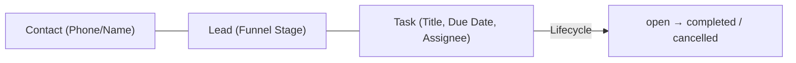

# CRM-003: CRM Tasks / Next Action

**Document Type**: Operational Runbook & Architecture Specification
**Component**: `@baza/api` (CRM Module)
**Specification Reference**: `docs/api/v1-first-vertical-slice.yaml`
**Дата**: 30.08.2026 (worktree `codex/crm-tasks-next-action`, база — `codex/crm-contacts-read-path`)

---

## 1. Overview & Business Context

CRM-003 introduces the **Task / Next Action** backend vertical slice to support disciplined lead processing across BAZA ERP organizations.

A Task represents an actionable assignment (e.g., call, meeting, property showing, document preparation) tied to an optional **Lead** and/or **Contact** and assigned to an organization **Position**.

## 2. "Active Lead Without Next Action" — реализованное правило (мягкое)

**Явная owner-развилка (30.08.2026):** правило реализовано как **read-only индикатор**, НЕ как write-блокировка. `changeLeadStage`/`assignLead`/`revealContact` не знают про Task вообще — CRM-003 добавляет вычисляемое поле, не меняет существующий lead-модуль. Более жёсткий вариант ("нельзя перевести активный лид в новую активную стадию без открытой задачи") был рассмотрен и отклонён на этом проходе — упомянут здесь как явно НЕ реализованный, не как забытый.

1. **Active Lead Definition**: `Lead.stage ∈ {new, contacted, qualified}` (`ACTIVE_LEAD_STAGES` в `crm.service.ts`). `converted`/`lost` — исключены: сделка закрыта или лид вне активной воронки, правило их не касается.
2. **Индикатор**: `GET /leads` и `GET /leads/:leadId` возвращают `hasOpenNextAction: boolean` в каждом lead-объекте — `true`, если активный лид имеет хотя бы одну `Task{status: 'open'}`, ссылающуюся на него (`Task.leadId`).
3. **Вычисление**:
   - `getLead` — один `TaskRepository.countOpenForLead(organizationId, leadId)`, вызывается ТОЛЬКО если stage активен (для converted/lost — сразу `false`, без похода в Mongo).
   - `listLeads` — один батч-запрос `TaskRepository.distinctLeadIdsWithOpenTask(organizationId, leadIds[])` на всю страницу (не N+1 query), тот же принцип батчинга, что `ContactRepository.findByIdsForOrganization`/`LeadRepository.distinctContactIdsForOwner`.
4. Никакой блокировки записи, никакого нового permission-grant для этого поля — `lead.read` (уже существующий grant) достаточно.

## 3. Data Model & Relationships

### Collection: `tasks`

| Field | Type | Required | Description |
|---|---|---|---|
| `_id` | `ObjectId` | Yes | Unique task identifier. |
| `organizationId` | `ObjectId` | Yes | Tenant scope identifier. Strict multi-tenant isolation. |
| `title` | `string` | Yes | Brief task description (1–255 characters). |
| `description` | `string` | No | Extended task notes (max 2000 characters). |
| `status` | `enum` | Yes | Task status: `open`, `completed`, `cancelled`. Default: `open`. |
| `dueAt` | `Date` | No | Target completion timestamp (UTC). |
| `assignedPositionId` | `ObjectId` | No | Organization Position responsible for task execution. |
| `leadId` | `ObjectId` | No | Associated Lead identifier. Must belong to the same tenant. |
| `contactId` | `ObjectId` | No | Associated Contact identifier. Automatically inherited from `lead.contactId` if omitted. |
| `completedAt` | `Date` | No | Timestamp when task was marked completed. |
| `completedByPositionId` | `ObjectId` | No | Position that marked the task completed. |
| `version` | `number` | Yes | conventions.md разд.5 optimistic concurrency (default `0`). |
| `createdAt` | `Date` | Yes | Record creation timestamp. |
| `updatedAt` | `Date` | No | Last modification timestamp. |

Indexes: `{organizationId,_id}`, `{organizationId,assignedPositionId,status}`, `{organizationId,leadId,status}`, `{organizationId,contactId}`, `{organizationId,dueAt}`, `{organizationId,status}`.

## 4. RBAC & Permission Scoping

`task.*` — новый resource, **не имел** предшествующего owner-approved спека в репозитории (проверено: `docs/architecture/permission-matrix.md`/`domain-model.md` физически отсутствуют в этой кодовой базе на момент прохода — упоминаются в комментариях как источник истины, но файлов нет). Полный набор grant'ов ниже подтверждён явным диалогом с владельцем 30.08.2026 (тот же процесс, что `lead.changeStage` в D-05B) — не самостоятельное "техническое решение".

| Role | `task.read` | `task.create` | `task.edit` | `task.complete` | `task.reassign` |
|---|---|---|---|---|---|
| **Owner** | `organization` | `organization` | `organization` | `organization` | `organization` |
| **Director** | `organization` | `organization` | `organization` | `organization` | `organization` |
| **ROP** | `organization` | `organization` | `organization` | `organization` | `organization`¹ |
| **Developer** | `organization` | `organization` | `organization` | `organization` | `organization` |
| **Manager** | `own` | `organization`² | `own` | `own` | — (нет гранта) |
| **Administrator** | `organization` | `organization` | — | `organization` | — |
| **Marketer** | — | — | — | — | — |

¹ rop.task.reassign — `organization`, не `team`: `PermissionScope` содержит значение `team`, но в кодовой базе нет модели подчинённости/иерархии Position, реализующей его реальное сужение (тот же статус, что `lead.reassign` у rop, где `team` формально используется, но тоже не сужает ничего сверх наличия гранта). Владелец явно выбрал `organization` для `task.reassign` у rop на этом проходе — `team` отложен до появления модели команды.

² `task.create` у manager — `organization`-scope: manager может создать задачу и сразу назначить её на **любую** Position организации (тот же паттерн, что `lead.create`), не только на себя. Если `assignedPositionId` не передан явно — auto-assign на себя (см. §5.3).

### task.edit vs task.reassign — принципиальное разделение

`PATCH /tasks/:taskId` (`task.edit`) **никогда** не меняет `assignedPositionId` — поле физически отсутствует в `UpdateTaskDto`/`UpdateTaskRequest`, `ValidationPipe{forbidNonWhitelisted:true}` отклоняет его 400, если клиент всё же его пришлёт. Смена исполнителя — **только** через `PATCH /tasks/:taskId/reassign` (`task.reassign`, отдельный grant). Тот же принцип, что `lead.assign` отделён от `lead.changeStage` в `LeadController` — разные действия с разным блэст-радиусом получают разные permission checkpoints, а не один overloaded action.

Manager **не имеет** `task.reassign` вовсе (подтверждено владельцем — не "own", а полное отсутствие гранта): manager не может передать свою задачу другому manager'у. Может только создать новую задачу на коллегу через `task.create` (organization-scope) или попросить owner/director/rop/administrator переназначить существующую.

### Non-Disclosure Principle
Доступ к задаче вне tenant или вне резолвленного `own`-scope — единообразный `404 NOT_FOUND` (никогда `403` и никакого различия в теле ответа между "не существует" и "существует, но чужая").

## 5. API Endpoints Reference

### 1. `GET /tasks`
Cursor-paginated список (`_id`-курсор, `limit≤100`, default 20). Фильтры: `status`, `assignedPositionId` (own-scope: клиентское значение обязано совпадать со своей Position — иначе 400, не расширяет scope), `leadId`, `contactId`, `dueBefore`/`dueAfter` (ISO 8601).

### 2. `GET /tasks/:taskId`
`404` для чужой/несуществующей задачи (non-disclosure).

### 3. `POST /tasks`
Создаёт задачу в статусе `open`. `leadId` без `contactId` — автонаследование `contactId` от лида. `leadId`, указывающий на чужой/несуществующий лид — `404`. `assignedPositionId` валидируется через `OrganizationsService.findAssignablePosition` (существует, принадлежит организации, не `closed`) — тот же путь, что `assignLead`.

### 4. `PATCH /tasks/:taskId`
Изменяет `title`/`description`/`dueAt`/`status` — **не** `assignedPositionId` (см. §4). Требует `expectedVersion` в body (conventions.md разд.5) — устаревшая версия даёт `409`, не молчаливый lost update. Нельзя редактировать `completed`-задачу иначе как через `status: 'open'` (reopen) — иначе `400`.

### 5. `PATCH /tasks/:taskId/reassign`
Единственный путь смены `assignedPositionId`. `expectedVersion` обязателен. `assignedPositionId: null` (или поле отсутствует) — снимает назначение. Новый `assignedPositionId` валидируется тем же `findAssignablePosition`.

### 6. `POST /tasks/:taskId/complete`
Переводит в `completed`, фиксирует `completedAt`/`completedByPositionId`. `expectedVersion` обязателен для самого перехода `open→completed` (устаревшая версия на ещё открытой задаче — `409`). **Идемпотентно** на уровне "уже completed": повторный вызов с любым `expectedVersion` после успешного завершения просто возвращает текущее состояние (`200`), не ошибку — безопасно вызывать повторно (например, при retry на клиенте после таймаута).

## 6. Optimistic Concurrency (conventions.md разд.5)

`TaskDocument.version` (default `0`) — тот же паттерн, что `LeadDocument.version`/`UnitDocument.version`. `PATCH /tasks/:taskId`, `PATCH /tasks/:taskId/reassign` и `POST /tasks/:taskId/complete` (для открытой задачи) атомарно проверяют `version: expectedVersion` в одном Mongo `updateOne` (`TaskRepository.updateTask`/`reassignTask`/`completeTask`), не read-then-write. `modifiedCount:0` после успешной tenant/scope-проверки → `409 ConflictException`. В отличие от `LeadDocument` (где есть legacy-документы без поля `version`, требующие `$or` fallback), `TaskDocument` — новая схема с `version` с первого дня, fallback не нужен.

## 7. Audit Logging

Все мутирующие операции пишут транзакционные записи в `audit_events` (`AuditService.append`, в той же Mongo-транзакции, что бизнес-изменение):

| Action | Resource | Key Metadata Captured |
|---|---|---|
| `task.create` | `task` | `title`, `assignedPositionId`, `leadId`, `contactId`, `dueAt`, `status` |
| `task.update` | `task` | Before/after `title`/`dueAt`/`status` (НЕ `assignedPositionId` — см. `task.reassign` ниже) |
| `task.reassign` | `task` | Before/after `assignedPositionId` |
| `task.complete` | `task` | `status: completed`, `completedByPositionId`, `completedAt` |

## 8. Явные ограничения этого прохода

- **Нет hard-блокировки** перевода активного лида без открытой задачи — только read-only `hasOpenNextAction` (см. §2). Если владелец захочет ужесточить правило до write-блокировки, это отдельная задача — требует решения о messaging/UX (что видит manager, когда его блокируют) и не входит в этот проход.
- **`team`-scope для `task.reassign` (rop) не реализован** — используется `organization` (см. §4, сноска 1). Требует модели подчинённости Position, которой в кодовой базе пока нет.
- **`assignedPositionId` не версионируется отдельно от остального документа** — `reassignTask` использует тот же `version`, что `updateTask`/`completeTask` (единое поле CAS на весь документ, не per-field). Конкурентный `PATCH .../reassign` и `PATCH /tasks/:taskId` на одной задаче корректно конфликтуют друг с другом (одно из двух получит `409`), это осознанный выбор простоты, не пробел.
- **Никакой outbox/domain-event публикации** (`packages/domain-events`) для Task-событий в этом проходе — только `audit_events`. Другие модули (например, будущий digest/уведомления) не могут сегодня подписаться на `TaskCompleted`/`TaskCreated` через outbox — это следующий шаг, если появится потребитель.
- **Нет OpenAPI-документации для `GET /leads/:leadId`** (`getLead`) — предсуществующий пробел (не добавлен ни в этом, ни в предыдущем CRM-проходе), `hasOpenNextAction` для одиночного лида задокументирован только в реализации/тестах, не в OpenAPI-спеке per-operation (только как поле `LeadListItem`, используемого `GET /leads`).
