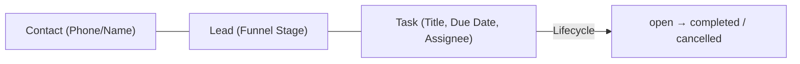

# CRM-003: CRM Tasks / Next Action

**Document Type**: Operational Runbook & Architecture Specification
**Component**: `@baza/api` (CRM Module)
**Specification Reference**: `docs/api/v1-first-vertical-slice.yaml`

---

## 1. Overview & Business Context

CRM-003 introduces the **Task / Next Action** backend vertical slice to support disciplined lead processing across BAZA ERP organizations.

A Task represents an actionable assignment (e.g., call, meeting, property showing, document preparation) tied to an optional **Lead** and/or **Contact** and assigned to an organization **Position**.



---

## 2. The "Active Lead Without Next Action" Rule

### Concept & Pipeline Hygiene
In real estate and high-ticket B2C sales pipelines, stalled leads represent lost revenue. To ensure deal momentum:

1. **Active Lead Definition**: Any Lead in stages `new`, `contacted`, or `qualified`.
2. **Next Action Requirement**: Every active lead **must** have at least one associated `open` task with an upcoming or current `dueAt` date.
3. **Task Completion Flow**: When a manager completes a task via `POST /tasks/:taskId/complete`, the business process expects either:
   - Creation of the subsequent Next Action via `POST /tasks` (e.g. "Prepare preliminary contract", "Follow up after mortgage approval"); OR
   - Advancement of the lead to a terminal stage (`converted` upon successful closing, or `lost` if qualification failed).
4. **Stalled Lead Flagging**: Any active lead with zero `open` tasks is flagged as **"No Next Action"** in pipeline metrics and reporting, signaling required intervention by ROP or Director.

---

## 3. Data Model & Relationships

### Collection: `tasks`

| Field | Type | Required | Description |
|---|---|---|---|
| `_id` | `ObjectId` | Yes | Unique task identifier. |
| `organizationId` | `ObjectId` | Yes | Tenant scope identifier. Strict multi-tenant isolation. |
| `title` | `string` | Yes | Brief task description (1–255 characters). |
| `description` | `string` | No | Extended task notes (max 2000 characters). |
| `status` | `enum` | Yes | Task status: `open`, `completed`, `cancelled`. Default: `open`. |
| `dueAt` | `Date` | No | Target completion timestamp (UTC). |
| `assignedPositionId` | `ObjectId` | No | Organization Position responsible for task execution. |
| `leadId` | `ObjectId` | No | Associated Lead identifier. Must belong to the same tenant. |
| `contactId` | `ObjectId` | No | Associated Contact identifier. Automatically inherited from `lead.contactId` if omitted. |
| `completedAt` | `Date` | No | Timestamp when task was marked completed. |
| `completedByPositionId` | `ObjectId` | No | Position that marked the task completed. |
| `createdAt` | `Date` | Yes | Record creation timestamp. |
| `updatedAt` | `Date` | No | Last modification timestamp. |

---

## 4. RBAC & Permission Scoping

Permissions follow BAZA's `DEFAULT_ROLE_GRANTS` architecture:

| Role | `task.read` | `task.create` | `task.edit` | `task.complete` | Scope Enforcement |
|---|---|---|---|---|---|
| **Owner** | `organization` | `organization` | `organization` | `organization` | Full tenant visibility, can assign/edit any task. |
| **Director** | `organization` | `organization` | `organization` | `organization` | Full tenant visibility, can assign/edit any task. |
| **ROP** | `organization` | `organization` | `organization` | `organization` | Full tenant visibility, can assign/edit any task. |
| **Developer** | `organization` | `organization` | `organization` | `organization` | Full visibility for developer organization tasks. |
| **Manager** | `own` | `organization` | `own` | `own` | Can only view, edit, and complete tasks assigned to their own `positionId`. |
| **Administrator** | `organization` | `organization` | — | — | Can view and create tasks for audit/setup purposes. |

### Non-Disclosure Principle
When a user attempts to access or mutate a task outside their tenant or outside their resolved `own` scope, the system returns a uniform `404 NOT_FOUND` (never `403` or disclosing existence).

---

## 5. API Endpoints Reference

### 1. `GET /tasks`
- **Description**: Returns cursor-paginated list of tasks matching query filters.
- **Permission**: `@RequirePermission('task', 'read')`
- **Query Parameters**:
  - `status`: `open` \| `completed` \| `cancelled`
  - `assignedPositionId`: Filter by assigned position (restricted to caller position for `own` scope).
  - `leadId`: Filter by lead.
  - `contactId`: Filter by contact.
  - `dueBefore` / `dueAfter`: Filter by due date range (ISO 8601).
  - `cursor`: Pagination cursor (`_id` of the last record from previous page).
  - `limit`: Page size (1..100, default 20).

### 2. `GET /tasks/:taskId`
- **Description**: Returns full details of a specific task.
- **Permission**: `@RequirePermission('task', 'read')`
- **Errors**: `404 Not Found` if task does not exist or falls outside caller's permission scope.

### 3. `POST /tasks`
- **Description**: Creates a new task in status `open`.
- **Permission**: `@RequirePermission('task', 'create')`
- **Payload**:
  ```json
  {
    "title": "Call client regarding mortgage terms",
    "description": "Discuss rate options and down payment requirements",
    "dueAt": "2026-09-02T10:00:00.000Z",
    "assignedPositionId": "66d0e123456789abcdef0001",
    "leadId": "66d0e123456789abcdef0002",
    "contactId": "66d0e123456789abcdef0003"
  }
  ```

### 4. `PATCH /tasks/:taskId`
- **Description**: Updates task attributes (`title`, `description`, `dueAt`, `assignedPositionId`, `status`).
- **Permission**: `@RequirePermission('task', 'edit')`
- **Rules**: Cannot edit a `completed` task unless explicitly reopening. Managers can only update tasks assigned to them.

### 5. `POST /tasks/:taskId/complete`
- **Description**: Marks task as completed, setting `completedAt` and `completedByPositionId`.
- **Permission**: `@RequirePermission('task', 'complete')`
- **Idempotency**: Safe to invoke repeatedly; returns current task state.

---

## 6. Audit Logging

All mutating task operations append transactional audit records to `audit_events`:

| Action | Resource | Key Metadata Captured |
|---|---|---|
| `task.create` | `task` | `title`, `assignedPositionId`, `leadId`, `contactId`, `dueAt`, `status` |
| `task.update` | `task` | Before and after diffs of modified fields (`title`, `assignedPositionId`, `dueAt`, `status`) |
| `task.complete` | `task` | `status: completed`, `completedByPositionId`, `completedAt` |
